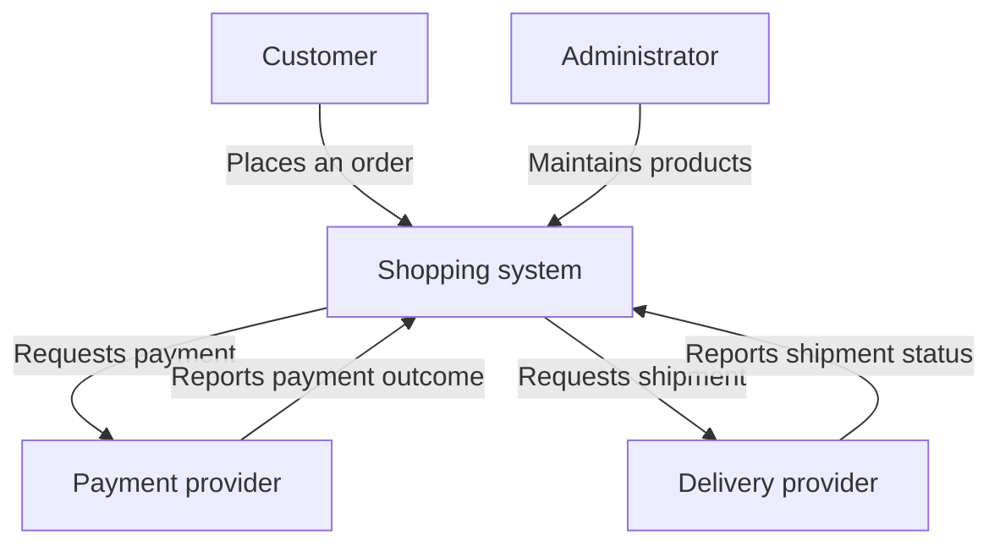
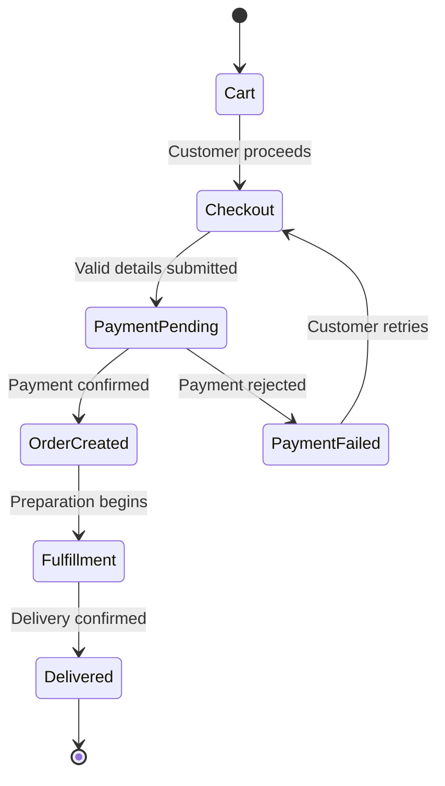
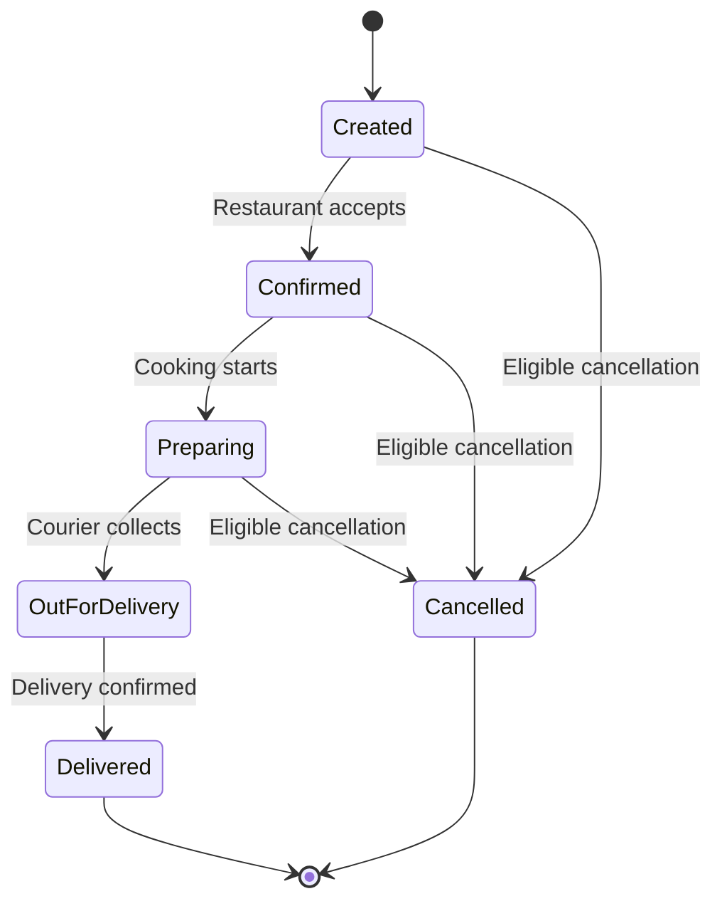

*A textbook chapter, practice workbook, and interview guide for absolute beginners*

**The central question: What must the system do?**

You need no programming knowledge to start. Read Sections 1–15 first, then practice describing successful and unsuccessful behavior in [Sections 16–28](/tutorials/system-design/functional-requirements/paths-and-quality). [Sections 29–46](/tutorials/system-design/functional-requirements/requirements-to-design) connect this skill to software design. [Sections 47–65](/tutorials/system-design/functional-requirements/practice-and-interviews) provide worked problems and interview practice. Finish with the [knowledge check, flashcards, and revision sheet](/tutorials/system-design/functional-requirements/knowledge-check).

**How to study:** Before opening a solution, write your own answer. Compare the conditions and results, not merely the wording. Example policies, numbers, and priorities in this chapter are teaching choices, not universal rules or claims about real products. A requirement with an unresolved decision is a draft, not a complete agreement.

> Requirements describe what the system must do. Design describes how the system will do it.

## 1. Start from absolute zero: what is a system?

Imagine ordering soup in a restaurant. You make a request, staff prepare it, and you receive soup. Several people and objects work together toward a result.

A **system** is a set of connected parts that work together for a purpose. A restaurant ordering system includes customers, servers, menus, kitchen staff, and order slips. The word matters because we need to decide which parts we are describing and what they are responsible for.

An **input** is something a system receives, such as your soup order. **Processing** is the work performed on that input, such as cooking. An **output** is the result, such as a bowl of soup or a message saying soup is unavailable. These words help us describe behavior without discussing machinery.

**Input → Processing → Output**

Before the shopping example: **stock** means the quantity available to sell, such as three pairs of shoes. It matters because receiving a purchase request does not guarantee the item is available.

| Everyday system | Input | Processing | Output |
|---|---|---|---|
| Restaurant ordering | Request for soup | Check availability and cook | Soup or an unavailable-item response |
| Public library | Request to borrow a book | Check membership and availability | Loaned book or refusal with a reason |
| ATM, a machine for bank transactions | Card, secret code, cash request | Check identity, balance, and available cash | Cash and receipt, or refusal |
| Hospital appointment desk | Requested doctor and date | Check open appointment times | Confirmed appointment or alternatives |
| Washing machine | Clothes, detergent, selected cycle | Wash and rinse | Clean clothes |
| Online shopping website | Product selection and delivery details | Check stock, accept payment, arrange order | Order confirmation or error |

A **software application** is a program people or other programs use to accomplish tasks. A shopping application lets a person choose products and buy them. It matters because software can perform and coordinate parts of the same everyday process.

A **software system** consists of cooperating software and the resources it uses to deliver a purpose. An online store may include an application, stored product information, and a connection to a payment company. We can discuss the store as one system while treating the payment company as outside it.

A **system boundary** is the line between what our system controls and what lies outside it. The store controls its cart, but a bank controls whether a card payment is approved. Boundaries prevent us from promising behavior we cannot directly control.

A **user** is a person who interacts with an application: for example, a shopper. Identifying users matters because different people need different behavior.

**Try:** What are the input and output of a weather application when you enter a city?

**Solution:** Input: the city. Processing: obtain its forecast. Output: the forecast, or an explanation that it cannot be obtained.

## 2. What is a requirement?

If you ask someone to bake a birthday cake, “It must serve eight people” is a requirement: something that must be satisfied. “I would love an impressive cake” expresses a desire, but does not establish how to judge success.

A **software requirement** is a stated need or obligation that a software system or its development must satisfy. “Customers can order food online” identifies a need, but still needs detail about selecting food, payment, and unavailable items. Requirements matter because they establish what we are trying to deliver and how to check it.

A **payment provider** is an organization or system that processes payments, such as accepting a card-payment request. It matters because the application may need an outside party to determine whether payment succeeded.

| Term | Plain meaning | Online-food example | Why distinguish it? |
|---|---|---|---|
| Desire | Something someone hopes for | “I want ordering to be convenient.” | Reveals motivation but needs clarification |
| Idea | A possible approach or product | “Let’s build an online ordering app.” | Starts discovery, not a full specification |
| Feature | A recognizable part of a product | “Saved favorite meals.” | Names a function but may omit exact behavior |
| Requirement | A need or obligation to satisfy | “A customer can save an available meal as a favorite and view saved favorites later.” | Can guide implementation and checking |
| Constraint | A restriction on permitted choices | “Use our existing payment provider.” | Limits possible solutions |

A **feature** might contain several requirements. Saved favorites need adding, viewing, removing, and handling meals that become unavailable.

Unclear requirements produce incompatible interpretations. One person thinks “order online” includes cash on delivery; another assumes card payment only. They can build different products from the same sentence. Clarifying before construction reduces rework.

**Try:** Is “Make shopping amazing” ready to build?

**Solution:** No. Ask which shopping problems should improve and what observable behavior would address them.

## 3. What is a functional requirement?

Suppose a library member asks to reserve a book that is currently borrowed. We must describe what the library software does with that request.

**One sentence:** A functional requirement specifies behavior a system must perform.

**Beginner definition:** It describes an action someone can take or a response the system must produce, including the rules and conditions that affect that response.

A **role** identifies a type of participant and its responsibilities, such as customer or librarian. It matters because behavior and permissions differ between participants. An **actor** is a role interacting with the system from outside its boundary, such as a library member or an external payment company. It matters because behavior depends on who asks for it. Section 6 explores actors in detail.

An **event** is something that happens and may trigger work, such as a payment succeeding. It matters because some behavior starts without a person clicking anything.

**30-second interview explanation:** “Functional requirements describe what the system must do: who can perform which actions, what results the system produces, and how it handles rules and failures. For a shopping system, that includes searching products, adding items to a cart, submitting an order, and rejecting checkout if stock is unavailable. I clarify these behaviors and scope before choosing a design.”

**More technical definition:** It specifies an externally observable behavior of the system in response to an actor’s action, an event, or a condition, including information changes and rule enforcement.

A **capability** is an ability the system provides, such as purchasing products. A **behavior** is its observable response, such as updating the cart after an item is added. A **workflow** is an ordered sequence of steps toward a result, such as choosing items, checking out, and paying. A **business rule** is a rule about the activity being supported that governs an action, such as “orders of at least $50 qualify for free delivery.” These terms help describe different levels of what must happen; later sections develop them fully.

An **account** is a stored record representing a person’s relationship with an application, such as a shopper’s account. It matters because the application can associate information and permissions with that person.

A **password** is secret text used to help prove an account holder’s identity. A password reset replaces a forgotten password after an agreed identity check; it matters because people can lose access without forgetting who they are. An **email address** identifies a destination for electronic messages, such as registration instructions; it matters when an account uses email to communicate or identify its holder.

A **refund** returns previously paid money, such as payment for a cancelled purchase. It matters because cancelling an order and returning money are separate outcomes.

Functional requirements can describe:

- Actions: a user requests a password reset.
- Capabilities: a store supports product purchasing.
- Responses: the system reports a rejected payment.
- Workflows: an accepted return leads to a refund request.
- Rule enforcement: the system refuses withdrawal above the available balance.

Example: **The user can create an account.** 

Who acts? A new user. What happens? The user submits registration information. What must the system do? Check the information, create an account when valid, and explain a rejection when invalid. The short statement is useful as a starting point; these details make it testable.

## 4. Functional versus non-functional requirements

A restaurant must serve meals. It may also promise to serve them within a specified time. Serving is behavior; the time target is a quality of that behavior.

A **non-functional requirement** specifies a quality, operating limit, or condition the system must satisfy. For example, “At least 95% of successful searches must finish within two seconds under the agreed workload.” It matters because a system can perform the right action yet perform it too slowly or unreliably.

**Functional: WHAT should the system do?**  
**Non-functional: HOW WELL should it do it, or under what quality conditions?**

This is a helpful shortcut, not a perfect classification law. Security and information protection include both behavior and quality obligations.

A **file** is a named collection of digital information, such as a photo. **Upload** means send a file into a system; **download** means receive a file from it. An **identifier** distinguishes one thing from another, such as an order number. A **URL** is a web address, such as a page address. These terms matter because we need to know what information moves and which item an action affects.

**Sign-in**, or **login**, establishes access for a person whose identity the application has checked; signing into an account lets the person retrieve their own information. An **administrator** is a person with elevated management permissions, such as suspending an account; this matters because management functions need a different role from ordinary users.

The following targets are illustrative. **Workload** means the amount and pattern of work presented to a system; 100 searches per second is an example. A **percentile** indicates the proportion of measurements below a value: a 95th-percentile time of two seconds means 95% finish within two seconds. **Availability** means being usable when needed; its measurement must specify the period and what counts as usable. These definitions matter because “fast” and “always available” cannot be checked consistently.

**Encryption** transforms readable information into a protected form recoverable with the appropriate secret information. Protecting card information is a quality obligation; selecting an exact encryption mechanism may be a technical constraint. **Accessibility** means people with differing abilities can use the product; keyboard operation is one example. Both matter because working functionality must also protect and serve people appropriately.

A **test** is a planned check of an expected result; for example, submit a valid search and compare the response with its criteria. It matters because requirements need evidence of satisfaction.

| # | Functional requirement | Non-functional requirement |
|---|---|---|
| 1 | Users can upload photos | 95% of uploads of supported files up to 5 MB finish within 3 seconds on the agreed connection |
| 2 | Users can send messages | Sending is available for at least 99.9% of minutes in a calendar month, measured by the agreed availability check |
| 3 | Customers can pay for orders | Payment information is protected by encryption during transmission and storage under the agreed security specification |
| 4 | Customers can search products | 95% of searches complete within 2 seconds at 100 searches per second |
| 5 | Users can reset passwords | The reset page works using keyboard navigation alone under the agreed accessibility checks |
| 6 | Members can reserve books | The reservation function handles 200 simultaneously active members under the agreed workload |
| 7 | Customers can view order status | Status pages meet the agreed readability and contrast checks |
| 8 | Travelers can book seats | No more than the agreed error rate occurs under a defined 1,000-booking-request test |
| 9 | Users can create notes | Saved notes survive the agreed recovery test without loss of acknowledged saves |
| 10 | Staff can export reports | 95% of reports with 10,000 rows finish within 30 seconds |
| 11 | Users can watch videos | Playback begins within 2 seconds for 95% of attempts under agreed video and network conditions |
| 12 | Drivers can accept ride requests | Acceptance requests finish within 1 second for 95% of attempts under the agreed load |
| 13 | Customers can transfer funds | The system is restored within the agreed recovery time after a specified outage |
| 14 | Administrators can suspend accounts | The administration interface passes the agreed accessibility checks |
| 15 | Users can receive shipment notifications | The notification function supports the agreed daily volume without exceeding its error target |
| 16 | Customers can download invoices | Invoice download works in each browser named in the supported-browser specification |

A **permission** is allowance to perform a particular action on specified information, such as viewing your own order. It matters because different actors must not automatically have access to everything.

Ambiguous cases:

- “Only owners can delete notes” is functional permission behavior: allow or refuse a specific action.
- “The system is secure” is an unclear quality wish. Ask what must be protected and what threats or checks are relevant.
- “Lock an account after five failed sign-in attempts” is functional behavior implementing a security policy; five is an illustrative policy decision.
- “Send messages within one second” combines sending behavior and a time target. Split them and define the measurement conditions.
- “Do not sell the same seat twice” describes a functional correctness rule. Keeping it true under competing booking attempts affects design; that does not erase the behavior requirement.
- “The app must work offline” needs decomposition: which actions work without a connection, which information is available, and when changes are exchanged later?

**Classify before reading:** (a) Users can cancel eligible orders. (b) 95% of cancellations complete within one second at the agreed load. (c) Only the order owner can cancel. (d) The app must be reliable.

**Solution:** (a) functional; (b) non-functional; (c) functional permission behavior; (d) unclear non-functional aspiration needing a measure.

## 5. Anatomy of a functional requirement

Imagine telling a librarian, “Reserve this book for me.” We know who acts, what they do, and what they act upon. We also need to know the result.

**Actor + Action + Object + Expected Result**

An **actor** is a role outside the boundary that interacts with the system: a customer or a payment company, for example. An **object** is the thing acted upon, such as a product. These terms help us avoid sentences with missing participants or unclear targets.

“A customer can add a product to the shopping cart.” A **shopping cart** is a temporary collection of products the shopper intends to purchase. It matters because selecting an item does not yet mean buying it.

| Part | Example |
|---|---|
| Actor | Customer |
| Action | Add |
| Object | Product, with a selected quantity |
| Destination/current condition | Customer’s cart |
| Expected result | Cart contains the product at the agreed quantity and shows the updated total |

Destination alone is not a complete result. What if the product is already there? State whether quantities are combined or a separate line is created.

**Acceptance criteria** are observable conditions used to decide whether a requirement is satisfied, such as seeing a saved item after reopening the cart. They matter because a short statement can leave the exact result uncertain. Section 43 develops this idea.

| Writing style | Example | Strength | Limitation |
|---|---|---|---|
| Actor-centered | Customers can add available products to their cart | Easy to scan and discuss | May omit trigger, failures, and precise results |
| System-centered | The system shall reject checkout when the cart is empty | Makes a conditional obligation explicit | Can become wordy; may hide the actor’s goal |
| User story | As a customer, I want to save my cart so that I can buy later | Connects behavior to purpose | Usually needs rules and acceptance criteria |

A **user story** is a short description of a need from an actor’s perspective. “As a… I want… so that…” explains why the behavior matters. It is not a complete specification by itself.

“Shall” means a mandatory obligation in that document. “Can” describes an enabled action. Define your document’s wording consistently; avoid using “should” for both mandatory and optional behavior.

**Try:** Rewrite “Add favorites.”

**Solution:** “When a signed-in customer saves an available product as a favorite, the system adds it to that customer’s favorites list and shows it in later visits.” Separate requirements can define removal and unavailable products.

## 6. Actors

At an ATM, the person requesting cash is an actor. The bank’s account system is another actor if it lies outside the ATM system boundary.

A **primary actor** seeks a goal through the system: the customer wants cash. A **secondary actor** supports that goal: the bank approves or refuses the withdrawal. An **external system** is another software system outside the boundary: the bank’s account system. These labels help uncover both customer actions and interactions needed to complete them.

An **administrator** is a person with elevated management permissions, such as changing a product listing. A **payment provider** is an organization or system that processes payments. A **delivery provider**, also called a **shipping provider**, transports goods and may supply tracking updates. Each matters because its actions can change a customer’s outcome.

| System | Primary actors | Supporting/external actors |
|---|---|---|
| ATM | Bank customer | Bank account system |
| E-commerce | Customer; administrator for management tasks | Payment provider, shipping provider |
| Messaging | Message sender and recipient | External identity provider if used |
| Food delivery | Customer; restaurant; delivery partner | Payment provider, external map provider if used |

A **scheduler** starts work at specified times, such as starting an expiration check every night. A **background job** is work performed without a person actively waiting on a screen, such as sending a receipt. They are actors only if outside the system boundary being modeled. If they are internal parts, model “time reaches the expiration deadline” as a trigger rather than pretending an internal component is an external user.

An **API**, or application programming interface, is a defined way for software to request actions or information from other software. A payment request interface is an example. It matters because systems can interact without a person operating a screen. An external API is an interaction route; the external system behind it is normally the actor. Section 34 develops this distinction.

Each arrow represents an interaction, not the location of a software component. Customer → store submits an order. Administrator → store changes catalog information. Store → payment asks for payment processing; the return arrow reports the result. Store → delivery requests shipment; the return arrow reports progress. The diagram shows why requirements must cover returned outcomes, too.

## 7. Capabilities: from goal to requirement

A shop owner wants people to buy products online. That is an outcome, not yet a description of all behavior.

| Level | Meaning | Example |
|---|---|---|
| Business goal | Desired benefit | Enable customers to buy without visiting the shop |
| Capability | Broad ability needed | Product purchasing |
| Feature | Recognizable product function | Search, cart, checkout |
| User action | A specific thing a person does | Adds two pairs of socks |
| Functional requirement | Agreed behavior under conditions | When a customer adds an available product, the system updates the cart quantity and total |

**Checkout** is the process of confirming the purchase details and arranging payment. It matters because it connects selecting products to committing an order.

Break product purchasing into searching, viewing, adding to cart, checking delivery details, paying, and receiving confirmation. Then specify conditions and results for each. This decomposition helps spot missing work: a cart with no way to submit an order does not achieve the business goal.

**Try:** What capability might support “reduce missed medical appointments”?

**Solution:** Appointment reminders. Possible requirements include sending a reminder before a scheduled appointment and stopping reminders after cancellation. The desired reduction is a business outcome; sending and stopping reminders are system behaviors.

## 8. Inputs, processing, and outputs

Use this model whenever a requirement feels vague. “What arrives, what must happen, and what leaves or changes?”

**Credentials** are information used to prove identity, such as an email address and password. **Login**, also called sign-in, is the process of establishing an identified user’s access to an application. **Authentication** checks identity; **authorization** checks whether that identity may perform a particular action. A correct password may authenticate a customer without authorizing access to someone else’s order. These distinctions matter because proving who you are does not permit everything.

**State** means an item’s current meaningful condition, such as Cancelled; it matters because current condition affects allowed next actions. **Validate** means check information or an action against agreed rules, such as requiring a positive amount; it matters because unsuitable input must not silently be accepted. A **service area** is the geographical region where a product operates, such as a city’s supported pickup area; it matters for refusing unsupported bookings.

| # | Action | Input | Processing behavior | Output/result |
|---|---|---|---|---|
| 1 | Login | Email and password | Verify credentials and account eligibility | Signed-in access or an error |
| 2 | Search products | Keywords | Find products matching the agreed fields | Matching results or “no results” |
| 3 | Payment | Order and payment instruction | Ask provider to process the specified amount | Confirmed payment, failure, or pending outcome |
| 4 | Send message | Recipient and text | Check permission and accept message | Message appears with its current status |
| 5 | File upload | File and description | Check permitted type and size | Stored file reference or rejection |
| 6 | Book appointment | Doctor and time | Check availability and confirm booking | Booking confirmation or unavailable response |
| 7 | Create short link | Long web address | Validate supported address and assign short link | Short link or error |
| 8 | Return book | Book copy and member | Close eligible loan and apply agreed rules | Return recorded and any charge shown |
| 9 | Cancel order | Order identifier | Check owner and cancellation eligibility | Cancelled state or reason for refusal |
| 10 | Reset password | Reset link and new password | Verify link and password rules | Password changed or rejection |
| 11 | Request ride | Pickup and destination | Validate service area and request a driver | Searching status or refusal |
| 12 | Withdraw cash | Account and amount | Check rules and coordinate cash dispensing | Cash and confirmed debit, or failed/pending outcome |

Processing here describes required work and observable consequences. “Store it using technology X” would be a solution choice unless separately mandated.

## 9. CRUD: a useful discovery tool

Imagine a paper task list. You write a task, read it, change it, or cross it off. Software often supports similar information operations.

**CRUD** stands for **Create, Read, Update, Delete**. An **entity** is a kind of thing we keep information about, such as a task, customer, or order. CRUD helps discover missing operations on each entity.

| Operation | Task example |
|---|---|
| Create | Add “Buy milk” as a new task |
| Read | View the task and its status |
| Update | Change its due date or mark it completed |
| Delete | Remove the task under the agreed deletion policy |

A **profile** is an account’s descriptive information, such as a display name. It matters because updating this information differs from creating or deleting the whole account.

| Entity | Create | Read | Update | Delete or permitted equivalent |
|---|---|---|---|---|
| User account | Register | View profile | Change display name | Request account deletion under policy |
| Product | Add listing | View details | Change price | Retire listing from sale |
| Message | Compose/send | View history | Edit if allowed | Delete for self or permitted recipients |
| Order | Submit purchase | View order | Change permitted details | Cancel if eligible; retain required history |
| Document | Create document | Open document | Edit content | Remove or archive according to policy |

**Archive** means remove from active use while retaining information. Delete does not always mean immediate permanent erasure. Orders and transactions may require history; explicitly define what removal means rather than mechanically assigning all four operations.

CRUD does not discover every requirement. Sending a notification, calculating shipping price, processing payment, recommending products, and approving a transaction describe additional behaviors. A **notification** is a message drawing attention to an event, such as shipment. A **transaction** is a recorded business operation such as a money transfer. Both require conditions and outcomes beyond editing a record.

**Try:** Is “approve a loan request” fully described by Update?

**Solution:** No. It may update status, but also requires eligibility rules, an authorized approver, and communication of the decision.

## 10. User journeys

A **user journey** describes the steps a person takes to achieve a goal, including their experience across those steps. Buying shoes is an example. It matters because separate feature lists often miss the connections needed to finish a task.

| Journey step: buying a product | Extracted functional requirement |
|---|---|
| 1. Customer opens the application | The system displays products available for browsing |
| 2. Customer searches for shoes | Customers can search product names and descriptions using keywords |
| 3. Customer chooses a product | Customers can view its price, available sizes, and stock status |
| 4. Customer adds it to the cart | The system records the selected size and quantity in the customer’s cart |
| 5. Customer enters delivery information | The system checks required address fields and shows delivery options |
| 6. Customer pays | The system requests payment for the confirmed total and records the outcome |
| 7. System creates the order | Under this example policy, confirmed payment creates one order with the purchased items |
| 8. Customer receives confirmation | The system shows the order number and makes the order available in purchase history |

A **stock** or **inventory** quantity is how many units are available to sell. A **catalog** is the collection of product listings. These matter because a displayed product may no longer be purchasable when checkout begins.

Walking through the journey reveals hidden questions: Where does the address go? When is stock checked again? What happens if payment is unresolved? Is confirmation available if the notification fails? The system should still retain the order even when a confirmation email cannot be delivered.

## 11. Use cases: withdraw cash from an ATM

Suppose we want to document one complete interaction, including failures. A **use case** describes how an actor reaches a goal through the system. It matters because it connects several individual requirements into a coherent example.

| Term | Plain meaning | ATM example |
|---|---|---|
| Actor | Role interacting with the system | Bank customer |
| Goal | Result the actor wants | Obtain cash from an account |
| Precondition | Something that must already be true | ATM is operating and has a bank connection |
| Trigger | What starts the interaction | Customer selects withdrawal |
| Main flow | Normal successful sequence | Request, checks, dispense, confirmation |
| Alternative flow | Another supported route | Choose another account or amount |
| Exception/error flow | Handling a failed condition | Insufficient funds or dispensing problem |
| Postcondition | What is true afterward | Withdrawal outcome recorded accurately |

A **PIN** is a personal identification number, a secret code used with a card. It matters because the ATM must check that the person is permitted to use the account.

### Complete use case: withdraw cash

**Actors:** Customer, external bank account system.  
**Goal:** Receive the requested cash and an accurate account record.  
**Preconditions:** ATM is available; the card/account is supported; the bank connection is available.  
**Trigger:** After successful card and PIN verification, customer selects “Withdraw.”

**Main flow:**

1. ATM asks the customer to select an eligible account.
2. Customer enters an amount.
3. ATM checks the amount against supported denominations and withdrawal limits.
4. ATM asks the bank whether the account can fund the withdrawal.
5. Bank authorizes the withdrawal under the agreed bank–ATM process.
6. ATM dispenses the requested cash.
7. ATM records dispensing success and coordinates final debit confirmation with the bank.
8. ATM shows the confirmed outcome, offers a receipt, and returns the card.

**Alternative flows:** Customer chooses a different account; requests a different valid amount; declines a printed receipt; cancels before dispensing begins.

**Error flows:** Invalid PIN: refuse account access and follow the configured attempt policy. Insufficient balance: refuse the amount and allow another selection. Insufficient ATM cash: refuse that amount and offer supported alternatives if known. Connection failure before approval: do not dispense; report that withdrawal cannot proceed. Uncertain or partial dispensing: record actual/uncertain outcome, prevent an unsafe repeat, and initiate the agreed reconciliation process.

**Reconciliation** means checking records against what actually happened and resolving differences. It matters because “cash did not appear” and “bank request timed out” do not automatically prove that no money movement occurred.

**Postconditions:** On success, cash was dispensed and the corresponding debit is confirmed. On definite rejection before dispensing, no withdrawal debit is completed. On uncertain dispensing or bank confirmation, a pending exception is recorded for resolution; do not falsely promise a clean rollback.

### Derived requirements

- **ATM-FR-01:** Customers can request withdrawal from an eligible account after successful identity verification.
- **ATM-FR-02:** The ATM rejects amounts outside supported denominations or configured limits and explains the applicable restriction.
- **ATM-FR-03:** The ATM refuses withdrawal when the bank reports insufficient available funds.
- **ATM-FR-04:** The ATM dispenses only an approved amount for which it has sufficient cash.
- **ATM-FR-05:** The ATM records dispensing outcome and coordinates account confirmation under the agreed bank process.
- **ATM-FR-06:** The ATM records unresolved withdrawal outcomes for reconciliation and prevents retry from creating a second withdrawal for the same request.
- **ATM-FR-07:** Customers can cancel before dispensing begins, under the documented cancellation policy.

## 12. Workflows

A restaurant order passes through steps in a particular order. A **workflow** specifies the sequence, decisions, and responses that move work toward completion. It matters because each branch requires behavior.

**Fulfillment** means preparing and sending purchased goods. A **state** is a meaningful current condition, such as “Delivered.” A **state diagram** shows possible conditions and the events that move between them. We use one below to make the workflow’s decisions explicit; Section 13 explains state more deeply.

In this teaching example, only confirmed payment creates an order. A failed payment leaves the cart available for another attempt and does not create a paid order. An unknown payment outcome stays pending until resolved. Some real stores create an unpaid order before payment; choose and document the policy rather than assuming this diagram is universal.

Requirements revealed: validate checkout; track pending payment; distinguish rejection from unknown outcome; create the order once after confirmed payment; start fulfillment only for eligible orders; record delivery.

## 13. State

A traffic light may be red or green. Knowing its state tells you what action is currently allowed. A food order’s state similarly affects whether cancellation is permitted.

**State** is a meaningful current condition of an item at a particular time. A **state transition** changes one condition to another. A **valid transition** is permitted under the rules; an **invalid transition** is not. These concepts matter because the same action can be valid at one time and invalid later.

“OutForDelivery” means the order is on its way. Under this example policy, a customer may cancel before that state. Preparing → Cancelled is valid; Delivered → Preparing is invalid. A return is a separate process, not pretending the original delivery never happened.

- **STATE-FR-01:** The system accepts customer cancellation only for the customer’s own order in Created, Confirmed, or Preparing.
- **STATE-FR-02:** The system rejects cancellation after departure for delivery and displays the current status and reason.
- **STATE-FR-03:** Cancelled orders cannot proceed to preparation or dispatch.

**Try:** If cancellation and dispatch arrive together, what is missing?

**Solution:** The ordering rule. Define the accepted transition: whichever eligible transition is committed first determines whether cancellation remains allowed. Never leave the system with both cancelled and dispatched as incompatible final outcomes.

## 14. Business rules

A shop decides that orders of at least $50 receive free delivery. That rule exists even if employees handle orders on paper.

A **business rule** governs decisions in the activity being supported. It matters because permitted actions depend on more than the button a user presses.

| Rule | Functional requirement enforcing it |
|---|---|
| Withdrawal cannot exceed available balance | The system refuses withdrawal when the requested amount exceeds the available balance |
| This example account requires age 18 or older | The system refuses registration when the submitted birth date implies age below 18 |
| Delivery is free at a qualifying subtotal of $50 | The system sets delivery charge to zero when the qualifying subtotal is at least $50 |

These are illustrative policies. Define “available balance,” age-check basis, currency, qualifying subtotal, and whether tax/discounts count before treating them as complete.

| Concept | Meaning | Example |
|---|---|---|
| Action | Something attempted or performed | Submit an order |
| Validation | Check whether information/action meets rules | Check that quantity is positive |
| Business rule | Domain rule governing decisions | Free delivery at the qualifying threshold |
| Policy | A broader agreed approach, possibly containing rules | Cancellation policy allows certain cancellations and defines refund handling |
| Constraint | Restriction on permitted solutions or operation | Must integrate with the existing shipping provider |

A policy is not automatically software behavior. Derive explicit system obligations when the system must enforce it.

## 15. Conditions and validation

On a paper form, a blank delivery address prevents shipment. Software must check similarly.

**Valid input** meets the agreed rules; **invalid input** does not. A **required field** must be supplied, such as the recipient’s name. An **optional field** can be omitted, such as delivery instructions. A **field** is one named piece of information on a form or record. **Validation** checks information or an action against the rules. **Error handling** defines what happens when a request cannot succeed. These concepts matter because users cannot reliably correct problems without clear feedback.

Examples:

- Registration requires an email and password but permits an optional display name.
- The system rejects registration when the email is already registered, according to the chosen feedback policy.
- The system rejects quantities that are not whole numbers from 1 to the available permitted quantity.
- The system preserves acceptable checkout entries when the address is rejected so the customer can correct it.

Be explicit about duplicate-email feedback: revealing existing accounts may conflict with a privacy policy. One alternative is a neutral response with instructions sent to the supplied email if appropriate. The agreed behavior must be documented.

An error requirement should state the rejection, the information changed or preserved, and the visible response. Otherwise one developer may silently drop an invalid request while another accepts part of it.
