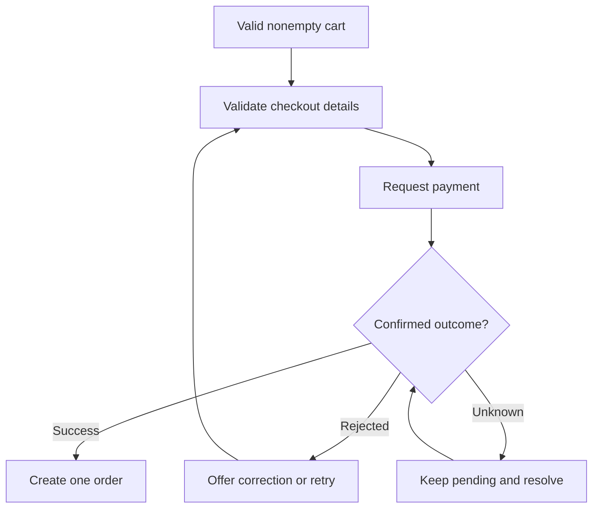

*Part 2 of 5 of [Functional Requirements](/tutorials/system-design/functional-requirements) · Sections 16–28.* In these sections you practice describing successful and unsuccessful behavior. New to the topic? Start with [Functional Requirements Fundamentals](/tutorials/system-design/functional-requirements/fundamentals).

## 16. The happy path

The **happy path** is the intended successful route when inputs and conditions are valid. It matters because it gives a simple starting point before considering alternatives and failures.

Account registration:

1. New user provides valid required information.
2. System checks field rules and account uniqueness.
3. System creates the account.
4. System shows confirmation and sends the agreed verification message.

A **verification message** asks the user to prove control of a contact address, for example by opening an emailed link. This matters when account access depends on verified contact information.

Requirements: accept the defined registration fields; enforce their rules; create one account for a successful request; communicate the result; if email verification is required, keep access restricted until verified.

**Try:** If account creation succeeds but email delivery fails, should the account disappear?

**Solution:** Not automatically. Specify a pending-verification account and a resend option if that is the intended product behavior.

## 17. Alternative paths

An **alternative flow** is another supported way to reach a goal. Paying with a gift card instead of a debit card is an example. Alternatives matter because they need their own conditions and results.

A user might choose “Sign in with Google” rather than registering a password. An **identity provider** is an external system that verifies identity for another application. This alternative needs requirements for accepting its identity result, creating or finding the appropriate account, handling provider refusal, and deciding how existing accounts are linked.

Do not silently merge accounts just because displayed names match. Ask what proves the identities are the same. Alternative paths increase scope; include them only when agreed.

## 18. Error and failure paths

A **failure path** describes what the system does when the intended action cannot complete. A card rejection is a definite outcome; a missing response can be an unknown outcome. The distinction matters because retrying an unknown payment can charge twice.

| What happened? | System behavior | What the user sees | Information changes |
|---|---|---|---|
| Invalid password | Refuse sign-in; record attempt under policy | Generic credentials error and recovery option | No signed-in access; attempt counter may change |
| Card rejected | Mark attempt failed; allow another method | Payment declined, order not paid | Payment attempt history changes; no successful charge recorded |
| Product out of stock | Reject affected purchase; request cart correction | Product and quantity needing attention | Cart retained; no completed purchase for unavailable quantity |
| Unsupported file format | Reject upload | Allowed formats and a correction prompt | No usable uploaded item created |
| Booking no longer available | Refuse confirmation; offer available alternatives | Selected time/seat unavailable | No confirmed booking; temporary holds resolved per policy |
| Payment response missing | Preserve pending outcome and check provider result | Payment pending; avoid another independent payment | Attempt recorded as pending; no invented success or failure |

“Nothing changes on error” is often wrong: error history, attempt counts, or pending status may change. Describe intended effects precisely.

## 19. Edge cases

If a recipe serves four, feeding three is ordinary variation; feeding zero or 400 exposes assumptions. An **edge case** is an unusual or boundary situation that tests the limits of normal behavior. It matters because apparently obvious rules often stop being obvious at boundaries.

A **variant** is a particular version of a product, such as a shoe in size 8 and blue. It matters because different variants can have different stock and must not be combined accidentally.

| Shopping-cart case | Requirement to decide |
|---|---|
| Quantity is 0 | Reject zero or remove the line; choose explicitly |
| Quantity exceeds stock | Refuse increase and show available quantity |
| Product removed after addition | Mark unavailable and block purchase of that line |
| Same product added twice | Combine quantities for the same product/variant under the chosen policy |
| Empty-cart checkout | Refuse checkout and explain that an item is required |
| Price changes while in cart | Show new total and require confirmation before payment |
| Two requests buy the final unit | Confirm at most one purchase for that unit; inform the other customer |

Each case generates behavior, conditions, or additional questions. Not every conceivable edge case deserves equal priority; start with common, harmful, and business-critical boundaries.

## 20. Positive and negative requirements

A **positive requirement** states behavior to enable: “Users can reset their password.” A **negative requirement** states behavior to prohibit: “Suspended users cannot place orders.” Both matter because enabling all actions for all people is rarely correct.

A **suspended account** is temporarily restricted under a stated policy. Specify which actions suspension blocks: purchasing may be forbidden while reading past orders remains allowed.

Avoid only stating “The system must not fail.” That gives no observable response. A useful negative requirement identifies actor, prohibited action, and condition, and usually adds what the system does when someone attempts it.

## 21. Permissions and roles

In a shop, a customer purchases goods while an employee manages them. A **role** is a named set of responsibilities or permissions. A **permission** is allowance to perform an action on specified information. These concepts matter because the same application serves people with different authority.

A **moderator** manages submitted content, such as removing prohibited comments. An administrator manages broader application settings or accounts; the exact permissions are product decisions.

| Role | Permitted behavior | Prohibited behavior |
|---|---|---|
| Customer | View own orders | Modify another customer’s order |
| Employee | Update assigned shipment status | Change customer payment details unless expressly authorized |
| Moderator | Remove content within assigned authority | Change financial records |
| Administrator | View orders allowed by the administration policy | Bypass every rule merely because the role is called admin |

Authorization requirements are functional: the system allows or refuses specific actions. Security quality requirements may additionally govern protection and verification. Never rely only on hiding a button; the system must enforce the permission for every route that can perform the action.

## 22. Dependencies between requirements

You cannot pay for a purchase whose contents and total have not been established. A **prerequisite** is something required first. A **dependency** means one behavior relies on another. **Sequencing** specifies the required order. These matter when deciding what to build and when a request is eligible.

The arrows show prerequisites and outcome branches. In this example, successful payment is a condition for order creation. A different store may create an unpaid order first. Requirements establish that choice; the diagram does not establish a universal rule.

## 23. Requirement priority

A first release cannot usually include every desirable function. **Priority** indicates relative importance or intended delivery order. It matters because teams need to protect the essential goal when time or money is limited.

**MoSCoW** is a prioritization method:

- **Must have:** essential for the agreed release to serve its purpose.
- **Should have:** important, but a workable first release can proceed without it.
- **Could have:** useful if capacity remains.
- **Won’t have for now:** explicitly excluded from this release, not necessarily forever.

A **release** is a version made available for use. An **MVP**, or minimum viable product, is the smallest coherent product that delivers useful value and supports learning about the product. It matters because “minimum” still must complete a real goal; a shopping cart with no purchasing outcome is not a viable online shop.

Example: personal task application, with proposed priorities:

| Requirement | Priority | Reason |
|---|---|---|
| Create and view tasks | Must | Core purpose |
| Mark tasks completed | Must | Enables tracking progress |
| Reject empty task titles | Must | Prevents unusable entries |
| Edit task titles | Should | Useful correction; deletion/recreation could temporarily substitute |
| Set reminder times | Could | Extra convenience |
| Share task boards with teams | Won’t for now | Changes actors and permissions substantially |

Priorities depend on the goal. Reminders might become Must for a medication-reminder product. Dependencies also matter: do not prioritize a feature without the prerequisites needed to use it.

## 24. Requirement scope

A bakery may sell bread without offering wedding cakes. Its purpose does not require every related service. **Scope** is the agreed boundary of work and functionality for the problem or release. **In scope** means included; **out of scope** means explicitly excluded. Scope matters because a product name does not specify its full behavior.

For a basic **URL shortener**, an application that turns a long web address into a shorter one:

| In scope | Out of scope for this example |
|---|---|
| Submit a long URL and obtain a short URL | Customer-owned custom domains |
| Open a short URL and reach its destination | Detailed analytics dashboard |
| Receive an error for an unknown short URL | Advertising |

A **redirect** makes the browser navigate from one address to another. A **browser** is software used to open websites. A **domain** is the named part of a website address identifying its site. An **analytics dashboard** displays measurements such as how often a link was opened. These distinctions matter because “shortening links” does not automatically promise a branded address or usage reports.

In an interview, confirm scope before spending time on design. Otherwise you may build analytics while the interviewer wants reliable redirection.

## 25. Requirement ambiguity

**Ambiguity** means a statement can reasonably be interpreted in different ways. “The system should support users” could mean registration, customer support, accessibility, or many simultaneous users. It matters because all those interpretations produce different work.

Better: “Visitors can register using an email address and password; the system creates an account only after the specified field checks pass.”

“Users should easily find products” mixes behavior with an unmeasured experience goal. Clarify search fields and result behavior, then establish a separate usability target if needed. **Usability** concerns how effectively people can accomplish tasks; a test with representative shoppers may measure successful product finding.

For every vague statement, ask:

1. Who acts?
2. What action do they perform?
3. On which object?
4. Under what conditions?
5. What observable result follows?
6. What happens if the attempt fails?

**Try:** What is ambiguous in “Customers can delete orders”?

**Solution:** Does delete mean hide history, cancel an unshipped order, or erase a completed purchase record? Who is eligible, when, and what happens to payment and stock?

## 26. Good versus bad functional requirements: 20 pairs

Read the left column and attempt a rewrite before reading the right. “Better” means clearer under the example policy; production documents still need shared definitions and linked rules.

| # | Bad | Better | What improved? |
|---|---|---|---|
| 1 | The system should have login | When an eligible registered user submits valid email/password credentials, the system grants signed-in access | Actor, condition, result |
| 2 | Support users | Visitors can create an account with the specified registration fields | Specific capability |
| 3 | Have search | Customers can search available products by keywords in name or description | Object and matching fields |
| 4 | Make cart work | Adding an available product updates the customer’s cart quantity and displayed total | Observable effect |
| 5 | Payments should work | The system records the provider’s confirmed payment outcome for the checkout attempt | Actor interaction and outcome |
| 6 | Handle bad payments | On provider rejection, the system marks the attempt failed and offers another payment method | Defined failure behavior |
| 7 | Manage orders | Customers can view their own order’s items, total, and current status | Role, ownership, information |
| 8 | Delete orders | Customers can cancel their own orders before dispatch; the system rejects later cancellation | Correct meaning and condition |
| 9 | Send messages | An unblocked signed-in sender can send nonempty text to an eligible recipient | Permission and validation |
| 10 | Show status | The system labels a message Delivered only after confirmation that it reached the recipient’s account or device, as agreed | Status meaning |
| 11 | Upload anything | Users can upload the listed file formats up to the configured size limit; other files are rejected | Supported inputs and rejection |
| 12 | Booking available | Customers can confirm an available seat; the system refuses a seat already committed to another booking | Success and competing request behavior |
| 13 | Admin stuff | Authorized administrators can retire products from new sales while retaining past-order details | Role, action, historical result |
| 14 | Reset passwords | Users can set a new valid password using an unused, unexpired reset link | Eligibility and result |
| 15 | Expire links | When the link’s expiry time is reached, the system refuses redirection and reports expiration | Trigger and response |
| 16 | Free delivery | The system applies zero delivery charge when the defined qualifying subtotal meets the free-delivery threshold | Rule and calculation basis |
| 17 | Users can change things | Task owners can update the title of their own task to a nonempty title | Object, field, permission |
| 18 | Give notifications | When an order is dispatched, the system sends its owner a shipment notification through the agreed channel | Event, recipient, channel |
| 19 | Stop bad users | The system rejects purchases by accounts marked suspended under the agreed suspension policy | Defined restriction |
| 20 | Do refunds | When an authorized employee approves an eligible return, the system requests the refund amount determined by the return policy | Actor, condition, amount source |

A **channel** is a route for communication, such as email or an in-app message. A **refund** returns paid money. Defining both matters: an order-status message is not a refund, and a refund request is not proof that money has arrived.

An even clearer login requirement can link separate obligations: accept credentials, verify identity, refuse invalid credentials, establish access, and expire that access under the chosen rules. An **authenticated session** is the period or context in which the application treats requests as coming from a verified identity. It matters because users usually do not re-enter their password for every action.

## 27. Requirement quality checklist

| Quality | Beginner meaning | Example check |
|---|---|---|
| Clear | Easy to understand | Replace “manage” with “view,” “edit,” or “cancel” |
| Specific | Says exactly what is expected | Specify that search examines product name and description |
| Testable | A check can determine whether it is satisfied | Given an empty cart, checkout is refused |
| Necessary | Supports an agreed goal or obligation | Link password recovery to restoring account access |
| Consistent | Does not contradict other requirements | Cancellation rules use the same dispatch boundary everywhere |
| Feasible | Possible within known limits | Check that a required external provider actually supports the needed operation |
| Unambiguous | Has one intended interpretation | Define whether message deletion affects only the sender’s view |
| Traceable | Its source and related work can be followed | Link FR-07 to the checkout goal and its tests |

A **test** is a planned check of an expected result. **Traceable** means we can follow connections back to why a requirement exists and forward to what satisfies it. These concepts matter because readable requirements still need evidence of fulfillment.

Do not equate detail with quality. A short requirement with linked definitions can be clearer than a paragraph mixing five obligations. Prefer one independently verifiable obligation per identifier.

## 28. Functional-requirements discovery process

**Discovery** means learning and refining what is needed, rather than copying assumptions into a list. A **stakeholder** is someone affected by the system or able to influence its goals, such as a shopper, store owner, or support employee. Discovery matters because different stakeholders see different failure cases.

| Step | What to do | Why it helps |
|---|---|---|
| 1. Understand product goal | Ask what problem should be solved | Avoid useful-looking features unrelated to the goal |
| 2. Identify actors | List people and external systems around the boundary | Find overlooked participants |
| 3. Identify actor goals | Ask what each actor needs to accomplish | Distinguish tasks from screen names |
| 4. Identify capabilities | Group goals into broad abilities | Organize discovery |
| 5. Describe journeys | Walk from starting point to completed goal | Discover connections and missing steps |
| 6. Extract actions | Identify verbs such as submit, approve, view | Produce concrete behavior candidates |
| 7. Identify inputs/outputs | Name needed information and results | Make requests and responses precise |
| 8. Identify business rules | Ask what is permitted and how decisions are made | Prevent invalid outcomes |
| 9. Identify alternatives | Ask what other supported routes exist | Avoid forcing one assumed path |
| 10. Identify errors | Ask what prevents success and what happens next | Support recovery without misleading outcomes |
| 11. Identify edge cases | Test empty, boundary, duplicate, and competing requests | Expose hidden assumptions |
| 12. Define permissions | Decide who can act on which information | Prevent unauthorized behavior |
| 13. Prioritize | Identify the smallest useful release | Focus effort |
| 14. Define scope | Explicitly include and exclude capabilities | Establish a shared boundary |
| 15. Validate | Review with stakeholders and derive example tests | Check that the statements match the actual need |

These steps are a guide, not a one-way conveyor. An error case may reveal a new actor; a priority decision may change scope. Record assumptions and open decisions instead of disguising uncertainty as agreement.
