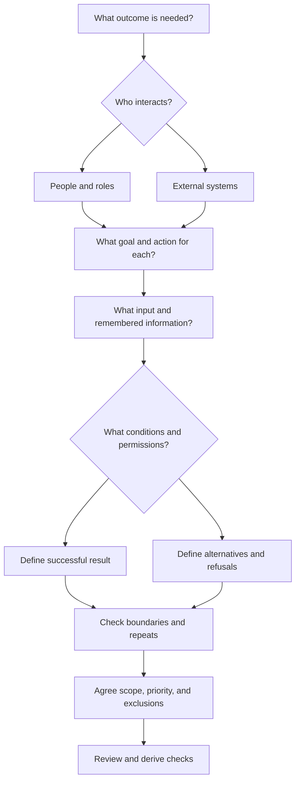
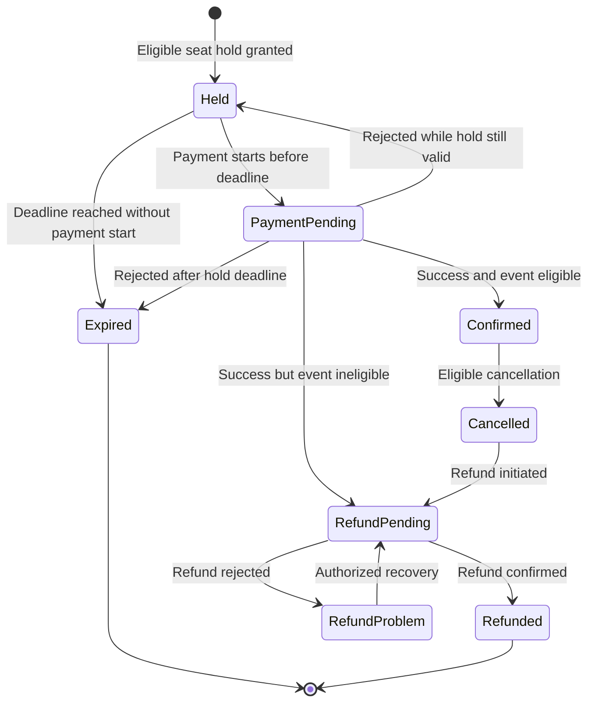

*Part 4 of 5 of [Functional Requirements](/tutorials/system-design/functional-requirements) · Sections 47–65.* These sections provide worked problems and interview practice. New to the topic? Start with [Functional Requirements Fundamentals](/tutorials/system-design/functional-requirements/fundamentals).

## 47. Mini requirements document: Todo application

### Product goal

Help one person record and complete everyday tasks. “Todo” means something that remains to be done.

### Actors

One local task-list user. No external identity or notification provider in this version.

### In scope

Create, view, edit, complete, reopen, and delete tasks in one personal list. Remember the list between application visits on the same device.

### Out of scope

Accounts, sharing, synchronized multi-device use, reminders, file attachments. **Synchronization** means coordinating information across copies so they reflect agreed updates; it matters when multiple devices or users can change the same list. Excluding it makes the first product much smaller.

### Functional requirements

- **TODO-FR-01:** The user can create a task with a required nonempty title; new tasks start as Active.
- **TODO-FR-02:** The user can view active and completed tasks in the list.
- **TODO-FR-03:** The user can update a task’s title to another valid title.
- **TODO-FR-04:** The user can change an Active task to Completed.
- **TODO-FR-05:** The user can reopen a Completed task as Active.
- **TODO-FR-06:** The user can delete a task after confirming the requested deletion.
- **TODO-FR-07:** The application restores the saved list when reopened on the same device, under the agreed local-storage conditions.
- **TODO-FR-08:** If saving fails, the system informs the user that the change was not saved rather than showing a false saved confirmation.

### Business rules

- **TODO-BR-01:** A title contains 1–200 characters after leading/trailing spaces are removed. This is a proposed teaching limit.
- **TODO-BR-02:** Duplicate titles are allowed; tasks remain distinct by identifier.
- **TODO-BR-03:** Confirmed deletion has no undo in this version. **Undo** means reverse a previously completed action; excluding it must be explicit.

### Error cases

Empty/overlong titles are rejected with the field rule. A task already deleted cannot be edited. Save failure leaves the change visibly unsaved or restores the previous saved value according to a documented interface policy.

### Optional features

Due dates, priorities, filtering, undo deletion. **Filtering** means showing only items meeting selected conditions, such as completed tasks.

### Open questions

Does task order follow creation time or user-selected order? Is the list expected to survive application removal or device replacement? What should happen if the device’s stored information is cleared? The current local-only requirement does not promise recovery after such loss.

## 48. Practical exercise 1: ATM

**Prompt:** “An ATM allows bank customers to interact with their bank account.”

Before reading the solution, identify actors, capabilities, at least six requirements, two rules, two errors, and two edge cases. Do not assume deposits or every bank operation are included.

### Worked solution

**Actors:** Customer; external bank account system; cash-replenishment/maintenance operator if operational management is in scope.

**Proposed capabilities:** Verify identity, show available balance, withdraw cash, end the interaction. Deposits and transfers are open scope decisions.

- **ATM-EX-01:** Customers can verify supported card access using the agreed PIN process.
- **ATM-EX-02:** Verified customers can view available balance for an eligible linked account.
- **ATM-EX-03:** Verified customers can request a permitted withdrawal amount.
- **ATM-EX-04:** The ATM refuses a withdrawal exceeding available balance or the configured withdrawal limit.
- **ATM-EX-05:** Approved withdrawals coordinate cash dispensing and bank recording as defined in Section 11.
- **ATM-EX-06:** The ATM offers a receipt of the known outcome.
- **ATM-EX-07:** Customers can end the interaction; the ATM clears access before serving another customer.
- **ATM-EX-08:** If maintenance is included, authorized operators can mark the ATM unavailable and record replenishment under policy.

**Rules:** Supported cash denominations; account-specific limits; identity-attempt policy. Define limits rather than inventing a real bank’s policy.

**Errors:** Incorrect PIN; unsupported card; unavailable bank connection; insufficient balance; cash dispensing failure.

**Edge cases:** Amount zero; amount not divisible into supported notes; final available cash; abandoned interaction; duplicate withdrawal request; uncertain partial dispensing.

**Why this is complete enough to refine:** It covers access, reads, writes, outcomes, and ending access. A statement like “ATM supports banking” would not reveal any of those obligations.

## 49. Practical exercise 2: public library

**Prompt:** “Design software for a public library.”

Try to identify who searches, who records loans, whether reservations target titles or specific copies, and how fines work. Write a main borrowing journey before listing requirements.

### Worked solution

**Actors:** Member, librarian, administrator; optional external payment provider for fines. A **member** is a person registered to borrow. A **loan** records temporary borrowing. A **reservation** records a request for future access. Distinguishing book titles from physical copies matters: a library may own five copies of one title.

**Proposed journey:** Member searches → finds title → librarian selects available copy → eligibility checked → loan recorded with due date → member returns copy → loan closed and any charge assessed.

- **LIB-FR-01:** Members and visitors can search titles by agreed title, author, or category fields.
- **LIB-FR-02:** The system shows each title’s copy availability and reservation eligibility.
- **LIB-FR-03:** Authorized librarians can issue an available copy to an eligible member and record its due date.
- **LIB-FR-04:** The system refuses a loan that breaches the agreed borrowing limit or account restrictions.
- **LIB-FR-05:** Authorized librarians can record a returned copy and close its active loan.
- **LIB-FR-06:** Members can reserve eligible titles when immediate borrowing is unavailable.
- **LIB-FR-07:** The system offers a returned copy to the next eligible reservation under the queue policy.
- **LIB-FR-08:** Members can cancel their own active reservations.
- **LIB-FR-09:** The system calculates overdue charges using the approved fine policy and shows the amount and basis.
- **LIB-FR-10:** Authorized staff can record fine payment or a permitted waiver with its reason.
- **LIB-FR-11:** Authorized staff can add copies, mark lost/damaged copies unavailable, and retain relevant loan history.

A **waiver** is an authorized decision not to require a charge. It matters because staff exceptions need explicit authority and records.

**Rules:** Loan duration, maximum active loans, reservation ordering, collection deadline, fine policy. Some libraries charge no overdue fines; do not assume fines merely from the word “library,” though this exercise explicitly asks us to consider them.

**Errors/edges:** Already-loaned copy; expired membership; return recorded twice; copy lost while reserved; simultaneous issue attempts; fine at the exact due-time boundary. The system must not create two active loans for one physical copy.

## 50. Practical exercise 3: food delivery

**Prompt:** “Design a food-delivery application.”

Before reading: identify customer, restaurant, delivery partner, and administrator goals. What happens when a restaurant refuses an order after payment?

### Worked solution

**Actors:** Customer places orders; restaurant manages availability and preparation; delivery partner collects and delivers; administrator manages permitted disputes/settings; payment provider handles payment.

**Core journey:** Browse restaurant → select available meals → specify address → confirm total → submit/pay → restaurant accepts → partner collects → delivery confirmed.

- **FOOD-FR-01:** Customers can browse restaurants serving the entered delivery area.
- **FOOD-FR-02:** Customers can view current menus, prices, and availability.
- **FOOD-FR-03:** Customers can create a cart from one restaurant under this proposed MVP rule.
- **FOOD-FR-04:** The system validates service area, availability, and final total before submission.
- **FOOD-FR-05:** Customers can submit and pay for an order using the agreed method.
- **FOOD-FR-06:** Restaurants can accept or reject submitted orders within the agreed decision policy.
- **FOOD-FR-07:** Rejection cancels the order and initiates required payment release or refund under the payment-timing policy.
- **FOOD-FR-08:** Restaurants can mark accepted orders Preparing and Ready for pickup.
- **FOOD-FR-09:** Eligible delivery partners can accept offered delivery work and record pickup.
- **FOOD-FR-10:** Delivery partners can record delivery completion or a delivery problem.
- **FOOD-FR-11:** Customers can view their order’s current status.
- **FOOD-FR-12:** Customers can request eligible cancellation; the system applies the agreed stage and fee rules.
- **FOOD-FR-13:** Authorized administrators can record and resolve an order dispute under policy.

**Payment release** means releasing money previously reserved but not finally collected, if the payment method supports that process. It differs from refunding already collected money. Requirements must reflect the agreed payment process.

**Rules:** Service boundaries, restaurant acceptance deadline, cancellation eligibility, partner assignment, refund amount. **Errors/edges:** Restaurant closes after browsing; meal unavailable; partner declines; address unserviceable; no delivery partner; payment unresolved; duplicate restaurant acceptance; customer unreachable.

Do not silently substitute a meal or mark a failed delivery Delivered. Those are product decisions, not implementation shortcuts.

## 51. Practical exercise 4: ride sharing

**Vague prompt:** “Design a simple Uber-like application.” We mean a hypothetical ride-request application.

**Try:** Rewrite “Users can book rides” into a complete journey with rejection and cancellation behavior.

### Clarifying questions

Do we need immediate rides or scheduled rides? Which actors operate the application? Does the customer select a destination before requesting? Can drivers decline? What happens when no driver is available? How is price confirmed? When may each actor cancel? Are payments in scope?

### Proposed MVP solution

**Goal:** A passenger requests an immediate ride, a driver accepts, and both can follow the trip to completion.

- **RIDE-FR-01:** Eligible passengers and drivers can sign in under the agreed account process.
- **RIDE-FR-02:** Passengers can submit a supported pickup and destination and see the agreed price estimate or offer before requesting.
- **RIDE-FR-03:** Passengers can request one active immediate ride under the proposed account rule.
- **RIDE-FR-04:** Eligible available drivers can receive, accept, or decline ride offers.
- **RIDE-FR-05:** At most one driver is assigned to a ride; later conflicting acceptance attempts are refused.
- **RIDE-FR-06:** The passenger sees the assigned driver and ride status, or a no-driver result when the agreed search policy ends.
- **RIDE-FR-07:** The assigned driver can record arrival, pickup/trip start, and trip completion in valid order.
- **RIDE-FR-08:** Passengers and drivers can cancel eligible requests under the specified stage and fee rules.
- **RIDE-FR-09:** The system calculates the final charge under the agreed pricing rule and records the payment outcome.
- **RIDE-FR-10:** Both parties can view their own completed trip details.

**States:** Requested → Assigned → Driver arrived → In progress → Completed; eligible early states may transition to Cancelled. No-driver search ends in Unfulfilled.

**Important edges:** Passenger cancels as driver accepts; two drivers accept; inaccurate pickup address; driver cannot reach passenger; payment pending after completion. A completed physical trip must not disappear because payment failed.

**Exclude initially:** Shared rides, scheduled rides, subscriptions, loyalty schemes, multi-stop journeys, complex dynamic pricing, detailed ratings. **Dynamic pricing** changes price based on conditions such as demand; excluding it avoids an additional pricing policy. Exclusion does not mean basic operational safeguards or applicable obligations may be ignored in a real deployment.

## 52. Practical exercise 5: video platform

**Prompt:** “Design a basic YouTube-like system.”

Before reading: Who uploads? Who watches? How does a viewer find a video? Which behavior is essential, and which can wait?

### Worked solution

**Actors:** Uploader, viewer, administrator/moderator if moderation is included. **Capabilities:** Upload, make available, watch, manage owned videos.

**Proposed MVP:** Signed-in uploaders submit supported videos with titles. Visitors watch public ready videos by link. Uploaders see readiness/failure status and remove owned videos. Missing/unavailable videos show clear results. These correspond to VID-FR-01 through VID-FR-06 in Section 37.

Additional clarifications: maximum file size; supported formats; public versus private visibility; owner edits; paused/resumed watching; age/content restrictions; whether discovery/search is required for the MVP. **Playback** is presenting the video over time; basic playback controls include play and pause. Those are observable functions, not a storage choice.

**Optional:** Search, comments, likes, subscriptions, recommendations, viewing history, captions. **Captions** are text representing speech and relevant sounds; they may be essential for the actual audience or obligations, so “optional” here is a teaching scope proposal to confirm.

**Initially excluded:** Live streaming, monetization, advertising, voice chat, advanced recommendation behavior. **Live streaming** transmits video as it happens; **monetization** supports earning money from content. Each changes capabilities and rules substantially.

**Errors/edges:** File rejected; upload interrupted; preparation fails; owner deletes while another viewer is opening it; link points to removed content. Define whether active playback stops immediately on removal or may finish under an agreed policy.

## 53. Requirement-writing exercises: 20 rewrites

Cover the solution columns and rewrite every poor requirement. Use the six questions in Section 25.

| # | Poor requirement | Complete example solution | Explanation |
|---|---|---|---|
| 1 | The app should have search | Customers can search available products using keywords contained in product names or descriptions | Names actor, object, and search fields |
| 2 | Users manage profiles | Signed-in users can change their own display name to a value satisfying the display-name rule | Narrows “manage” into a testable action |
| 3 | Checkout is good | Customers can submit a nonempty eligible cart after confirming a valid address and final total | Replaces opinion with behavior |
| 4 | Fix wrong data | The system rejects a missing required address field and identifies the field while preserving accepted entries | Defines rejection and recovery |
| 5 | Accounts are private | The system refuses access to order details by anyone other than the owner or an explicitly authorized staff role | Specifies permission behavior |
| 6 | Save documents | Document owners can save valid content and receive a saved confirmation only after the save succeeds | Defines ownership and honest confirmation |
| 7 | Do bookings | Customers can confirm an available event seat after satisfying the agreed payment conditions | Identifies object and prerequisite |
| 8 | No duplicate stuff | Retrying the same booking request must not produce a second confirmed booking or charge | Defines the duplicate being prevented |
| 9 | Add notifications | The system sends the customer a shipment notification when their order enters Dispatched | Names event and recipient |
| 10 | Returns supported | Customers can request a return for delivered items eligible under the return policy | Makes eligibility explicit |
| 11 | Delete chats | A participant can hide a conversation from their own history without removing it from other participants’ histories | Clarifies deletion meaning |
| 12 | Admin controls users | Authorized administrators can suspend an account and record the reason | Names action and required information |
| 13 | Easy uploads | Uploaders can submit the listed supported formats and receive a clear rejection for unsupported formats | Extracts behavior; “easy” needs a separate usability criterion |
| 14 | Cancel whenever | Customers can cancel their own order only before dispatch; later requests are refused with the current state | Defines boundary and failure |
| 15 | Deal with missing links | Opening an unknown short identifier returns an unknown-link result without redirection | Describes exact response |
| 16 | Have money transfers | An eligible customer can submit a transfer to a valid recipient, subject to balance and transfer-limit rules | Names key conditions; more outcome requirements follow |
| 17 | Update quantities | Customers can change cart quantities to whole numbers within the permitted range; totals are recalculated | Defines valid input and result |
| 18 | Password forgotten | A user with a valid unused reset link can choose a new password satisfying the password rule | Turns situation into behavior |
| 19 | Show everything | A customer can view the items, total, payment status, and shipment status of their own order | Lists fields and scope |
| 20 | Videos removable | The system removes a video from new public playback requests when its owner confirms removal | Clarifies actor, trigger, and effect |

These are example solutions, not the only correct wording. For entry 16, derive separate requirements for insufficient balance, unknown payment outcome, transfer status, and duplicate submission. A clear high-level statement can still need decomposition.

## 54. Classification exercises: 30 statements

Use six labels: **FR** functional requirement; **NFR** non-functional requirement; **I** implementation detail; **BR** business rule; **C** constraint; **U** unclear requirement. Categories can overlap; use the primary reading here, then explain any overlap. A rule becomes an FR when we explicitly require the system to enforce it.

A **millisecond** is one thousandth of a second. **Caching** means keeping a reusable copy of information to avoid repeating work. **Durability** is the property that acknowledged stored information remains retained under the specified failure conditions. These ideas matter when classifying the quality of storage or response behavior; later study covers their implementation.

### Statements: answer before reading the key

1. Users can upload profile photos.
2. Under the agreed workload, 95% of profile-photo loads finish within 500 milliseconds.
3. Images will be stored in Amazon S3; this is the proposed storage design.
4. Orders of at least $50 qualifying subtotal receive free delivery.
5. The solution must use the company’s existing payment provider.
6. The application should be amazing.
7. The system refuses registration when the email already belongs to an account, using the agreed feedback policy.
8. Sending messages must meet the agreed 99.9% monthly availability measure.
9. Use Redis to cache product information in the proposed design.
10. A library member may borrow at most five copies at once under this library’s policy.
11. Hosting must use the company’s approved AWS account.
12. The system supports users.
13. Customers can view their own order history.
14. The checkout page must pass the agreed keyboard-only usability checks.
15. Use WebSockets for the proposed connected-message delivery design.
16. Riders below the product’s minimum age are ineligible to request rides.
17. The system rejects a ride request from an account below the configured minimum age.
18. Users can find products easily.
19. Owners can set a link expiration time.
20. Under the defined workload, 95% of redirections finish within 100 milliseconds.
21. Use PostgreSQL as the proposed task storage design.
22. Integration must use the organization’s existing identity provider.
23. After dispatch, customers cannot cancel orders under the store’s policy.
24. The system refuses customer cancellation when the order has been dispatched.
25. Payments are secure.
26. Customers can request an eligible refund.
27. Saved acknowledged notes must survive the specified recovery test without information loss.
28. Use background workers for the proposed receipt-processing design.
29. The project must remain within the approved budget.
30. Make notifications better.

### Answer key with explanations

| # | Label | Why |
|---|---|---|
| 1 | FR | Enables upload behavior; supported inputs still need detail |
| 2 | NFR | Specifies a measurable speed property |
| 3 | I | Selects storage in a proposed design |
| 4 | BR | States an eligibility/pricing policy independent of software |
| 5 | C | Mandates a solution partner |
| 6 | U | No behavior or evaluation condition |
| 7 | FR | Specifies a conditional refusal |
| 8 | NFR | Specifies availability quality with a defined measure |
| 9 | I | Names a proposed storage/reuse technique |
| 10 | BR | States a borrowing rule |
| 11 | C | Restricts the hosting environment |
| 12 | U | “Supports” could mean several unrelated needs |
| 13 | FR | Enables an owned-information read |
| 14 | NFR | Defines an interface usability/accessibility condition |
| 15 | I | Selects a communication mechanism |
| 16 | BR | Defines eligibility policy |
| 17 | FR | Requires software to enforce that policy |
| 18 | U | Hints at search and usability but defines neither adequately |
| 19 | FR | Enables an owner action |
| 20 | NFR | Defines a timed quality target |
| 21 | I | Selects a database as a design choice |
| 22 | C | Mandates an integration dependency |
| 23 | BR | States the store’s cancellation policy |
| 24 | FR | Defines the software response implementing the policy |
| 25 | U | Security aspiration lacks protection details or checks |
| 26 | FR | Enables a refund request; eligibility needs a linked definition |
| 27 | NFR | States a durability/recovery quality obligation |
| 28 | I | Chooses how receipt processing is performed |
| 29 | C | Limits project resources |
| 30 | U | Missing actor, event, channel, and expected improvement |

## 55. Missing-requirement exercises

**Exercise A:** “Users can transfer money to another account.” What needs clarification?

**Exercise B:** “Users can upload files.” What is missing?

**Exercise C:** “Customers can cancel bookings.” What is missing?

Write questions before reading the solutions. A **transfer** moves money between accounts. Hidden requirements matter especially when incorrect results are costly or hard to reverse.

### Solutions

**A: transfer questions:** Who can transfer from which account? Is the recipient registered or externally specified? Which currencies? What amount limits and fees apply? How is available balance checked? Is confirmation required? Can a transfer be cancelled, and until when? What if the recipient is invalid? What states distinguish pending, completed, and rejected? How are duplicate requests handled? What is shown when the external outcome is unknown? What history and receipt does the customer receive?

Derived requirements for a simplified banking example:

- **BANK-FR-01:** An authenticated customer can view balances for accounts they are authorized to access.
- **BANK-FR-02:** An eligible customer can submit a transfer from an owned eligible account to a validated supported recipient.
- **BANK-FR-03:** The system shows the amount, currency, recipient, and applicable fee for confirmation before committing the transfer.
- **BANK-FR-04:** The system refuses transfer requests exceeding the available balance or agreed limits.
- **BANK-FR-05:** The system records one transfer for one confirmed request and prevents a retry of that request from creating a second transfer.
- **BANK-FR-06:** The customer can view pending, completed, or rejected transfer status and relevant history.
- **BANK-FR-07:** An uncertain external outcome remains pending until reconciliation establishes the result.
- **BANK-FR-08:** The system refuses access to another customer’s accounts without an expressly granted authority.

This is a teaching specification, not a complete specification for operating a regulated banking product. The important learning point is the discovery of behavior, including confirmation and uncertainty.

**B: upload questions:** Who uploads? Which formats/sizes? Required description? Who sees the file? Can users replace or delete it? What happens to interrupted uploads? When is it considered ready? Can the same request create duplicates? What should unsupported files do?

**C: cancellation questions:** Who owns the booking? What cancellation deadline and time zone apply? Which states allow cancellation? What refund or fee follows? What if the event has already begun? What if cancellation races with confirmation? Can a cancelled seat be sold again? Is the cancellation reversible?

Finding hidden requirements means testing assumptions, not adding every imaginable feature.

## 56. Edge-case exercises

For each system below, list at least four boundary or unusual situations. Then specify the expected behavior rather than merely naming the situation.

A **timeout** means the expected response did not arrive within a chosen waiting period; it does not prove the operation failed. A **hold** temporarily reserves something, such as a seat. **Compensation** is corrective business work after an earlier action cannot be completed as intended, such as refunding a paid but unconfirmable booking. These definitions matter when requirements must keep users accurately informed after interrupted interactions.

| System | Detailed solution examples |
|---|---|
| Login | Empty credentials: reject required fields. Wrong password: refuse access using agreed neutral message. Suspended account with correct password: restrict access under policy. Repeated failed attempts: apply configured attempt controls. Lost response after success: do not create contradictory access states. Password changed during an existing session: follow explicit session-revocation policy |
| Shopping cart | Quantity zero: remove or reject per policy. Final unit bought elsewhere: recheck and refuse unavailable purchase. Same variant added twice: combine intended additions. Empty cart: block checkout. Changed price: show new total and reconfirm. Retired product: preserve explanatory cart entry but block purchase |
| Payments | Definite rejection: show failure and no paid order. Timeout: keep pending and resolve. Repeated submit: one intended charge. Wrong amount from provider: do not mark the order paid; flag for resolution. Partial refund: record amount and remaining refundable balance. Repeated success notification: do not create a second order |
| Ticket booking | Two people select final seat: confirm at most one. Hold expires during payment: apply agreed hold/payment ordering and compensation rule. Event cancelled: apply notification and refund policy. Invalid seat: refuse request. Duplicate booking submit: one booking. Payment succeeds but confirmation response is lost: return/recover the same booking, not a new purchase |
| Chat messaging | Empty text: refuse. Recipient unavailable or disallowed: refuse under policy. Offline recipient: preserve accepted message for later access under retention rules. Duplicate retry: do not create another message. Two messages with equal displayed time: use the agreed ordering rule. Deleted conversation receives new message: apply explicit reappearance policy |

## 57. Mock interview: beginner URL-shortener discovery

Focus on discovery only. Each candidate question is followed by a teaching comment.

**Interviewer:** Design a URL shortener.

**Candidate:** May I focus on creating short links and redirecting visitors, or do you want link management and analytics too?

**Why useful:** Establishes the core goal and offers a bounded scope.

**Interviewer:** Creating and redirecting are enough.

**Candidate:** Can anyone create a link without signing in?

**Why useful:** Determines whether accounts and ownership are necessary.

**Interviewer:** Yes, no accounts.

**Candidate:** Should creators choose aliases, or should the system choose them?

**Why useful:** Reveals a functional naming choice and conflict cases.

**Interviewer:** System chooses.

**Candidate:** Should links expire or be deletable in this version?

**Why useful:** Clarifies lifecycle behavior without assuming optional management functions.

**Interviewer:** Neither for now.

**Candidate:** Can I assume supported destinations are valid `http` or `https` URLs, with invalid inputs rejected?

**Why useful:** Establishes input scope and refusal behavior. It does not promise destination reachability.

**Interviewer:** Yes.

**Candidate:** Should an unknown short link show an unknown-link result rather than redirect anywhere?

**Why useful:** Defines a simple failure response.

**Interviewer:** Correct.

**Candidate:** Should I use Redis?

**Why unnecessary at this stage:** It is a design question; core behavior should be summarized first.

**Candidate:** Let me confirm: anonymous creation, system-chosen aliases, supported-URL validation, redirect existing links, and report unknown links. No accounts, deletion, expiration, or analytics.

**Why useful:** Turns answers into a shared scope agreement.

### Clean requirements

- **SHORT-FR-01:** Any creator can submit a supported valid long URL and receive a system-assigned shortened URL.
- **SHORT-FR-02:** Invalid or unsupported destination inputs are refused with the supported-input explanation.
- **SHORT-FR-03:** Visitors opening an existing shortened URL are redirected to its associated destination.
- **SHORT-FR-04:** Unknown short identifiers produce an unknown-link result.

The next discussion can cover quality targets and workload. Discovery does not require prematurely choosing storage.

## 58. Mock interview: food-delivery platform

**Interviewer:** Design an online food-delivery platform.

**Candidate:** I see customers, restaurants, and delivery partners as core actors, with payment support outside our boundary. Should administrators handle disputes in the initial scope?

**Critique:** Strong actor identification, including an external dependency. Ask for essential administration rather than assuming a large back-office product.

**Interviewer:** Include basic dispute handling. Focus on single-restaurant orders and immediate delivery.

**Candidate:** I propose browsing available menus, placing/paying for an order, restaurant acceptance, partner assignment, pickup, delivery confirmation, and customer tracking. Exclude subscriptions and scheduled orders. Does that match your goal?

**Critique:** Strong capability and scope summary; it describes a coherent end-to-end MVP.

**Interviewer:** Yes.

**Candidate:** Is payment collected before restaurant acceptance, and what should happen if the restaurant rejects the order?

**Critique:** Valuable workflow question because payment timing changes refund/release behavior.

**Interviewer:** Collect first; rejected orders receive full refunds.

**Candidate:** When can the customer cancel, and should there be a fee?

**Critique:** Finds a business rule. It avoids copying the policy of a real application.

**Interviewer:** Free cancellation before the restaurant accepts; no customer cancellation afterward for this exercise.

**Candidate:** What if no delivery partner accepts, or two partners accept the same work?

**Critique:** Covers both failure and competing actions. The required outcome must be stated before selecting coordination mechanisms.

**Interviewer:** Only one partner may be assigned. If assignment fails by the configured deadline, cancel and refund.

**Candidate:** May restaurants reject unavailable meals rather than substitute without customer approval?

**Critique:** Useful clarification of restaurant authority and customer consent.

**Interviewer:** Yes. Exclude substitution.

**Candidate:** For the MVP, I’ll treat menu availability, checkout validation, confirmed payment, acceptance/refusal, one-partner assignment, stage updates, tracking, and specified cancellation/refunds as Must. Basic dispute recording is also Must. Reviews and promotions are outside scope.

**Critique:** Good prioritization tied to the agreed goal. Refund completion may be delayed; show status rather than claiming immediate money arrival.

### Final requirement summary

- **FDI-FR-01:** Customers can browse available meals from restaurants serving their address.
- **FDI-FR-02:** Customers can submit a valid single-restaurant cart and pay the confirmed total.
- **FDI-FR-03:** Restaurants can accept or reject a paid submitted order.
- **FDI-FR-04:** Restaurant rejection cancels the order and initiates a full refund.
- **FDI-FR-05:** Customers can cancel before restaurant acceptance without a fee; later cancellation requests are refused.
- **FDI-FR-06:** Eligible partners can accept offered delivery work; at most one partner is assigned.
- **FDI-FR-07:** Assignment failure at the configured deadline cancels the order and initiates a full refund.
- **FDI-FR-08:** Assigned actors can record preparation, pickup, and delivery transitions within their permissions.
- **FDI-FR-09:** Customers can view their own order and refund status.
- **FDI-FR-10:** Authorized administrators can record and resolve disputes under the agreed policy.

**Remaining decisions:** Exact assignment deadline; invalid delivery-address recovery; customer unreachable at delivery; external payment uncertainty. A good candidate distinguishes clarified scope from unresolved details rather than claiming the specification is finished.

## 59. Interview question bank

Try each question aloud before reading the answers. A strong answer explains behavior and reasoning, not just a memorized keyword.

### Ten beginner questions

| # | Question | Strong answer | Weak answer | Evaluating | Follow-up |
|---|---|---|---|---|---|
| B1 | What is a system? | Connected parts receive inputs, perform work, and produce results for a purpose; an ordering desk is an example | A computer | Foundational model | What is its boundary? |
| B2 | What is a requirement? | An agreed need or obligation to satisfy, such as letting members reserve books | A suggestion | Purpose of specification | How would you check it? |
| B3 | What is an FR? | Required observable behavior, including conditions and failure responses | A feature name | Behavior reasoning | Give an error FR |
| B4 | FR versus NFR? | Sending a message is behavior; a measured sending-time target is quality | FR is important; NFR is optional | Category distinction | Can security include both? |
| B5 | What is an actor? | A role outside the boundary interacting with the system; a payment provider can be one | Only a customer | Participant discovery | Is an internal worker an actor? |
| B6 | What is a use case? | A goal-oriented interaction describing conditions, success, alternatives, and failures | A screen | Structured interaction | Name its postcondition |
| B7 | What is a workflow? | An ordered set of actions and decisions toward an outcome | A list of technologies | Sequencing | Where does payment failure branch? |
| B8 | What is state? | An item’s current meaningful condition that determines allowed actions, such as Dispatched | Where data is stored | Lifecycle reasoning | Can dispatched orders cancel? |
| B9 | What is CRUD? | Create, Read, Update, Delete: a starting checklist for information operations | All requirements | Information discovery | Give a non-CRUD action |
| B10 | What is scope? | The agreed included and excluded behavior for the problem or release | Everything in the real app | Focus | What would you exclude from a basic shortener? |

### Ten intermediate questions

| # | Question | Strong answer | Weak answer | Evaluating | Follow-up |
|---|---|---|---|---|---|
| M1 | Why are error cases FRs? | They specify required responses and information effects when success is impossible | Developers handle them later | Completeness | What changes after rejection? |
| M2 | Story versus FR? | A story captures actor, desire, and purpose; detailed FRs and criteria establish precise behavior | They are identical in every context | Specification levels | Add criteria to a story |
| M3 | Rule versus behavior? | “Five loans maximum” is policy; “refuse the sixth loan” is enforcement behavior | Every rule is an API | Classification | How are they linked? |
| M4 | What makes an FR testable? | Defined condition/action and observable result let a check decide pass or fail | It has many words | Quality | Test “support users” |
| M5 | How prioritize? | Tie Must items to the release goal, then examine dependencies and deferrable value | Everything is Must | Judgment | What can be deferred safely? |
| M6 | What is traceability? | Connect need, requirement, related design, and evidence so purpose and impact remain visible | Add numbers only | Change control | What links change after deletion policy changes? |
| M7 | How handle ambiguity? | Ask who acts, on what, under what condition, and what result/failure follows | Guess the common meaning | Clarification | What does “delete message” mean? |
| M8 | What is an edge case? | A boundary or unusual condition exposing assumptions, such as the final available seat | Any bug | Boundary analysis | Expected outcome for two buyers? |
| M9 | Is a database an FR? | A database choice is normally design; a mandated database is a constraint; remembered behavior is the FR | Always yes | Problem/solution separation | What data does order history imply? |
| M10 | How resolve conflicting FRs? | Surface the conflict, identify the decision owner, agree a policy, update linked statements/tests | Build the easier one | Stakeholder reasoning | How resolve deletion versus retention? |

### Ten scenario questions

**Migration**, in a product change, means moving existing information to a new arrangement, such as making the old image the default primary image. It matters because changed behavior must account for existing users, not only new ones.

| # | Question | Strong answer | Weak answer | Evaluating | Follow-up |
|---|---|---|---|---|---|
| S1 | Discover a URL shortener | Clarify anonymous creation, redirect behavior, invalid links, optional alias/expiry/deletion, then confirm scope | Start with Kafka | Discovery | Which are Must? |
| S2 | Two customers book the last seat | Require at most one confirmation and a clear refusal/recovery outcome for the other | Hope it is rare | Correctness | What if the other already paid? |
| S3 | Payment request times out | Preserve pending status, resolve provider outcome, avoid a second charge for the same request | Mark failed and charge again | Uncertainty | What should the user see? |
| S4 | Product price changed in cart | Show the revised total and require confirmation before charging, under policy | Charge whichever price code sees | Business rules | When is price fixed? |
| S5 | User deletes a chat message | Clarify self-only versus all participants, deadline, visible placeholder, and retained records | Erase every copy everywhere | Scope and semantics | What about offline recipients? |
| S6 | Food order rejected after payment | Cancel and initiate the agreed refund; expose status rather than promise instant arrival | Delete the order | Full outcome | What if refund request fails? |
| S7 | Library copy returned twice | Do not create a second return effect or duplicate charges; report current state | Create two returns | Repeat-action behavior | What if a new loan already exists? |
| S8 | Video owner removes a playing video | Clarify new-access refusal and whether current playback stops, then document it | Assume instant global removal | Precise boundaries | Is owner confirmation required? |
| S9 | Ride cancelled as driver accepts | Define transition ordering and one coherent final state, with fees based on that result | Store both statuses | State reasoning | How are both actors informed? |
| S10 | One profile image becomes many | Define maximum, primary selection, migration of existing images, visibility, and older-client behavior | Add a list and finish | Impact analysis | What tests must change? |

## 60. Common beginner misconceptions

| Misconception | Why it is wrong | Better understanding |
|---|---|---|
| FRs are just features | A feature name omits conditions, permissions, and outcomes | Features organize several precise behaviors |
| Include every possible feature | Unbounded scope prevents focus and coherent delivery | Choose behaviors that achieve the agreed goal |
| Requirements and architecture are the same | A goal can have several solutions | Requirements establish needs; architecture chooses organization |
| The database belongs in the FR list | Storage technology usually names a solution | History requirements imply information retention, not a product choice |
| Error handling is not a requirement | Users and stored information still need defined outcomes on failure | Specify rejection, feedback, recovery, and effects |
| Only users create requirements | Administrators, businesses, external partners, and events generate needs | Discover all relevant stakeholders and actors |
| FRs must describe screens | APIs and automatic work also produce observable behavior | Describe outcomes; specify screens only when genuinely required |
| Requirements never change | Goals, rules, and discoveries evolve | Record changes and update connected work |
| Non-functional means unimportant | Unusable or unprotected behavior can defeat the goal | Both behavior and quality are essential |
| Any number makes a requirement clear | An arbitrary threshold without context may mislead | State source, meaning, and measurement conditions |
| MVP means ignore failures | A product that accepts payment but loses orders is not coherent | Include critical correctness and recovery behavior |

## 61. Mental models

### The restaurant model

Customer requests soup → kitchen prepares or rejects the request → customer receives soup or a clear reason.

Map this to **actor → action → system behavior → result**. Add rules: a sold-out soup cannot be ordered. Add an alternative: choose a different dish. Add a failure: payment rejected. This is already requirements thinking.

### The question model

**WHO wants to do WHAT to WHICH THING, under WHAT CONDITIONS, and what should HAPPEN?**

Example: A signed-in customer wants to cancel their own order before dispatch; the system marks it Cancelled and initiates the agreed payment correction.

### The boundary model

For a number or deadline, ask **below, at, above**. For a permission, ask **allowed actor, disallowed actor**. For an operation, ask **success, definite rejection, unknown outcome, repeated request**. This small pattern discovers many important cases without memorizing every product.

## 62. Requirement-discovery decision tree

Begin at the top and follow each branch. This is a set of discovery questions; decisions lead you back to refine earlier answers.

For a beginner: choose one actor’s goal, write one successful example, then ask what stops it. Describe the response to each important obstacle. Repeat for the next actor. Finish by agreeing what you will intentionally leave out. You do not need architectural vocabulary to follow this tree.

## 63. Reusable functional-requirements checklist

### Actors

- [ ] Who uses the system, and in which roles?
- [ ] Which external systems exchange requests or results?
- [ ] Where is the boundary? Are internal jobs being mistaken for external actors?

### Actions and objects

- [ ] What can each actor do?
- [ ] What thing does each action affect?
- [ ] What information is created, viewed, changed, or removed?
- [ ] Which non-CRUD behaviors are essential?

### Workflows and state

- [ ] What sequence completes each actor’s goal?
- [ ] Which prerequisites must hold?
- [ ] What states exist and what transitions are valid?
- [ ] What happens when competing actions request incompatible transitions?

### Business rules and validation

- [ ] What eligibility, pricing, limits, deadlines, and restrictions apply?
- [ ] Which fields are required, optional, and constrained?
- [ ] Are thresholds and time zones defined?

### Errors and permissions

- [ ] What can fail, and what can remain uncertain?
- [ ] What should the actor see and be able to do next?
- [ ] What information changes or stays unchanged?
- [ ] Who may act on which items?
- [ ] What happens on a duplicate or repeated request?

### Scope and priority

- [ ] What is explicitly included and excluded?
- [ ] Which capabilities are essential to a coherent MVP?
- [ ] Are optional features creating hidden prerequisites?

### Quality and review

- [ ] Are quality targets separated from behavior?
- [ ] Are solution constraints recorded distinctly?
- [ ] Are assumptions, open decisions, and conflicts visible?
- [ ] Can examples and acceptance checks demonstrate each requirement?
- [ ] Can each requirement be traced to a justified need?

## 64. Reusable interview template

“Before discussing architecture, I’d like to clarify the core functionality.

1. Who are the primary users and external actors?
2. What main actions must they complete?
3. What functionality is essential for the MVP?
4. Which business rules and permissions affect those actions?
5. What should happen in important failures, uncertain outcomes, and edge cases?
6. What should we explicitly exclude?

I’ll summarize the agreed requirements, then discuss quality targets and design.”

Adapt it to the problem:

| Problem | High-value adaptation |
|---|---|
| URL shortener | Anonymous creation? Alias, expiry, deletion, or analytics? |
| Messaging | One-to-one or groups? Offline delivery? Deletion meaning? |
| E-commerce | Guest checkout? Stock rules? Payment/order timing? Returns? |
| Ride sharing | Immediate or scheduled? One-driver assignment? Cancellation? |
| Video | Upload and watch only? Public/private? Discovery? Removal? |
| Banking | Account authority? Recipient validation? Limits? Pending/duplicate transfer behavior? |

Use the template as a prompt for reasoning, not a script that asks irrelevant questions after the answer is already known.

## 65. Complete worked case study: basic ticket booking

**Starting sentence:** “Users should be able to book tickets for events.”

Do not choose servers or a database yet. We will turn this sentence into behavior first.

### Step 1: product goal

Let customers obtain a confirmed ticket for an available event seat and retrieve proof of booking later. A **ticket** is proof of a booking entitlement; an **event** here is a scheduled concert or performance, distinct from the earlier general meaning “something happened.” Stating the meaning prevents confusion.

### Step 2: actors

Customer, event administrator, external payment provider. A venue entry checker could validate admission, but that capability is excluded from this teaching MVP. We are building booking, not the entire event operation.

### Step 3: clarifying questions and example answers

| Question | Agreed teaching assumption |
|---|---|
| Assigned seats or general admission? | Assigned seats |
| Must customers sign in? | Yes, to book and retrieve owned tickets |
| How many seats per booking? | One in the MVP |
| Is payment required? | Yes, before a booking is confirmed |
| Can selecting a seat reserve it temporarily? | Yes, a five-minute hold using system time |
| Can customers cancel? | Before the event start; full refund under this teaching policy |
| What if payment is unresolved near expiry? | A payment started before expiry keeps the seat in PaymentPending for resolution; do not sell it while outcome is unknown |
| Can administrators cancel events? | Yes; stop sales and initiate refunds for confirmed bookings |
| Are transfers/resale/seat changes included? | No |

These choices are a specification exercise, not universal ticketing policies. A real product must define a payment-resolution deadline and authorized exception handling. Never release a pending seat merely because the customer did not receive a response.

### Step 4: core capabilities

Browse events and seats; hold a seat; pay; confirm a booking; retrieve a ticket; cancel eligible bookings; manage events and event cancellation.

### Step 5: user journey

| Step | Behavior discovered |
|---|---|
| Open event list | Display events open for booking |
| Choose event | Show schedule, price, and seat availability |
| Sign in and choose seat | Check identity and obtain an available-seat hold |
| Review selection | Show seat, total, and hold deadline |
| Confirm payment | Begin one payment attempt while hold is eligible |
| Wait for outcome | Show pending status until known |
| Payment succeeds | Create one confirmed booking/ticket and make seat unavailable |
| View confirmation | Show booking identifier and retrieve owned ticket |

### Step 6: use case A — book one seat

**Primary actor:** Customer. **Secondary actor:** Payment provider.  
**Goal:** Obtain one confirmed event ticket.  
**Preconditions:** Customer is signed in; event is open and has not started.  
**Trigger:** Customer requests an available seat.

**Main flow:** System grants a five-minute hold → shows seat, total, deadline → customer confirms payment before expiry → system marks attempt pending and keeps seat reserved → provider confirms success → system creates one booking/ticket → customer views confirmation.

**Alternative flows:** Customer selects another available seat before payment; customer abandons the hold and it expires; customer uses a different permitted payment method after a definite rejection while eligibility still holds.

**Error flows:** Seat already held/sold: refuse and show alternatives. Hold expired before payment begins: refuse payment initiation and release seat. Payment rejected: do not confirm booking; permit retry only if the hold remains valid. Unknown payment: retain pending status and resolve. Event cancellation during payment: prevent booking confirmation after cancellation; if collection succeeded, initiate the agreed refund.

**Postconditions:** Success produces one confirmed owned booking and unavailable seat. Definite failure produces no confirmed booking. Pending outcome retains enough information and seat reservation to resolve safely.

### Step 7: use case B — cancel a booking

**Actor:** Booking owner. **Goal:** Cancel an eligible confirmed booking.  
**Preconditions:** Owner is signed in; booking is Confirmed; event has not started.  
**Trigger:** Owner confirms cancellation.

**Main flow:** Check ownership and eligibility → mark booking Cancelled → make the seat available if the event remains open → initiate full refund → show cancellation and refund status.

**Alternative:** Administrator cancels the whole event; all affected confirmed bookings enter the event-cancellation process.

**Error:** Wrong owner: refuse access/action. Already cancelled: return current cancellation result without a second refund. Event started: refuse customer cancellation.

**Postcondition:** Ticket no longer represents admission eligibility; refund may be pending, completed, or failed and must remain visible.

### Step 8: functional requirements

- **TKT-FR-01:** Visitors can view events open for booking and their schedule/details.
- **TKT-FR-02:** Visitors can view seats and their current availability for an event.
- **TKT-FR-03:** Eligible customers can sign in and access their own bookings.
- **TKT-FR-04:** A signed-in customer can hold one available seat for five minutes before the event start, under the system-time rule.
- **TKT-FR-05:** The system refuses competing holds or bookings for a seat already reserved or booked.
- **TKT-FR-06:** The system shows the held seat, confirmed total, and hold deadline before payment confirmation.
- **TKT-FR-07:** A customer can initiate one payment attempt for an eligible hold before its deadline; the seat remains reserved while that attempt’s outcome is unresolved.
- **TKT-FR-08:** Confirmed successful payment creates exactly one owned booking and ticket, provided the event remains eligible.
- **TKT-FR-09:** A definite payment rejection does not create a confirmed booking and is communicated to the customer.
- **TKT-FR-10:** An unknown payment outcome stays pending and is resolved using the agreed payment-resolution process.
- **TKT-FR-11:** A hold with no payment started expires at its deadline and releases the seat.
- **TKT-FR-12:** Customers can retrieve their own ticket and booking status after confirmation.
- **TKT-FR-13:** Customers can cancel their own confirmed booking before the event start.
- **TKT-FR-14:** Accepted cancellation invalidates the ticket, releases an eligible seat for resale, and initiates one full refund under the policy.
- **TKT-FR-15:** Retrying the same intended booking, cancellation, or provider outcome must not create another booking, charge request, or refund request.
- **TKT-FR-16:** Authorized event administrators can create and update event details and seat offerings under the event-management rules.
- **TKT-FR-17:** Authorized event administrators can cancel an event; the system stops sales and initiates the affected-booking refund process.
- **TKT-FR-18:** The system refuses unauthorized booking/ticket access and reports missing or ineligible resources under the agreed feedback policy.
- **TKT-FR-19:** Customers can view refund status; an unsuccessful refund remains recorded for the agreed recovery process.
- **TKT-FR-20:** A successful payment that cannot produce an eligible booking is recorded and initiates corrective refund handling rather than disappearing from history.

Some list items summarize a linked process. In a larger document, split independently accepted obligations into child identifiers while preserving these parent links.

### Step 9: business rules

- **TKT-BR-01:** One booking contains one seat in this MVP.
- **TKT-BR-02:** A seat has at most one active allocation, whether held, payment pending, or booked.
- **TKT-BR-03:** An ordinary hold lasts five minutes measured by system time; eligibility to start payment requires a request accepted strictly before the deadline.
- **TKT-BR-04:** Starting payment on time changes the allocation to PaymentPending; ordinary hold expiry no longer releases it until the payment outcome is resolved.
- **TKT-BR-05:** Booking requires successful payment and an event still eligible for confirmation.
- **TKT-BR-06:** Customer cancellation is allowed strictly before event start and refunds the confirmed paid amount in full under this example policy.
- **TKT-BR-07:** Event dates are shown with their time zone; eligibility comparisons use the same agreed time reference.
- **TKT-BR-08:** Event schedule/price changes affecting existing bookings require an explicitly agreed customer-impact policy; administrators cannot silently rewrite paid ticket terms.

At the exact deadline, “strictly before” means the action is no longer eligible. This removes a boundary ambiguity.

### Step 10: states

The following diagram describes the **booking attempt**, not an event or refund. Keep these distinct: cancellation status and refund completion are not the same fact.

An unknown outcome stays PaymentPending; no state transition invents a result. A fresh selection after Expired is a new attempt. Event eligibility is checked again before confirmation because the event may have been cancelled during payment.

### Step 11: alternative flows, errors, and edge cases

**Alternatives:** Choose another seat; abandon before payment; retry a definitely rejected payment if still eligible; cancel before event start.

**Errors:** Invalid event/seat; unauthorized owner; unavailable seat; expired hold; payment rejection; uncertain payment; refund failure.

**Edges:** Final seat requested simultaneously; duplicate success notification; repeated cancellation; payment response arrives after the original deadline; event cancelled while payment is pending; customer closes the app after payment; administrator changes event start; cancellation submitted exactly at event start.

Each edge has a required result. A customer closing the app does not erase the booking. Duplicate outcomes do not create duplicate purchases. PaymentPending protects the seat while uncertainty is resolved. Event cancellation prevents new confirmations and activates corrective payment handling.

### Step 12: scope, MVP, and optional requirements

**MVP Must:** Browse, identity/access, single-seat allocation, hold eligibility, payment outcome handling, confirmation, ticket retrieval, specified cancellation/refund behavior, essential event administration. Since cancellation was agreed above, it is part of this MVP; another release could exclude customer cancellation explicitly.

**Out of scope:** Seat transfers, resale, multi-seat bookings, waiting lists, admission scanning, promotional codes, live seat recommendations.

**Optional later:** Group bookings, saved payment preferences, reminder messages, waiting-list offers. Each would require additional rules and acceptance criteria.

### Step 13: acceptance criteria

1. Given an available seat and eligible customer, accepting a hold shows its seat, total, and five-minute deadline.
2. Given an existing allocation, another customer cannot obtain the same seat allocation.
3. Given no payment initiation, reaching the hold deadline releases the seat.
4. Given eligible payment initiation before the deadline, the allocation remains reserved while the outcome is unresolved.
5. Given confirmed payment success and an eligible event, the customer can retrieve one confirmed ticket.
6. Repeating the same request or provider success does not create another booking or charge request.
7. Given payment rejection, no confirmed ticket is created; the next available action reflects current hold eligibility.
8. Given an owned confirmed booking strictly before event start, cancellation invalidates the ticket and initiates one refund.
9. Given cancellation at or after event start, the request is refused without changing the confirmed booking.
10. Given event cancellation during pending payment followed by payment success, no usable ticket is confirmed and corrective refund handling is recorded.
11. A different customer cannot retrieve the ticket.
12. Refund failure does not change the ticket back to Confirmed; it records a separate unresolved refund problem.

### Step 14: basic tests

| Test | Linked requirement(s) | Expected evidence |
|---|---|---|
| Ordinary successful booking | 04, 06–08, 12 | One allocation, payment, booking, and retrievable ticket |
| Two customers request final seat | 05 | At most one allocation; other gets unavailable result |
| Unpaid hold expires | 11 | Seat available; expired attempt cannot pay |
| Payment initiated exactly at deadline | 07; BR-03 | Initiation refused |
| Pending payment exceeds original deadline | 07, 10 | Seat remains reserved pending resolution |
| Duplicate submit and success outcome | 15 | No additional purchase/charge request |
| Rejected payment after deadline | 09, 11; workflow | No ticket; allocation released |
| Cancel before event start, twice | 13–15 | Cancelled ticket; one refund initiation |
| Cancel exactly at start | 13; BR-06 | Refused; original booking remains |
| Event cancellation during payment | 17, 20 | No eligible ticket; recorded refund process |
| Different customer opens ticket | 18 | Refused access |
| Refund rejected | 19 | Refund problem visible; ticket remains invalid |

### Step 15: only now consider architecture

Requirements are now input to design. The design must assign responsibility for identity, event/seat information, allocation, payment interaction, booking/ticket retrieval, and refunds. These responsibilities could be parts of one application; separate services are not automatically required. Requirements imply information about events, seats, holds, attempts, bookings, and outcomes. APIs may support seat selection and booking retrieval.

Next clarify workload, speed, availability, information protection, and operating constraints. Then compare solution choices that can satisfy both behavior and quality. For example, FR-05 requires coordination of competing allocations; the implementation mechanism is a later design decision.
