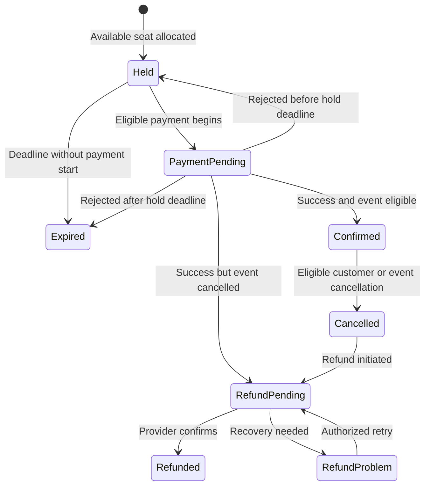
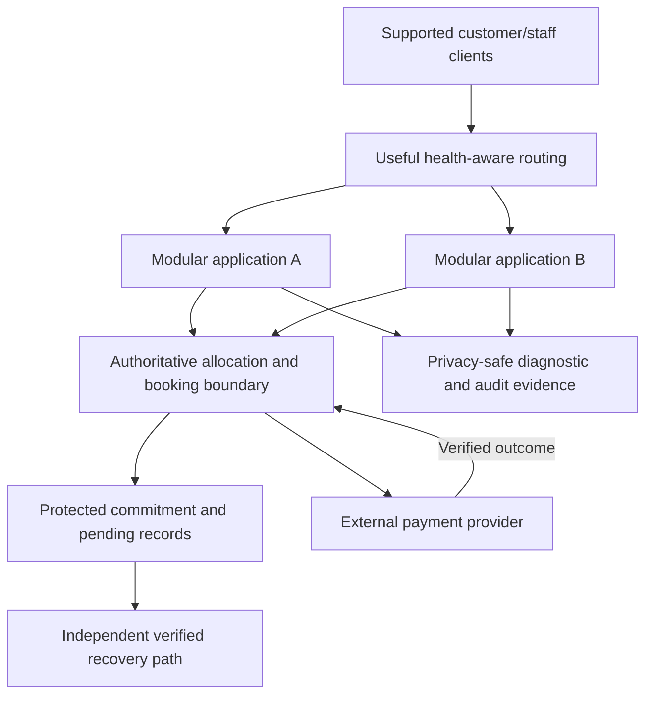

*Part 7 of 7 of [Non-Functional Requirements](/tutorials/system-design/non-functional-requirements) · Sections 97–102.* Finish with a hands-on project, a final case study, and revision material. New to the topic? Start with [Non-Functional Requirements Fundamentals](/tutorials/system-design/non-functional-requirements/fundamentals).

## 97. Hands-on project: define NFRs for an online store

### Instructions

Create a requirement document for a store allowing browsing, search, cart, payment, owned order history, and eligible cancellation. Use invented but explicit assumptions if no stakeholder answers exist. Do not copy every numerical target from this chapter without a reason.

1. Identify the FRs and complete purchase journey.
2. Identify important qualities for each step and information type.
3. Estimate active users, request mix, peaks, stored growth, and geography.
4. Write at least ten NFRs with measurable targets or concrete quality scenarios.
5. Prioritize and explain at least three trade-offs.
6. Propose the simplest plausible design implications without claiming proof.
7. Define measurements, fault/recovery checks, and open decisions.

### Submission template

```text
Product goal and functional scope:
Actors and external dependencies:
Workload/geography/cost assumptions:
Critical journeys and failure consequences:
NFR entries using Section 39:
Priorities and conflicts:
Candidate design responses:
Verification/monitoring plan:
Open decisions and owners:
```

**Traceability** follows connections from a need to requirements, related design, and verification, like linking a cake order to its recipe and checks. It matters for proving purpose and assessing change.

### Evaluation rubric, 100 points

| Criterion | Points | Full-credit evidence |
|---|---|---|
| Goal/FR/journey clarity | 15 | Coherent purchase goal and success/failure boundaries |
| Workload assumptions | 15 | Active traffic, mix, peaks, size, geography, uncertainty |
| Testable NFRs | 25 | Targets/scenarios, scope, conditions, methods, no vague slogans |
| Priorities/trade-offs | 15 | Business consequences and baseline obligations preserved |
| Requirement/solution separation | 10 | Techniques labeled candidates with rationale |
| Verification/operations | 15 | Outcome metrics plus meaningful fault/recovery/access evidence |
| Open decisions/traceability | 5 | Source/owner/links and unresolved gaps visible |

### Complete reference solution

**Goal/actors:** Customers purchase available products; staff maintain catalog/fulfillment; payment provider reports outcomes. **Core FRs:** search/view, add/change cart, validate stock/address/total, submit authorized payment, resolve outcome, create one paid order under policy, retrieve owned history, cancel eligible undispatched orders and show correction/refund status.

**Assumptions:** W1 from Section 75; one region; final checkout total requires confirmation; no overselling; lost responses do not cause another intended purchase. Cost ceiling proposed ₹200,000/month; verify feasibility rather than asserting it.

**NFR document:** Use all 16 entries in Section 75 with the template fields from Section 39. This supplies the reference targets, scope, measurements, reasons, and priorities. Resolve its listed open decisions before approval. In particular, define the single-site acknowledged-order survival model and required independent protection.

**Trade-offs:** Strong inventory commitment may wait/refuse during separation; browsing can serve agreed stale product details. Protected paid-order acknowledgement may take longer than local memory acceptance. Additional zone/site capacity costs resources; use it only for the promised survival/availability scope. Privacy-safe diagnostics may omit bodies while preserving status and correlation.

**Candidate organization:** One modular application with identity, catalog/cart, checkout, and order responsibilities; appropriate persistent order protection; necessary independent serving capacity; provider integration with durable pending-outcome records; deferrable notifications with safe retries; private/accountable operating evidence. Separate services, cache, or another region are added only after the requirements/measurements justify them.

**Verification:** Representative W1 benchmark including checkout bursts and cold reads; duplicate/concurrent stock/payment tests; route authorization matrix; record-survival and verified recovery drills; rollback/diagnosis exercises; adopted accessibility evaluation; retention/audit comparison; total/unit cost and reference energy comparison.

**Monitoring:** Good checkout attempts/eligible attempts, search/checkout distributions, pending-outcome age, authoritative stock discrepancies, accepted-order survival evidence, capacity queues, actionable incident alerts, audit completeness, retention and cost. Track outcome and leading indicators separately.

**Open decisions:** Provider final timing and pending reconciliation; catalog/data sizes; supported network/client mix; fault independence; price/tax rules; applicable compliance controls; energy measurement scope. These links prevent the reference solution from pretending assumptions are agreed facts.

## 98. Final case study: ticket booking platform

### Functional starting point

Customers browse scheduled events, choose an available assigned seat, obtain a time-limited hold, confirm payment, receive a ticket, retrieve owned bookings, and cancel when policy permits. Administrators manage events and cancellations. The payment provider is external.

A **hold** temporarily reserves a seat, like a clerk setting it aside while payment is arranged. A **booking** commits an entitlement; a **ticket** is its retrievable proof. The time window and payment outcome decide state. **State** is an item’s current meaningful condition, like Held or Confirmed; a **transition** changes that condition under defined rules. These matter because two people cannot both own the final seat.

Teaching rules: one seat per booking; ordinary hold lasts five minutes; payment must begin strictly before expiry; an eligible started payment retains allocation while outcome is unresolved; confirmed payment creates one booking only if the event remains eligible; event cancellation prevents new confirmations and triggers required correction/refund; cancellation invalidates the ticket independently of refund completion. Define a bounded pending-resolution/escalation policy before real operation.

### Workload and failure assumptions

At sale peak: 50,000 browsing requests/second, 5,000 seat-hold attempts/second, 1,000 payment-start attempts/second, one-hour burst, regional clients, a hot event with strong contention. Target numbers are invented. A **contention** point is a resource several parties try to use incompatibly, like two customers requesting the final seat. Data volume, provider limits, network conditions, and cost ceiling must be confirmed.

### Derived NFRs, with measurement and design implications

| ID/attribute | Proposed outcome | Why and evidence | Candidate architecture implication |
|---|---|---|---|
| TKT-NFR-01 Scalability | Preserve targets at the stated mixed sale peak, including the hot-event distribution | Sales are bursty; benchmark actual operation mix, not evenly spread seats | Separate browse pressure from authoritative allocations; remove measured bottlenecks |
| TKT-NFR-02 Availability | ≥ 99.95% eligible browse/hold/status attempts meet agreed good criteria over 30 days, reported separately by operation | A combined figure can hide failed purchases | Independent useful capacity; honest pending/refusal paths |
| TKT-NFR-03 Reliability | No duplicate booking/charge effect and no incompatible seat allocation in the defined competing-request/retry/fault suite | Incorrect sales defeat the goal | Clear commitment boundary and request identity |
| TKT-NFR-04 Durability | Acknowledged confirmed bookings survive named server/disk/site failures without loss during promised retention | Tickets are commitments | Protected records before final acknowledgement and independent usable recovery |
| TKT-NFR-05 Consistency | Each seat has one authoritative allocation order; reads governing new commitment honor completed allocations | Stale browsing must not oversell | Coordinated allocation, explicit stale display versus commitment behavior |
| TKT-NFR-06 Latency | Browse p95 ≤ 300 ms; hold/status p95 ≤ 500 ms at the defined API boundaries/peak; payment completion separately scoped | Fast seat decisions and honest waiting | Short measured critical path; bounded waits; appropriate data access |
| TKT-NFR-07 Throughput | Sustain the stated eligible completion rates with error/latency limits for one hour | Arrivals are not completed capacity | Sufficient processing/storage/partner capacity and admission controls |
| TKT-NFR-08 Fault tolerance | Loss of one application instance preserves quality at the specified sale peak | Failures during sale are foreseeable | Independent spare capacity and safe routing |
| TKT-NFR-09 Recoverability | Restore defined booking/status within 30 minutes of site-loss drill; RPO = 0 for acknowledged bookings in that scoped failure model | Cannot lose confirmed entitlement | Tested restoration, keys/access/dependencies, pending reconciliation |
| TKT-NFR-10 Security | All owner/staff/provider authority cases satisfy approved access policy; secrets/protection meet approved controls | Tickets and refunds have financial value | Trusted identity/context and every-route enforcement |
| TKT-NFR-11 Privacy | Only approved necessary customer/payment fields retained for justified periods; diagnostics omit sensitive payloads | Purchase history relates to people | Minimal collections and controlled evidence |
| TKT-NFR-12 Observability | Diagnose the defined slow-hold/pending-payment drill within fifteen minutes with privacy-safe evidence | Quickly distinguish contention, provider delay, and failure | Linked metrics/logs/traces and pending-status records |
| TKT-NFR-13 Auditability | All event cancellation/refund approvals have complete protected evidence | Accountability for changed entitlements/money | Recorded authority, reason, amount/currency, time, outcome |
| TKT-NFR-14 Compliance | Meet the applicable confirmed payment/personal-data/evidence obligations in scoped assessment | Actual obligation determines controls | Mapped processing/retention/residency and review evidence |
| TKT-NFR-15 Cost | Remain within the approved cost ceiling at the defined sale and normal workloads while preserving Critical targets | Peak provisioning has trade-offs | Capacity model and full lifecycle/unit-cost visibility |

RPO = 0 here is a demanding scoped proposal; choose architecture and failure independence capable of supporting it or revise the proposed promise with stakeholders. Do not claim ordinary nightly backups suffice.

### Other qualities remain relevant

Responsiveness: immediate honest hold/payment status; resilience: browse can remain useful if optional recommendations fail and admission controls protect commitments; maintainability/modularity: clear allocation/payment/refund responsibilities; operability: safe release, ownership, rollback and drills; extensibility: a second provider only if justified; portability/interoperability: named environment/partner contracts; testability: controlled clock and provider faults; accessibility: complete seat choice/payment/retrieval flows; energy: avoid unjustified repeated browse work while preserving required headroom. They are not silently irrelevant just because the main table emphasizes fifteen.

### State and error behavior before architecture



An unknown result remains PaymentPending and is resolved; ordinary expiry does not sell its reserved seat while the payment outcome is unknown. Stale availability shown on a browse page does not grant ownership. Duplicate provider outcomes cannot create additional tickets/refunds. Cancellation at the exact deadline follows the documented strict comparison; tests control the clock.

### Now evolve a candidate architecture

Start with one modular application and protected authoritative records. If measurement shows browse pressure threatens allocation, add appropriate caching/distribution for nonauthoritative views with defined freshness. If server-loss tolerance is required, add independent application capacity and routing. Protect commitment records and recovery independently according to the actual site-loss promise. Use deferrable work only for behavior whose delay is permitted, such as eligible notifications.



The authoritative boundary may be a module or storage-coordinated operation rather than a separate service. The picture is insufficient evidence: confirm independent protection, throughput, provider limits, failure routing, and authorized state changes.

### Acceptance and test plan

- Representative mixed peak plus final-seat contention: preserve limits and confirm at most one allocation.
- Hold request exactly at deadline: refuse under the strict timing rule.
- Lost payment response: retain pending status/seat, recover known provider result, do not charge again.
- Repeated success/cancellation outcomes: one business effect and protected history.
- Instance loss at peak: preserve measured useful service with surviving capacity.
- Storage/site-loss drill: compare acknowledged booking set, verify RPO/RTO and ticket access.
- Event cancellation during payment: no usable ticket after cancellation; record corrective refund if collection succeeded.
- Unauthorized ticket/refund access: refuse and record appropriate evidence.
- Keyboard/assistive full journey: complete selection/payment/retrieval under adopted scope.
- Diagnostic exercise and audit comparison: meet diagnosis/completeness targets without exposing private content.
- Cost/energy comparison: include protected copies, evidence, peak headroom, and operating effort.

### Trade-offs and review conclusion

Allocation safety can require waiting or refusal during communication failures. Browsing may use agreed stale information while commitment cannot. Protected acknowledgement can increase latency. Independent capacity adds cost and energy but serves the specified fault model. Good feedback reduces unsafe retries without pretending an external payment completed.

The simplest adequate design is the one with evidence for all agreed critical outcomes—not the one with the fewest boxes regardless of requirements, and not the one with the most technologies.

## 99. Summary cheat sheet: all 26 attributes

| NFR | Main question | Typical evidence |
|---|---|---|
| Scalability | Can growth be handled while quality holds? | Representative growth/peak benchmark |
| Availability | Is needed useful service provided? | Good-attempt/time fraction and failure evidence |
| Reliability | Does it perform correctly over conditions/time? | Outcome/error and correctness checks |
| Durability | Do acknowledged records survive specified failures? | Accepted-record comparison after recovery |
| Consistency | What views/order are permitted? | Read/write/competing-operation model tests |
| Latency | How long does one defined operation take? | Scoped distributions, failures and waits |
| Throughput | How much useful work completes per time? | Completion rate with preserved quality |
| Responsiveness | Does the interface react usefully promptly? | Full supported-client interaction checks |
| Fault tolerance | Does service continue under named faults? | Failure drill at required load |
| Resilience | Can disruption be contained and adapted to? | Overload/dependency/degradation drills |
| Recoverability | How quickly and accurately can service return? | Verified RTO/RPO exercises |
| Security | Are unauthorized harm/actions prevented appropriately? | Threat-scoped control/access review |
| Privacy | Is personal information handled appropriately? | Purpose/field/access/retention evidence |
| Maintainability | Can changes/fixes be made safely? | Defined change/diagnosis scenario |
| Operability | Can people run it safely? | Alert/runbook/release/rollback evidence |
| Extensibility | Can a relevant addition be made with bounded disruption? | Named extension exercise |
| Modularity | Are responsibilities and dependencies clear? | Boundary/change-impact review |
| Portability | Can it move to required environments? | Named environment/migration checks |
| Interoperability | Can systems exchange and use information correctly? | Versioned semantic contract checks |
| Testability | Can outcomes/qualities be checked reproducibly? | Controlled-clock/dependency test scenarios |
| Observability | Can behavior be investigated from outputs? | Diagnostic drills using linked evidence |
| Auditability | Can important actions be reconstructed? | Completeness/protection/identity comparisons |
| Accessibility | Can people with differing abilities finish tasks? | Adopted automated and assisted manual checks |
| Compliance | Are applicable obligations and evidence satisfied? | Confirmed scoped assessment |
| Cost efficiency | Can promised outcomes be afforded without waste? | Total/unit cost at defined workload |
| Energy/sustainability efficiency | Is useful work accomplished responsibly? | Measured energy/resource ratio at preserved quality |

**Writing formula:** Attribute + target/scenario + scope + conditions + measurement + rationale/priority.

**Calculations:** Availability = good/total; throughput = completed work/time; daily requests = DAU × actions/day; average QPS = daily/86,400; logical storage = records × bytes/record; copied storage = logical × total copies plus overhead; unit cost = attributed cost/useful work.

**Interview habit:** Confirm core functionality → identify critical quality consequences → clarify scale/boundaries/failures → prioritize → document targets/assumptions → compare simple candidate designs → verify.

**Avoid:** Unlimited “zero failure”; averages alone; unspecific “secure”; backups-as-proof; server-count-as-proof; stale permissions; timeout-as-failure; technology lists instead of outcomes; arbitrary targets; hidden cost/energy boundaries.

## 100. Final mental model

| Ask | Think about |
|---|---|
| Can it handle growth? | Scalability |
| Is useful service available? | Availability |
| Does it work correctly across conditions/time? | Reliability |
| Does acknowledged information survive? | Durability |
| Do observations and updates obey the needed rules? | Consistency |
| Is one operation fast enough, and does interaction feel useful? | Latency and responsiveness |
| Can enough useful work finish per period? | Throughput |
| Can it continue and adapt under disruption? | Fault tolerance and resilience |
| Can it return to acceptable service/information? | Recoverability |
| Is it protected from unauthorized harm? | Security |
| Is personal information used appropriately? | Privacy |
| Can engineers change it safely? | Maintainability, modularity, extensibility |
| Can people run and investigate it? | Operability and observability |
| Can accountable actions be reconstructed? | Auditability |
| Can intended users with differing abilities complete tasks? | Accessibility |
| Does it meet applicable obligations? | Compliance |
| Can we afford its useful outcomes? | Cost efficiency |
| Are resources/energy used responsibly? | Energy/sustainability efficiency |
| Can it move, cooperate, and be verified? | Portability, interoperability, testability |

For every answer add: **for which operation, under which conditions, to what target, and with what evidence?** Then compare benefits, cost, complexity, and effects on other required outcomes.

## 101. Learning progression

| Topic in sequence | Plain definition/example | Why it follows |
|---|---|---|
| Functional requirements | Needed behavior, such as booking a seat | Establish the problem |
| Non-functional requirements | Quality/conditions of that behavior | Establish acceptable outcomes |
| Back-of-the-envelope estimation | Rough calculations with explicit assumptions | Quantify traffic, storage, and cost before detailed design |
| Latency and throughput | Operation time and completed work rate | Understand actual capacity and user experience |
| Networking fundamentals | How computers exchange messages with delay/failure | Explains communication boundaries |
| Load balancing | Distribute suitable work across capacity | Apply capacity/failure knowledge |
| Caching | Reuse information/work under freshness rules | Reduce repeated work while respecting correctness |
| Databases | Organized persistent information operations | Support state, authority, and retained commitments |
| Replication | Maintain copies under update/acknowledgement rules | Explore serving/survival with multiple copies |
| Partitioning | Divide information/work among parts | Handle growth and introduce coordination boundaries |
| Consistency models | Precise allowed read/write observations and ordering | Choose guarantees for copies/partitions |
| Distributed systems | Parts on separate computers coordinating through networks | Combine delays, partial failures, and state |
| Reliability and SRE | Engineering dependable outcomes and operation; SRE means site reliability engineering | Turn promises into objectives, safe change, diagnosis, and recovery |

These are learning steps, not a mandate to deploy every technique. Revisit requirements as estimation or measured evidence changes your assumptions. Optional advanced next topics include formal consistency models, queueing theory, and reliability modeling. **Queueing theory** studies waiting and service mathematically, like analyzing checkout lines; it is useful after the basic arrival/completion model is comfortable.

## 102. Completeness review

Cover the answer column and explain each concept with one everyday analogy, one software example, one measure/scenario, and one design implication.

| Question | Minimum sound answer | Revisit |
|---|---|---|
| What is an NFR? | A required quality/operating outcome of behavior | 2, 38 |
| How differs from FR? | FR enables behavior; NFR describes quality/conditions; boundaries can overlap | 3 |
| Scalability? | Growth with preserved quality and viable resource use | 8 |
| Availability? | Needed useful service under an explicit measure/window | 9 |
| Availability versus reliability? | Service usability versus correct performance over conditions/time | 10, 36 |
| Durability? | Acknowledged retained information survives scoped failures | 11 |
| Consistency? | Permitted observations and update ordering | 12 |
| Latency? | Elapsed time for a defined operation boundary | 13 |
| Throughput? | Completed useful work per period | 14 |
| Throughput versus latency? | Amount/time versus time/operation | 14, 43 |
| Responsiveness? | Prompt useful interface reaction and honest status | 15 |
| Fault tolerance? | Continue under named component faults | 16 |
| Resilience? | Withstand, adapt, and recover usefully | 17 |
| Recoverability? | Restore acceptable information/service | 18 |
| RTO and RPO? | Restoration-time target and update-loss-span target | 18, 46 |
| Security? | Appropriate protection against unauthorized harm | 19 |
| Security versus privacy? | Protect information versus govern appropriate personal-information handling | 20 |
| Maintainability? | Understand/fix/change/verify effectively | 21 |
| Operability? | Run the system safely for real users | 22 |
| Extensibility? | Add a relevant capability with bounded disruption | 23 |
| Modularity? | Clear responsibilities/dependencies among parts | 24 |
| Portability? | Move between named environments | 25 |
| Interoperability? | Correctly exchange/use information between systems | 26 |
| Testability? | Reproducible verification of expected outcomes | 27 |
| Observability? | Investigate behavior through useful outputs | 28 |
| Auditability? | Reconstruct important accountable actions | 29 |
| Accessibility? | Intended tasks usable across differing abilities | 30 |
| Compliance? | Applicable obligations and evidence satisfied | 31 |
| Cost efficiency? | Required useful outcomes without unnecessary total spending | 32 |
| Sustainability efficiency? | Scoped useful-work energy/resource efficiency with preserved quality | 33, 82 |
| How do qualities conflict? | Coordination, protection, copies, and flexibility impose other costs; assess per operation | 34–36 |
| How make an NFR measurable? | Attribute, target, scope, conditions, method, rationale and owner | 38–40 |
| How discover NFRs in interviews? | Start with critical journeys/impact, clarify relevant scale/quality/failures, confirm assumptions | 60–62, 84 |
| How influence architecture? | Outcomes motivate candidate responsibilities/techniques whose adequacy requires evidence | 55–56, 98 |

### Final independent task

Take a public-library reservation application. Write its core FRs, five high-value clarification questions, ten testable NFRs, proposed priorities, three trade-offs, a simple candidate organization, and checks for peak load, lost responses, private access, accessibility, and recovery. Compare with the checklists and template rather than copying another system’s numbers.

You are ready to advance when you can explain why each quality matters, where it is measured, what failure scope it promises, what trade-offs it creates, and what evidence could show a proposed solution satisfies it.

## Primary references

The teaching scenarios, targets, exercises, and arithmetic are original examples. These references support the terminology and selected control/obligation categories; none establishes compliance or security of an actual product.

- [Gilbert and Lynch: CAP formalization](https://www.comp.nus.edu.sg/~gilbert/pubs/BrewersConjecture-SigAct.pdf) — the optional partition/consistency/availability preview.
- [Google SRE: Service Level Objectives](https://sre.google/sre-book/service-level-objectives/) — measurement, objectives, and agreements.
- [OWASP: Password Storage Cheat Sheet](https://cheatsheetseries.owasp.org/cheatsheets/Password_Storage_Cheat_Sheet.html) — password-verifier protection.
- [W3C: WCAG 2.2](https://www.w3.org/TR/WCAG22/) — web-accessibility criteria.
- [European Commission: EU data-protection framework](https://commission.europa.eu/law/law-topic/data-protection/legal-framework-eu-data-protection_en) — GDPR category/context.
- [PCI Security Standards Council: PCI DSS](https://www.pcisecuritystandards.org/standards/pci-dss/) — payment-account-data protection scope.
- [HHS: HIPAA Privacy Rule overview](https://www.hhs.gov/hipaa/for-professionals/privacy/laws-regulations/index.html) — health-information scope/context.
- [AICPA: SOC suite of services](https://www.aicpa-cima.com/resources/landing/system-and-organization-controls-soc-suite-of-services) — assurance-report categories.
