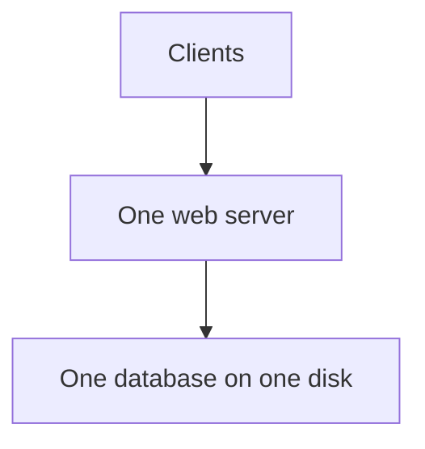
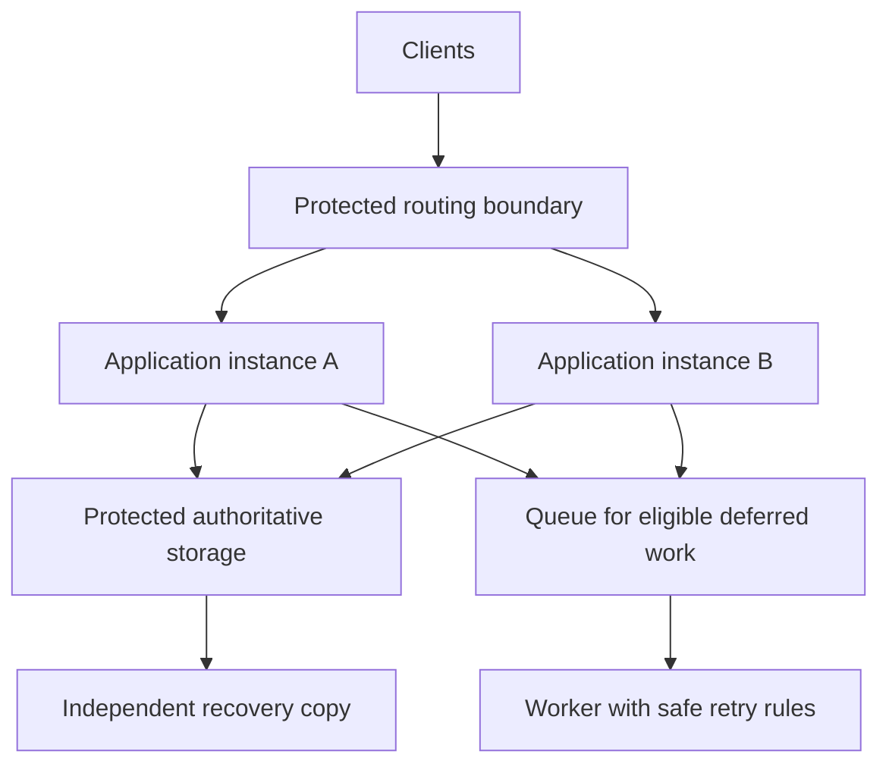
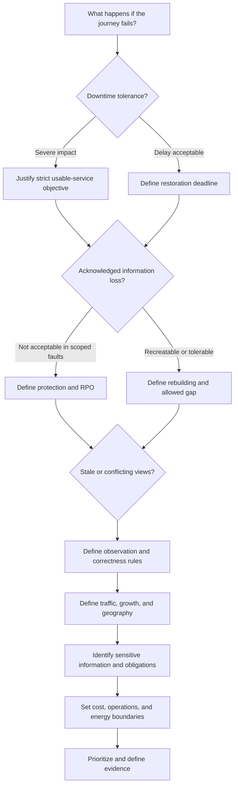

*Part 5 of 7 of [Non-Functional Requirements](/tutorials/system-design/non-functional-requirements) · Sections 68–89.* These sections continue applying the ideas with exercises, worked examples, and mock interviews. New to the topic? Start with [Non-Functional Requirements Fundamentals](/tutorials/system-design/non-functional-requirements/fundamentals).

## 68. Fifteen failure scenarios

Identify qualities and symptoms before reading the mitigation column. A **mitigation** reduces impact/risk; it may not eliminate the cause.

**Secret rotation** replaces a secret safely, like changing locks while ensuring authorized staff receive valid keys. **Sampling** observes a selected subset; it can reduce volume but must not discard required audit evidence or bias measurements. **Admission control** decides which work to accept within safe capacity.

| # | Scenario | Affected qualities and symptoms | Candidate mitigation/evidence |
|---|---|---|---|
| 1 | Application server crashes | Availability/fault tolerance; failed or pending requests | Tested independent capacity, detection, safe retries |
| 2 | Database disk fails | Durability/recovery/availability; information unavailable or lost | Protected copies, recovery checks, acknowledgement design |
| 3 | Regions lose communication | Consistency/availability; stale views or refused work | Explicit partition policy; preserve critical guarantees |
| 4 | Deployment introduces wrong totals | Reliability/operability; reachable but incorrect checkout | Correctness checks, controlled release, safe rollback/data correction |
| 5 | Logs stop collecting | Observability/auditability; investigation gaps | Detect collection gaps, retain required evidence safely |
| 6 | Unauthorized record access | Security/privacy; exposure | Enforce access, investigate scope, apply confirmed incident process |
| 7 | Sudden promotion burst | Scalability/latency/resilience; queue growth and errors | Capacity planning, headroom, admission controls |
| 8 | Payment response lost | Reliability/durability/auditability; uncertain charge | Preserve pending request, reconcile, prevent duplicate effects |
| 9 | Backup unreadable | Recoverability/durability; restore fails | Restore drills and independent usable copies/keys |
| 10 | Secret expires or is revoked | Security/availability/operations; legitimate calls refused | Managed rotation and expiry alerting with safe access recovery |
| 11 | Cache returns old price | Consistency/reliability; misleading total | Authoritative confirmation and explicit freshness rules |
| 12 | Keyboard user cannot reach Pay | Accessibility; core journey blocked | Semantic controls, focus order, assisted manual checks |
| 13 | Monitoring costs exceed budget | Cost/observability; poor visibility or overspend | Right-sized evidence, justified retention/sampling |
| 14 | Partner changes currency units | Interoperability/reliability; incorrect money amount | Versioned contract tests and compatibility controls |
| 15 | Idle capacity multiplies | Energy/cost; unnecessary consumption | Measured right-sizing while preserving headroom and failure targets |

## 69. Common beginner mistakes

| Mistake | Why tempting | Why wrong | Better reasoning |
|---|---|---|---|
| “Should scale” without numbers | Sounds ambitious | No growth/workload/quality contract | Specify dimensions, rate, size, targets, budget |
| Availability = reliability | Both sound dependable | Reachability misses wrong outcomes | Define useful service and correctness checks |
| Backups = durability | Copies feel safe | May be stale, corrupt, shared, or unrestoreable | Align acknowledgement/failure/retention and recovery evidence |
| More servers fix scale | Easy visual expansion | Shared bottleneck may worsen | Measure the limiting resource/path |
| Optimize latency first | Speed is visible | May trade away critical integrity | Clarify goals and constraints before optimization |
| Demand 100% availability | Feels customer-friendly | Unlimited failure scope is unverifiable | Define justified objectives and failure handling |
| Ignore cost | Architecture feels abstract | Product cannot operate sustainably | Include workload-scoped total/unit cost |
| Security = privacy | Both concern information | Proper protection does not justify collection/use | Document both threats and purposes |
| Observability = logs | Logs are tangible | Numbers and linked paths reveal different things | Build evidence around diagnostic questions |
| Strong consistency always best | “Strong” sounds superior | Unneeded coordination costs time/availability | Choose guarantees per operation |
| Microservices ensure maintainability | Fashionable separation | Distributed coordination can overwhelm | Test concrete change scenarios |
| Every NFR equally critical | Avoids decisions | No trade-off guidance | Prioritize by consequence and need |
| List technologies as NFRs | Easy to memorize | Names means, not desired result | Write outcome, then compare design responses |

## 70. Ten statements that look right but are wrong

| # | Claim | Missing reasoning |
|---|---|---|
| 1 | Three servers guarantee high availability | They may share database, power, region, routing, or a bad release |
| 2 | Backups guarantee durability | Need freshness, correctness, independence, access, and verified restoration |
| 3 | Average latency is 100 ms, so every user is happy | Tail waits, failed attempts, and broader journeys may be poor |
| 4 | Encryption makes the app secure | Permissions, secrets, input handling, operations, and threats remain |
| 5 | Eventual consistency guarantees a one-second delay | It does not establish a time bound without additional conditions/requirement |
| 6 | Double servers means double throughput | Shared bottlenecks and coordination can limit growth |
| 7 | A successful health check means checkout works | The check might omit required dependencies or correctness |
| 8 | A 99.99% yearly target guarantees 99.99% each month | Outages can concentrate; windows differ |
| 9 | Zero-error test means zero production risk | Tests cover finite workloads/scenarios and may use unrealistic conditions |
| 10 | Lower server utilization proves lower energy | More idle hardware may use more total energy for the same work |

**Try:** Add an eleventh.

**Solution example:** “A payment timeout proves no charge occurred.” A response can be lost after a successful external action; keep the outcome pending until established.

## 71. Architecture review exercise

Review this design before reading the solution. Assume the stated requirement is useful service during one server or one disk failure, with protected acknowledged orders and observable diagnosis.



Assess scalability, availability, reliability, durability, security, and observability.

**Solution:** The picture alone proves almost none of them. One web server suggests a possible availability point and capacity limit; verify load. One unprotected disk conflicts with required disk-failure survival. Reliable business outcomes depend on code and coordination, not box count. No access/protection/evidence guarantees are shown. The lack of drawn controls does not prove absence; ask for evidence.

Incremental improvements: define and measure critical paths; fix expensive queries; verify protected persistent writes/recovery; add actionable evidence and access checks; add independent useful application capacity if server-failure tolerance is required; protect the database according to the specific failure target. Re-test full journeys. Do not add regions until regional failure/geography targets justify them.

## 72. Progressive architecture exercise

For each proposed change, ask which observed gap or requirement justifies it.

| Stage | Motivating quality and benefit | Added complexity and verification |
|---|---|---|
| Single measured application | Simplicity, cost, maintainability | Capacity/failure limits; baseline checks |
| Multiple instances and load balancing | Throughput/server-loss tolerance | Routing health, spare capacity, state sharing, load-balancer failure |
| Replicated database | Defined failure survival/read capacity | Update consistency, promotion, stale reads, correlated failures |
| Cache | Suitable repeated-read latency/load reduction | Freshness, removal/permission behavior, miss bursts, added cost |
| Queue | Absorb bounded bursts/decouple deferrable work | Pending work, delay, retry/duplicate effects, retention, overload |
| Monitoring/evidence | Detection and diagnosis | Missing observations, false alerts, privacy, expense |
| Backups/restoration | Recovery from damage/deletion/site loss | Copy integrity, age, keys, dependency restoration, drills |
| Multi-zone deployment | Survival of specified local infrastructure failure | Real independence, network latency, cost, surviving capacity |



This is a candidate arrangement. It does not prove zone independence, consistency, sufficient capacity, or recovery. Evidence and configuration complete the review.

## 73. Trade-off matrix exercise

**Scenario:** A small store has a seasonal sale. Budget is bounded. Paid orders must not disappear, inventory must not oversell, private information must be protected, and a brief recommendation outage is acceptable.

Rank scalability, availability, consistency, latency, cost, security, and maintainability. Explain each rather than assigning all Critical.

| Attribute | Worked priority | Reason/trade-off |
|---|---|---|
| Security | Critical | Unauthorized access/money actions are unacceptable |
| Consistency/correctness | Critical for purchase commitment | Protect inventory and totals; informational browsing can differ |
| Durability, additionally | Critical | Paid-order records must survive promised failures |
| Availability | High for checkout | Lost sales matter; optional extras can degrade |
| Scalability | High for bounded sale peak | Must preserve checkout under known burst |
| Latency | High within defined checkout target | Faster acknowledgement must not weaken payment safety |
| Cost | High constraint | Budget limits unnecessary geographic complexity |
| Maintainability | High/Important | Staff need safe changes and diagnosis during sale |

Different answers can be reasonable if they preserve explicit obligations and justify trade-offs. Add omitted critical qualities rather than accepting an incomplete ranking list mechanically.

## 74. Quantitative workbook: eleven problems

Try every problem before the solution. Decimal units are used; overhead is omitted only where stated.

| # | Problem | Full calculation |
|---|---|---|
| 1 | 30 days, 30 minutes down. Availability? | Total = 43,200 minutes; good = 43,170; good/total × 100 ≈ **99.9306%** |
| 2 | 30-day 99.99% target. Downtime budget? | Bad fraction = 0.0001; 43,200 × 0.0001 = **4.32 minutes = 259.2 seconds** |
| 3 | Two million DAU, 12 requests/day, assumed 6× peak. QPS? | Daily = 24 million; average = 24,000,000/86,400 ≈ **277.78**; peak ≈ **1,666.67/second** |
| 4 | One million new records/day, 2 kB each, 30 days. Logical growth? | 1,000,000 × 2,000 × 30 = 60 billion bytes = **60 GB** |
| 5 | Times 20, 30, 40, 50, 60, 70, 80, 90, 100, 500 ms. Mean/p95? | Sum = 1,040; mean = **104 ms**. Nearest-rank p95: ceiling(9.5)=10 → **500 ms** |
| 6 | 180,000 completed messages in three minutes. Throughput? | Three minutes = 180 seconds; 180,000/180 = **1,000/second** |
| 7 | Three total full copies of 60 GB, excluding overhead. Storage? | 3 × 60 = **180 GB**, meaning **120 GB extra** beyond one copy; backups/indexes not included |
| 8 | 1,000 responses/second × 20 kB each. Useful bandwidth? | 1,000 × 20,000 = 20,000,000 bytes/second = **20 MB/second = 160 megabits/second** |
| 9 | ₹50,000 monthly cost; 25 million successful requests. Unit cost? | 50,000/25,000,000 = **₹0.002 per successful request** |
| 10 | Failure 10:00; latest recoverable updates 09:53. Loss-point gap? | Seven minutes. Meets **RPO ≤ ten minutes**, fails **RPO ≤ five minutes**, under the stated data scope |
| 11 | Failure 10:00; verified acceptable service 10:42. Recovery time? | 42 minutes. Meets **RTO ≤ one hour**, fails **RTO ≤ 30 minutes** |

Do not convert three copies into a durability probability without a failure model. Do not assume average QPS is sufficient for peak sizing. Units and assumptions are part of the answer.

## 75. Mini NFR document: online shopping platform

### Goal, scope, assumptions

Support browsing and single-store checkout with owned order history. Teaching workload W1: one million DAU, 20 requests/user/day, assumed 5× peak; representative catalog/query mix; peak checkout 200 attempts/second; one supported geographical region. All targets below are proposed and must be validated against business needs and budget.

| ID/attribute | Description and target | Measurement/conditions | Rationale | Priority |
|---|---|---|---|---|
| NFR-001 Scalability | Preserve search/checkout quality at W1, including ≥ 1,158 total requests/second rounded peak | Growth/load benchmark with actual operation mix and resource ceiling | Planned growth | High |
| NFR-002 Availability | Checkout good-attempt fraction ≥ 99.95% per rolling 30 days | Defined client/API attempt evidence; all counted system failures | Purchase value | Critical |
| NFR-003 Latency | Search API p95 ≤ 300 ms; checkout acceptance/status p95 ≤ one second at W1 | Whole-operation measurements, errors constrained separately | Interactive journeys | High |
| NFR-004 Durability | No acknowledged paid-order loss in named single-server/disk/site failure drills | Compare accepted records after recovery; explicit retention | Purchased goods accountability | Critical |
| NFR-005 Security | All access-matrix cases correct; sensitive communication/storage and secrets meet approved policy | Route tests, configuration/review evidence | Prevent harm | Critical |
| NFR-006 Privacy | Field collection/use and retention match approved purpose inventory | Inventory, deletion/retention checks, exceptions review | Appropriate information use | Critical |
| NFR-007 Observability | Diagnose specified slow/pending checkout within fifteen minutes without exposing private payment details | Incident simulation using correlated evidence | Reduce harm duration | High |
| NFR-008 Consistency | No overselling; accepted payment/order relationships remain coherent under competing/duplicate requests | Boundary, competing-request, and lost-response tests | Correct purchases | Critical |
| NFR-009 Recoverability | Restore defined checkout within 30 minutes; zero paid-order loss in scoped site-loss drill | Verified recovery exercise, keys/dependencies included | Business continuity | Critical |
| NFR-010 Auditability | All privileged refund/permission changes have protected required fields | Compare eligible actions with audit evidence | Accountability | Critical |
| NFR-011 Accessibility | Core browse/checkout journeys pass specified WCAG-based and assisted manual checks | Named browsers/devices/assistive tools | Inclusive purchase completion | Critical |
| NFR-012 Operability | Trained operator completes verified rollback within ten minutes | Deployment drill and documented escalation | Safe changes | High |
| NFR-013 Maintainability | Defined pricing change passes within two working days without unrelated behavior changes | Change exercise and regression checks | Sustainable evolution | Important |
| NFR-014 Cost | At W1, total attributed monthly operating cost ≤ proposed ₹200,000 | Cost allocation including evidence, copies, and operations | Viability | High |
| NFR-015 Energy | Improve energy per successful reference-workload checkout by proposed 10% from baseline without reducing quality | Comparable measured benchmark | Reduce avoidable resource use | Desirable |
| NFR-016 Compliance | Meet the applicable scoped obligations/evidence list established by the compliance owner | Qualified review and linked control checks | Required external obligations | Critical when applicable |

**Open decisions:** Good-request definition; exact fault independence; final workload/data sizes; payment-provider outcome timing; applicable controls; cost scope; supported accessibility environments. Each entry needs owner/source, review date, and links to FRs/tests. “Critical” is not a substitute for these definitions.

## 76. Monitoring NFRs

Observe actual user outcomes as well as internal predictors. A **leading indicator** may warn of future trouble, like a filling queue; an **outcome measure** shows whether the requirement was met, like timely completions.

| Quality | Observe | Interpretation and verification caution |
|---|---|---|
| Availability | Good-attempt fraction, synthetic journey checks, outages | A **synthetic check** submits a controlled representative request; it may miss real user variation |
| Latency | p50/p95/p99, timeout and outstanding counts, client journey times | Successful server timings alone omit missing requests/client waits |
| Scalability | Incoming/completed rate, CPU/memory, connections, queue depth, stored growth | **Queue depth** counts pending work; stable quality under representative peak matters |
| Throughput | Completed work/second and accepted/refused work | Do not report only incoming requests as successful capacity |
| Reliability | Wrong outcomes, failed jobs, reconciliation discrepancies | Returned replies may conceal business errors |
| Durability | Protected-copy health, acknowledged-write evidence, integrity checks, backup/restore results | A healthy-copy gauge does not prove absence of loss |
| Recoverability | Actual drill restoration time/loss point | Include verification and required dependencies |
| Consistency | Freshness/ordering checks, conflicting outcomes | Match the specific observation model |
| Security/privacy | Access failures, reviews, secret exposure, retention/collection checks | Low detected events does not prove low risk |
| Observability | Evidence gaps and diagnosis-time drills | Data volume is not diagnostic success |
| Auditability | Eligible-action record completeness and integrity/access | Required audit evidence must not be lost through casual sampling |
| Operability | Alert actionability, deployment/rollback outcomes | Tool installation alone does not establish safe operation |
| Accessibility | Automated checks plus user-flow/assistive evaluation | It is not primarily a CPU-style time-series metric |
| Cost/energy | Workload-scoped total and per-useful-work ratios | Include added copies and outside dependencies consistently |
| Maintainability/testability | Change/setup/diagnosis scenarios | Evaluate people and process conditions explicitly |
| Interoperability/portability | Contract/environment checks after changes | Re-run when supported versions or dependencies change |
| Compliance | Control evidence, review cadence, exception tracking | Applicability and assessment scope must remain current |

## 77. Observability example: view an order

A client requests order information via an API; the server queries its database and replies. **GET** is an HTTP method commonly requesting retrieval. **Status 200** is an HTTP response code indicating success at the protocol level, not proof the order content is correct.

Log example:

```text
2026-01-10T10:00:01Z method=GET route=/orders/{id}
status=200 request_id=req-789 duration_ms=120
```

`Z` denotes UTC, a common reference time. A log records this event and correlation context. Avoid placing private addresses or payment details in it. A normalized route prevents unnecessary per-order metric identifiers.

Metric example: this request contributes 120 ms to the order-read latency distribution; the aggregated good-request count increases if business success criteria hold. One number is not a p95 until combined with a defined collection of observations.

Trace example:

| Trace portion | Information it supplies |
|---|---|
| Whole order request | Its 120-ms measured elapsed interval and linked child work |
| Permission-check span | Access-check interval and outcome |
| Database-query span | Retrieval interval, including applicable waits |
| Response-construction span | Formatting/completion interval |

Spans show related portions, some of which may overlap. Logs explain events; metrics explain patterns; traces explain one path. Do not add overlapping span durations as though they were always a sequential total.

## 78. Auditability example: refund approval

```text
Timestamp: 2026-10-08T10:42:00Z
Actor: employee-123
Action: REFUND_APPROVED
Order: order-456
Amount: 2500
Currency: INR
Reason: eligible return approved
Request: refund-request-789
Outcome: approval recorded; provider refund pending
```

**INR** identifies Indian rupees. Include whether the amount uses major or minor units; here 2,500 means ₹2,500. Actor identity must come from verified context, not an arbitrary client-supplied label. Approval does not claim the provider completed the refund.

Debug logs might say a connection timed out. The audit record instead supports accountability and later reconstruction. Define access, protection, retention, clock conventions, missing-record detection, and linkage to eventual refund outcome.

## 79. Accessibility example: login page

Evaluate the whole interaction: reach the page, find fields, enter information, submit, understand errors, and recover.

| Requirement candidate | How to check |
|---|---|
| All controls reachable and usable by keyboard without traps | Complete sign-in/recovery using keys only |
| Email/password controls have meaningful programmatic labels | Inspect assistive output and control relationships |
| Current focus is visible and follows a meaningful order | Navigate normally and after validation errors |
| Errors identify the problem through text and accessible association | Submit missing/invalid information; verify announcement and correction |
| Contrast meets the applicable specified criteria | Check text/control states under the adopted evaluation scope |
| Success/pending status is perceivable without relying only on color | Verify textual/assistive status feedback |

**Programmatic label** means a label software can associate with a control, like a machine-readable name tag. This matters for assistive technologies. Specify the applicable WCAG criteria and supported evaluation environment; the examples above are not a complete WCAG conformance checklist. See the reference in Section 30.

## 80. Compliance example: payment platform

Start by mapping where payment information enters, is processed, is stored, and can be accessed—including diagnostics and external partners. Then confirm which obligations and assessment scope apply with the responsible compliance owner.

A **control** is a safeguard or operating procedure supporting an obligation, like restricted access to a card-processing area. Relevant categories can include payment-data protection, least-privilege access, accountable changes, secure communication, retention/deletion, and evidence of testing/review. Translate each confirmed obligation into a linked requirement and verification method.

Example: “Authorized staff access to scoped payment records follows the approved access matrix and is reviewable through protected audit evidence.” The precise retention/control requirements must come from the applicable approved source, not an invented generic number. Moving payment entry to a provider may reduce some direct handling, but does not automatically remove every organization obligation.

## 81. Cost modeling

**Total cost = compute + storage + network + database + operations**, with backups/evidence/support allocated once. Avoid counting a managed database’s compute twice.

| Monthly invented category | Amount |
|---|---|
| Application compute | ₹30,000 |
| File storage including designated copies | ₹10,000 |
| Network transfers | ₹20,000 |
| Managed database, including its allocated resources | ₹15,000 |
| Operations/evidence/support allocation | ₹25,000 |
| Total | **₹100,000** |

With 50 million completed eligible requests, unit cost = ₹100,000/50,000,000 = **₹0.002/request**. If work doubles, cost need not double; fixed/variable costs and capacity steps matter. A **fixed cost** does not change over the relevant workload range; a **variable cost** does, like per-parcel delivery.

Caching might reduce database expense but add cache resources. Replication increases retained storage/communication. Another region can improve specified failure tolerance or geography but increases operating and transfer work. Compare full cost while holding required quality constant. These figures are examples, not current cloud pricing.

## 82. Sustainability modeling

**Efficiency = useful work completed / defined resources consumed.** Define both sides and compare similar workload/quality conditions.

Example A: one million successful requests use 50 kWh; B completes one million at the same quality using 40 kWh. Energy/request A = 50/1,000,000 = **0.00005 kWh**; B = **0.00004 kWh**. Reduction = (50 − 40)/50 = **20%**.

A **kWh**, kilowatt-hour, is energy equal to one kilowatt sustained for one hour. A **cache hit rate** is requests served from the reusable copy divided by eligible cache lookups; a higher rate is not inherently greener if the cache adds more total work. Storage utilization and successful requests per CPU-second can reveal efficiency, but they are resource proxies unless energy is actually measured.

For 200 watts sustained for five hours: energy = 200 × 5 = 1,000 watt-hours = **1 kWh**. Emissions claims also require a scoped energy/carbon methodology; do not equate fewer machines with a verified environmental reduction without evidence.

## 83. NFR decision tree

Use the tree to identify questions, not to pick a technology automatically.



At Scale ask whether high traffic, bursts, or distant users affect latency/throughput. At Protect ask who may use data, why it is collected, and whether compliance/residency rules apply. At Verify use concrete targets and scenarios. If you discover another critical actor or journey, repeat the relevant branch.

## 84. Reusable NFR interview template

“Before designing, I want to clarify the main quality requirements:

1. What scale, operation mix, and peak duration should we support?
2. What user-facing latency is acceptable?
3. What useful-service availability is expected, over which period?
4. What failures must acknowledged information survive?
5. What read/write consistency and competing-action behavior are needed?
6. Is the audience regional or global, with residency constraints?
7. Does the system handle sensitive or regulated information?
8. What recovery, operating, and cost constraints apply?”

Omit already answered or irrelevant questions. For payments, lead with correctness, authority, pending outcomes, durability, and audit evidence. For video playback, lead with audience, geography, bitrate/throughput, start/stall experience, and cost. Explain why each question changes the design.

## 85. Requirement-prioritization framework

The prompt “business impact × likelihood × user impact × implementation cost” is a useful reminder of factors, but blindly multiplying cost into a priority score rewards expensive work. Business impact and user impact can also overlap. Treat them as explicit qualitative considerations, not a false precise formula.

| Factor | Ask | Example |
|---|---|---|
| Business consequence | Does failure defeat value or an obligation? | Lost committed payment |
| Likelihood/exposure | How often and under which scenarios? | Routine burst versus extremely rare failure |
| User consequence | How many and how severely affected? | Personal record loss versus delayed decoration |
| Implementation/lifecycle cost | What effort, risk, and ongoing burden? | Extra region and recovery testing |

Use Critical, High, Medium, Low based on justified consequence and constraints. Mandatory safety/legal/security obligations are not removed by a low score. Evaluate options by benefit/risk reduction **relative to** lifecycle cost, using estimates and uncertainty openly.

Example: Protect paid-order durability = Critical; useful checkout availability at sale peak = High/Critical; more detailed recommendation metrics = Medium; sub-millisecond animation improvement = Low. A costly requirement can be essential, while a cheap cosmetic one can wait.

## 86. Architecture trade-off exercise: choose two

Assume four improvements are independently feasible, correctly measured, and have the stated costs/benefits. You may choose two: **A** another region; **B** stronger consistency for specified operations; **C** 50% lower relevant latency; **D** 40% lower attributed infrastructure cost while preserving baseline obligations.

Choose before reading. In reality these options can interact and are not guaranteed by a label.

| Product context | Worked choice | Justification and limitation |
|---|---|---|
| Bank whose regional failure protection and balance guarantees are insufficient | A + B | Protect critical data/operations; validate coordination latency and acknowledgement survival. Another region alone proves neither |
| Public social feed already meeting visibility/security rules but with poor response and cost | C + D | Improve user experience and viability; informational counts can retain agreed weaker consistency. Revise if region outages dominate actual harm |
| Weekly analytics dashboard with limited budget and stale conflicting reports | B + D | Improve consistent report meaning and sustainable operation; multiple regions may not be justified |
| Real-time gaming with distant users and high interaction delay | A + C | Regional proximity and measured fast paths may improve play; game-state integrity remains an obligation, not something discarded |

Other choices can be sound under different stated needs. Reject a candidate improvement that violates baseline correctness/security or does not address the measured problem. Do not interpret the task as permission to cut required safeguards.

## 87. Mock interview: beginner URL shortener

**Interviewer:** Design a URL shortener. Creating and redirecting are the core functions.

**Candidate:** What creation and redirect rates should we design for, including peaks?

**Why it matters:** Determines work rather than assuming registered-user count equals traffic. **Possible influence:** Capacity and lookup/write-path choices.

**Interviewer:** Assume 1,000 creates and 100,000 redirects/second at peak.

**Candidate:** Which redirect latency boundary and target matter? Our response or loading the destination too?

**Why it matters:** The destination is outside our direct control. **Possible influence:** Geographic routing, lookup path, and honest measurement.

**Interviewer:** Our server response: p95 no more than 100 ms for regional clients.

**Candidate:** What availability target should the redirect operation meet, and how are failed/time-limited requests counted?

**Why it matters:** Establishes useful-service scope and denominator. **Possible influence:** Independent serving capacity, detection, dependency handling.

**Interviewer:** 99.99% good eligible redirects over 30 days, with time-limited attempts counted as bad.

**Candidate:** What should successfully created links survive? Is losing acknowledged mappings after a site failure acceptable?

**Why it matters:** Defines the acknowledgement’s storage promise. **Possible influence:** Protected copies, recovery, and creation latency.

**Interviewer:** No acknowledged mapping loss for single-site loss. Assume retention is indefinite for this exercise.

**Candidate:** Should a redirect issued after creation completes immediately find that mapping?

**Why it matters:** Identifies publication/consistency behavior. **Possible influence:** Read path and update coordination.

**Interviewer:** Yes.

**Candidate:** I’ll summarize those targets with their boundaries, then compare the simplest designs that preserve them. I’ll ask about broader regional loss, cost, and privacy only as needed for our chosen scope.

**Evaluation:** Strong: relevant questions, outcomes before mechanisms, numerical scope. Remaining assumptions: mapping size/data distribution, peak duration, cost ceiling, exact failure independence. Strong candidates keep unresolved items visible.

## 88. Mock interview: intermediate messaging

**Interviewer:** Design a private one-to-one text messaging application with retained history.

**Candidate:** What counts as accepted and delivered, and how should offline recipients be handled?

**Interviewer:** Accepted means retained under our promised failure model. Delivered means the recipient client confirmed receipt. Offline recipients retrieve later.

**Teaching comment:** Good reliability/durability semantics. Client receipt does not mean the person read it.

**Candidate:** For connected supported clients, may we target 99% delivered within 500 ms at the specified workload? What availability window applies to send and retrieve?

**Interviewer:** Use that latency target and 99.9% good send/retrieve attempts over 30 days.

**Teaching comment:** Good separation of connected delivery from offline completion and timing from availability.

**Candidate:** What failures must accepted messages survive, and can repeated send attempts create duplicate history entries?

**Interviewer:** Survive one site loss within the seven-day retention promise. The same intended message must appear once despite retries.

**Teaching comment:** Strong outcome requirement. Network transmission may repeat; history effects must not.

**Candidate:** Must participants see a consistent conversation order and their own accepted message after refresh? How are simultaneous sends ordered?

**Interviewer:** Agree one conversation order; use a documented ordering rule. Do not rely on phone clocks alone.

**Teaching comment:** Finds consistency without saying every operation needs the same global ordering.

**Candidate:** What content may operators inspect, and is end-to-end content encryption required?

**Interviewer:** Operators should diagnose status without reading message content. End-to-end encryption is outside this exercise, but access and transport/storage protection are required.

**Teaching comment:** Distinguishes privacy needs from a specific additional product capability. Keep the exclusion explicit.

**Candidate:** What peak message rate, connected clients, size limits, and supported geography guide capacity?

**Interviewer:** Use workload W2: 20,000 accepted messages/second, one million connected clients, supported regional geography, and the defined message-size distribution.

**Teaching comment:** Rate and connections are separate constraints. All figures are interview assumptions.

**Candidate:** I’ll capture acceptance/delivery semantics, duplicate prevention, retained-history survival, conversation ordering, scoped latency/availability, permissions/protection, privacy-safe diagnosis, and W2 capacity. Then I’ll test candidate designs against those guarantees, including partition and pending-outcome behavior.

**Evaluation:** Strong synthesis. Do not claim a queue or replicas alone gives all guarantees. Define retention expiry, deletion, device replacement, and outage completion expectations if the functional scope includes them.

## 89. Mock architecture review: evaluate all attributes

**Given design:** One application; one database on one local disk; an in-memory cache; all diagnostic logs on the same machine; manual deployments; nightly untested backups on the same site; administrator access shared through one credential.

**Given requirements:** Checkout useful availability ≥ 99.95% over 30 days; acknowledged orders survive one disk/site failure; safe authorization; peak workload W1; RTO ≤ 30 minutes; core accessibility; bounded cost; diagnosable and accountable operations. Other attributes have scenario-specific objectives to be confirmed.

**Try:** Does the design satisfy the requirements? Assess every quality, marking evidence unknown rather than guessing.

| Attribute | Detailed review finding |
|---|---|
| Scalability | Unknown capacity; one application/DB may or may not handle W1. Benchmark mix and shared bottlenecks |
| Availability | Single required parts and site are likely gaps; diagram/configuration cannot substantiate target without outcome evidence |
| Reliability | Unknown logic; test totals, pending payments, repeats, and competing inventory updates |
| Durability | Single disk and same-site backup cannot establish the stated disk/site survival of all acknowledged orders |
| Consistency | Unknown guarantee; cached information must not control purchases contrary to authoritative rules |
| Latency | Unknown distribution; measure critical user/server boundaries and cold-cache behavior |
| Throughput | Unknown sustained completions and queues under W1 |
| Responsiveness | Unknown interface feedback; test pending and failure states |
| Fault tolerance | No shown useful replacement after application/DB loss |
| Resilience | Unknown timeouts/retries/degradation; uncontrolled retries can worsen recovery |
| Recoverability | Untested same-site copies and manual steps do not substantiate RTO/RPO; drill |
| Security | Shared administrator credential obstructs individual authority/accountability; assess all routes and secret access |
| Privacy | Unknown collection/use/retention and diagnostic contents; inspect policy/evidence |
| Maintainability | One application can be maintainable; inspect responsibilities and change scenarios |
| Operability | Manual changes and unclear ownership/rollback are risks; evaluate concrete operating drills |
| Extensibility | Unknown; test a relevant extension rather than infer from size |
| Modularity | Unknown internal organization; one deployment does not prove poor modularity |
| Portability | Unknown disk/runtime/provider assumptions; test named environment move |
| Interoperability | Unknown external contracts and units; validate partner cases |
| Testability | Unknown controlled dependencies/time and outcome checks |
| Observability | Same-machine logs can disappear with the fault; no shown linked metrics/traces or diagnostic evidence |
| Auditability | Shared identity and vulnerable retained logs weaken accountable reconstruction |
| Accessibility | Unknown; test the complete user journeys with agreed evaluation scope |
| Compliance | Unknown applicability/evidence; do not infer compliance from any box |
| Cost efficiency | Measure total costs and failure/support burden; low machine count alone is not efficiency |
| Energy efficiency | Unknown useful-work/energy baseline; do not claim low emissions from the diagram |

**Incremental solution:** Clarify obligations; correct access/accountability and business invariants; protect acknowledged orders and usable independent recovery; measure W1; add necessary independent service capacity; provide durable diagnostic/audit evidence, safe changes, and tested recovery; verify accessibility and relevant partner/environment scenarios. Reassess cost and energy. Multiple regions or services are justified only by targets not met by simpler alternatives.
