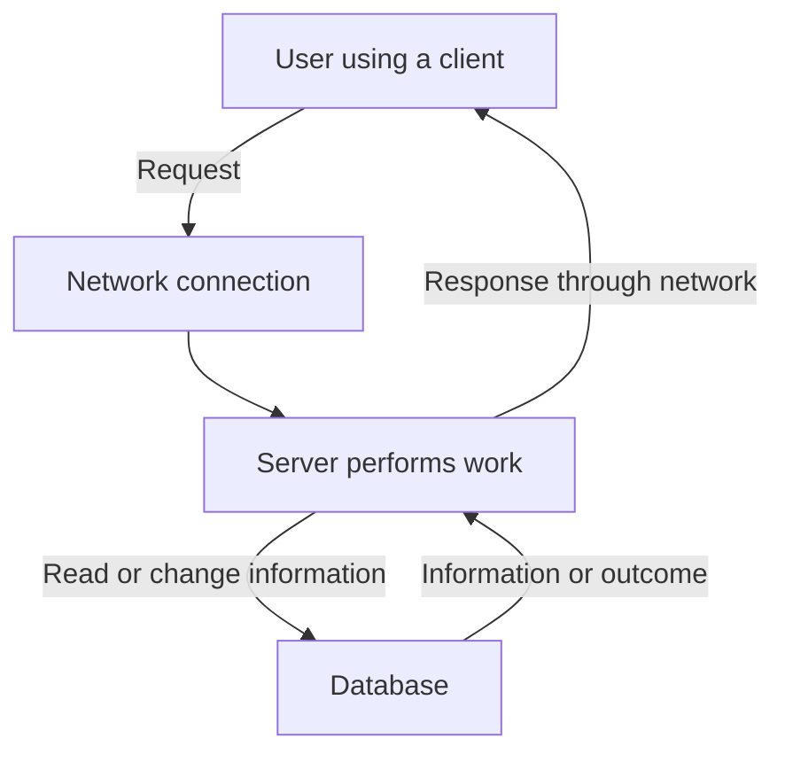

*A self-contained textbook, workbook, and interview guide for absolute beginners*

**What must the software do—and what qualities must that behavior have?**

Start here even if you have never written a program. Sections 1–7 establish the vocabulary. [Sections 8–33](/tutorials/system-design/non-functional-requirements/quality-attributes) teach the quality attributes. [Sections 34–47](/tutorials/system-design/non-functional-requirements/measurement-and-trade-offs) teach measurement and trade-offs. [Sections 48–89](/tutorials/system-design/non-functional-requirements/case-studies) apply the ideas to systems and interviews. [Sections 90–102](/tutorials/system-design/non-functional-requirements/practice-and-knowledge-check) provide further practice, answers, flashcards, a project, and revision material.

**Study method:** Attempt each “Try” before reading its solution. Treat all invented traffic figures, budgets, policies, and targets as teaching assumptions, not universal recommendations. Every quality target needs a scope, conditions, measurement method, and reason. Optional advanced material is explicitly labeled; it can be skipped on a first reading.

> A requirement describes the desired outcome. Architecture describes one possible way to achieve it.

A **quality attribute** is a property we care about, such as response speed. Like a restaurant’s cleanliness, it describes an aspect of the experience beyond the basic function. A shopping search can work but be too slow. Quality attributes matter because working functionality alone does not establish a useful product.

## 1. Start from absolute zero

A restaurant receives an order, prepares food, and serves a meal. A bank branch receives a withdrawal request, checks the account, and gives cash or a reason for refusal. A postal service receives a parcel, transports it, and delivers it. A hospital receives an appointment request, checks availability, and offers a time. A supermarket receives selected goods, calculates a bill, and completes a sale.

A **system** is connected parts working together toward a purpose. Its simple model is **Input → Work → Output**. Input is what arrives, work is what happens, and output is the result. This model matters because every result depends on both the request and what happens to it.

A **software application** is a program used to accomplish tasks, such as buying groceries. A **software system** is cooperating software and resources providing a purpose, such as the shopping application and its stored product information. Think of the program as restaurant procedures and the system as the whole operation. This distinction matters when deciding who is responsible for an outcome.

A **user** is a person using the software, like a restaurant customer. An **actor** is an interacting role outside the boundary we are describing; it may be a person or another system, like an outside payment company. A **system boundary** separates what our system controls from what lies outside it. These ideas matter because we must not assume control over every dependency.

| Term | Plain meaning and analogy | Software example | Why it matters |
|---|---|---|---|
| Client | The party asking for work, like a customer at a desk | A phone application asking for an order | Establishes where a request starts |
| Server | Software that accepts work requests; also the computer running it, like a staffed service desk | An order server receives requests | Identifies the processing responsibility |
| Request | A message asking for work, like an order slip | “Show order 123” | Defines the action being attempted |
| Response | A reply to the request, like a receipt or refusal | Order details or an error | Defines the visible result |
| Data | Represented information, like entries in a notebook | Prices, addresses, messages | Behavior depends on information |
| Storage | Keeping information for later, like a filing cabinet | Retaining a saved document | Supports memory between visits |
| Database | Organized stored information with retrieval/change operations, like a searchable register | An organized order collection | Supports finding and updating records |
| Network | Connections carrying information between computers, like roads between offices | A phone contacts a server over the Internet | Communication can take time or fail |
| Component | One part with a responsibility, like the kitchen | Payment-processing part | Helps reason about part failures |
| Service | Software providing an ability to other parties, like a delivery desk | Search service | Lets us discuss a behavior and its boundary |
| API | Application programming interface: agreed software request/response rules, like a menu/order format | An operation requesting order details | Systems can interact without a screen |

**User request → software processing → response.** A request may create or change information, not just retrieve it. A **read** retrieves information; a **write** changes it. Reading a notebook versus writing a new entry is the analogy. Viewing an order is a read; creating it is a write. This matters when measuring different operations separately.

The arrows are interactions, not proof that communication is instant or successful. A phone can lose its connection after the server completes work.

**Try:** If an application shows “Saved,” what might the user reasonably expect after reopening it?

**Solution:** The saved information is still there, within the promised storage and failure conditions. A temporary on-screen change alone does not meet that expectation.

## 2. What is a requirement?

A customer ordering a birthday cake may require eight portions and no nuts. A **requirement** is a stated need or obligation to satisfy. It matters because people need shared expectations before constructing something.

A **functional requirement**, or **FR**, describes what the system must do. “Users can upload photos” is an example. An **upload** sends information into a system, like delivering a parcel to the postal desk; a photo upload sends a file from a device. It matters because the receiving system must define acceptance and results.

A **non-functional requirement**, or **NFR**, describes the quality or operating conditions of the behavior. “Supported uploaded photos become viewable within two seconds for at least 95% of uploads under the specified conditions” is an example. Think of the delivery service’s time commitment rather than its basic promise to carry parcels. It matters because the same function can provide very different experiences.

A **constraint** restricts permitted choices, like requiring the cake to fit a particular box. “Use the existing payment provider” restricts a software solution. An **implementation** is the actual constructed solution; **architecture** is its major parts, responsibilities, and interactions, like the layout and organization of a restaurant. **System design** is deciding how to satisfy requirements through those parts. These distinctions matter because “use three servers” is generally a proposed solution, not a measured quality outcome.

A **feature** is a recognizable product function, such as photo sharing. Features may contain several FRs and NFRs. Do not equate a feature name with a complete requirement.

## 3. Functional versus non-functional: 25 pairs

**Functional = WHAT. Non-functional = HOW WELL / UNDER WHAT CONDITIONS.**

Before reading numerical examples: a **second** is a unit of time; a **millisecond**, written ms, is one thousandth of a second. A **percentage** describes a portion out of 100: 99% means 99 of each 100 in aggregate. **Concurrent** means happening at the same time, like several occupied restaurant tables. **Workload** is the amount and pattern of work presented, like the mix of meal orders. These matter because “two seconds” without inputs, conditions, and measurement boundaries can mislead.

An **account** identifies a person’s relationship with an application, like membership in a library. **Sign-in**, or login, verifies an account holder’s identity and establishes access, like showing a membership card and secret code. A **password** is secret text used in that check. A **file** is a named collection of information, like one document. **Encryption** protects readable information by transforming it into a form recoverable with the appropriate secret key, like a locked container; it matters for protecting communication and storage. Full security treatment comes later.

The following are teaching candidates. References to “defined” or “agreed” conditions mean a linked test specification must supply the details before the requirement is final. A **test** is a planned check of an expected result, like checking a cake’s ingredients; a software test may submit a request and compare the result. A **metric** is a numerical measurement, like a measured delivery time. Both matter because quality claims need evidence.

**Notification** means a message drawing attention to something, like a shipment notice. A **profile** is account-associated descriptive information, like a display name. An **administrator** manages privileged product functions; a **moderator** manages submitted content. These roles matter because permissions differ. **Permissions** define which actions a role may perform, like staff-only access to a storeroom.

A **good request** means a request satisfying the chosen success and possibly timing criteria, not merely one receiving any reply. We define exact objectives later. **Acknowledged** means the system has reported acceptance or success; it is like a signed receipt, so its meaning must be explicit.

### Vocabulary needed for the comparison examples

These short definitions prepare you for the table; the later dedicated sections teach measurement and trade-offs in depth.

| Term | Everyday analogy → plain meaning → software example → why it matters |
|---|---|
| Latency | Timing a clerk's answer → elapsed operation time → a search takes 200 ms → users wait for useful results |
| Availability | A usable ATM when needed → scoped useful service → sign-in works under its agreed success rules → access can fail even with correct code |
| Reliability | A cashier gives correct change consistently → correct performance over conditions/time → correct purchase totals → replies alone are not enough |
| Durability | A signed filed document remains retained → acknowledged information survives stated failures → a saved order survives restart → people rely on acceptance |
| Security | Restricted access to a storeroom → protection against unauthorized harm → refuse another person's private order → prevents exposure and improper actions |
| Privacy | Collect only relevant details on a form → appropriate personal-information handling → only needed delivery fields retained → protected collection can still be excessive |
| Accessibility | A usable building entrance and signs → intended tasks usable across differing abilities → keyboard-operable checkout → people need to complete real journeys |
| Audit evidence | A signed approval ledger → accountable records of important actions → who approved which refund → supports reconstruction and review |
| Disk | A filing cabinet → persistent storage hardware → saved records on storage devices → device loss can affect records |
| Persistent | Filing for later use rather than holding a note briefly → intended retention across restarts → a saved document → a display change is not necessarily retained |
| Deployment | Opening a desk with new procedures → putting software into operation → releasing a new checkout version → changes can introduce service faults |
| Rollback | Returning to earlier usable procedures → restore a previous software/configuration version → undo a faulty release → safe recovery from change matters |
| Retention | A rule for how long files stay in the cabinet → defined keeping period/purpose → diagnostic records retained for a stated period → governs access, deletion, and expense |
| Password verifier | Check a derived proof instead of keeping the secret itself → protected information used to check a password → password-specific hash → original passwords should not be exposed |
| Refund | Return money after a cancelled sale → repayment of collected money → cancelled paid order refund → cancellation and money return are separate outcomes |
| Migration | Relocate a branch and its records → move software/information to another arrangement → move the application to a named environment → compatibility and effort need checking |

| # | Functional requirement | Non-functional requirement |
|---|---|---|
| 1 | Users send messages | 99% of accepted text messages reach connected recipients within 500 ms under the defined workload |
| 2 | Users upload videos | The upload function supports 100,000 concurrent uploads under the defined file/network mix |
| 3 | Customers pay for orders | Payment information is protected during transmission under the approved security specification |
| 4 | Users sign in | Sign-in meets the defined 99.99% monthly good-request objective |
| 5 | Customers search products | 95% of supported searches finish within 300 ms at the defined server boundary and load |
| 6 | Users save documents | Acknowledged saves survive the specified single-disk failure tests |
| 7 | Customers retrieve orders | Order retrieval meets the agreed accessibility checks |
| 8 | Members reserve books | Reservation requests maintain the stated success/latency targets during a defined peak |
| 9 | Uploaders watch their videos | Playback starts within two seconds for 95% of supported attempts on the defined connection |
| 10 | Drivers accept rides | Driver acceptance remains usable during loss of one application server |
| 11 | Customers transfer funds | Completed transfers remain retained through the specified recovery scenarios |
| 12 | Staff export reports | 95% of reports of up to 10,000 rows finish within 30 seconds |
| 13 | Owners remove photos | Removal behavior is verifiable through the agreed automated tests |
| 14 | Users reset passwords | Stored password verifiers meet the approved password-protection specification |
| 15 | Administrators update products | A routine product-field change can be completed within the defined maintenance trial budget |
| 16 | Users view profiles | Profile reads may be at most five seconds behind accepted updates in the defined healthy-network test |
| 17 | Customers get shipment notifications | The notification function meets its accepted-job completion objective over 30 days |
| 18 | Users search messages | Search operates within the agreed monthly operating-cost budget at the defined volume |
| 19 | Customers download invoices | The download interface works with all named supported client versions |
| 20 | Moderators remove content | Authorized removal actions have complete required audit fields |
| 21 | Staff deploy new versions | The deployment process meets the agreed rollback-time objective in drills |
| 22 | Users use saved addresses | Only necessary address fields are retained under the approved retention schedule |
| 23 | Customers cancel bookings | Cancellation preserves the no-double-refund correctness rule in competing-request tests |
| 24 | Users edit tasks | The application can be moved between the two named environments within the agreed migration effort |
| 25 | Customers browse products | Energy per completed browse request stays within the target under the defined benchmark |

Fuzzy boundaries:

- “Only owners may read their messages” is functional permission behavior supporting security.
- “Audit every permission change” specifies behavior; completeness/protection/retention of audit evidence are quality obligations.
- “Never sell the same seat twice” is a correctness rule spanning functional behavior and reliability; define the outcome, not just its category.
- “Encrypt sensitive data” can be a testable protection obligation and a mandated technical control. Record both purpose and restriction if needed.
- “Works offline” must name which actions work without a network and how later updates are reconciled.

**Try:** Classify “Users can upload photos quickly.”

**Solution:** It mixes upload behavior with an unclear speed aspiration. Separate upload FRs from a measured time target with file sizes, connection conditions, and success criteria.

## 4. Why NFRs matter

A message application may technically send text but still fail its purpose:

- Delivery takes 30 seconds when people need a quick conversation.
- Messages disappear after a restart despite a saved confirmation.
- The application is unusable every hour.
- Unauthorized people can read private conversations.
- It becomes unusable beyond ten users.
- Engineers cannot modify it safely without breaking unrelated behavior.

A **failure** means the expected behavior or quality was not provided, like a meal delivered to the wrong table. A **restart** stops and starts a running program; it is like reopening a desk after a break. These matter because users expect some information and behavior to survive routine interruptions.

A system can satisfy a narrow successful-action check and still be a bad system. “Functionally correct” is not a license to ignore security rules or correct information handling; many such rules are functional too. The useful lesson is that successful behavior must be evaluated alongside its required qualities.

## 5. The core mental model

What does it do? → Functional requirements.  
How well and under what conditions? → Non-functional requirements.

**Functionality + quality attributes + constraints = real system requirements.**

Think of a taxi: it must take passengers to a destination, arrive within acceptable time, protect passengers, and operate under applicable rules. No single word such as “fast” captures all that.

A **business rule** is an activity’s policy, like “cancellation is allowed only before dispatch.” The system behavior enforcing it is an FR. A **priority** states importance for the goal, like safety before decorative comfort. Together, behavior, quality, rules, constraints, and priorities guide design.

## 6. Measurable versus vague requirements

“The system should be fast” leaves open which operation, how fast, and under what conditions. “95% of search requests finish within 300 ms” is better but still needs scope and workload.

A **secret** is information that grants access or protection, such as a password or encryption key; think of a door key. An **event** is something that happens, such as a payment outcome arriving; like a parcel arriving, it can start further work. A **log** is a written record of an event, like a desk diary. **Logging** means writing such records; a recorded payment outcome helps investigation, so useful context and protection matter. A **module** is a software part with a defined responsibility, like a billing department. These matter because quality checks may target not only users but development and operations.

| Vague | More testable teaching candidate | Why better |
|---|---|---|
| Fast | 95% of keyword searches finish within 300 ms measured at the server API boundary at 1,000 requests/second for the stated data set | Names operation, proportion, time, boundary, load |
| Scalable | Preserve the agreed search time/error targets as load grows from 1,000 to 5,000 requests/second within the stated resource budget | Growth plus maintained quality |
| Reliable | At least 99.95% of eligible order submissions produce the correct outcome over 30 days, including recovery tests | Correctness rather than reachability alone |
| Secure | All unauthorized order-access cases in the approved access-control test set are refused; stored secrets never appear in logs | Observable checks instead of “secure” |
| Highly available | At least 99.9% of eligible sign-in requests meet the defined good-request criteria over each rolling 30-day window | Defines service, denominator, window |
| Easy to maintain | A new engineer completes the defined price-field change exercise within two working days without modifying unrelated modules | Concrete change scenario and evidence |

Not every quality must be numeric. “No raw passwords in stored records” is testable. “Good code” is not until criteria or a concrete change scenario establish what counts as good.

## 7. Measurement vocabulary

| Measurement | Explanation, analogy, and software example |
|---|---|
| Seconds, ms | Time units; a stopwatch measures a waiter’s response; 200 ms = 0.2 seconds for a search |
| Requests/second | Requests arriving or completing each second; distinguish the two, like orders received versus served |
| Users | People using the product; total registered users are not the same as currently active people |
| Concurrent users | Users active at the same moment, like occupied restaurant tables |
| Percentage | Part divided by whole × 100; 98 successful requests out of 100 = 98% |
| Byte | A basic unit of digital information, conventionally eight bits; a bit is one two-choice value, like a switch off/on |
| kB, MB, GB, TB | Decimal sizes: 1,000 bytes; 1,000,000; 1,000,000,000; 1,000,000,000,000; like grouping units into larger boxes |
| KiB, MiB, GiB | Binary units: 1,024 bytes; 1,048,576; 1,073,741,824; useful because tools may use these instead of decimal units |
| Uptime | Time the scoped function is usable according to its definition |
| Downtime | Time it is not usable under that definition |
| Error rate | Failed eligible attempts divided by total eligible attempts; define refusals versus system failures |

A **power of ten** is repeated multiplication by ten: 10³ = 10 × 10 × 10 = 1,000. This helps express large traffic and storage quantities. We use decimal storage units throughout calculations unless stated otherwise.

A **time window** is the measurement period, like one month’s restaurant sales. A **denominator** is the whole count at the bottom of a fraction. These matter: “1% errors” changes meaning if you exclude failed attempts from the whole.

**Try:** Does one million registered users imply one million simultaneous requests?

**Solution:** No. Determine active users, activity rate, bursts, and concurrent work. **A burst** is a short surge, like everyone ordering at halftime; it matters because averages hide it.
