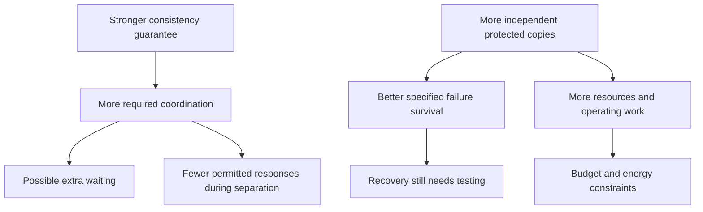

*Part 3 of 7 of [Non-Functional Requirements](/tutorials/system-design/non-functional-requirements) · Sections 34–47.* These sections teach measurement and trade-offs. New to the topic? Start with [Non-Functional Requirements Fundamentals](/tutorials/system-design/non-functional-requirements/fundamentals).

## 34. Relationships between NFRs

Qualities interact. More copies may improve tolerance to specified failures but increase storage, coordination, and cost. Stronger read/write guarantees may add waiting. Security checks add work but can prevent severe harm. None of these directions is universal for every workload.



Read arrows as possible causal influences, not automatic mathematical laws. An added copy with a shared failure point may not improve survival. A closer read copy can reduce read latency even while stricter writes add latency. Good architecture asks which operation and failure model each arrow concerns.

## 35. Ten major trade-offs

A **trade-off** is choosing a balance among competing desirable outcomes, like speed versus careful verification at a bank counter. Record the consequence and reason, not just “it depends.”

| Trade-off | Conflict and example | Which side matters when? |
|---|---|---|
| Availability / consistency | During a network separation, permitting every balance decision may violate required ordering | Financial decisions may refuse/wait; an informational feed may serve stale content |
| Latency / durability | Acknowledging before required persistent copies are safe reduces wait but weakens survival | Committed money records need the promised protection; recreatable temporary information may use weaker guarantees |
| Performance / cost | Spare capacity can lower queues but costs money | Interactive checkout may justify headroom; scheduled reports may tolerate delay |
| Security / usability | Extra verification increases steps | High-risk changes need appropriate proof; minimize unnecessary friction in low-risk tasks |
| Portability / provider optimization | Specialized hosted capabilities can simplify operation but increase migration dependence | Credible portability obligations justify extra adaptation; otherwise assess optimized services honestly |
| Extensibility / simplicity | General extension frameworks add indirection | Known near-term changes may justify a boundary; speculative features may not |
| Modularity / operations | Separately operated modules add network and release coordination | Independent needs may justify services; internal modules may suffice |
| Reliability / cost | Testing, spare capacity, and safe change processes require resources | Prioritize failures with serious consequences before rare low-impact inconveniences |
| Auditability / storage cost | More detailed retained evidence costs storage and review effort | Keep justified evidence with protection; do not log everything forever |
| Energy / resilient headroom | Spare independent capacity consumes resources | Preserve necessary failure tolerance while reducing unjustified idle overhead |

**Try:** Must adding a security check always hurt performance?

**Solution:** No. Costs depend on implementation and workload; preventing abuse may reduce load. Measure the full outcome rather than treating every trade-off as a fixed penalty.

## 36. Quality-attribute confusion matrix

| Pair | Definitions and distinction | Example |
|---|---|---|
| Availability / reliability | Usable service when needed / correct behavior over conditions and time | Replies arrive but totals are wrong |
| Reliability / durability | Overall specified correctness / retained acknowledged information survival | Correct queries today, lost records tomorrow |
| Durability / backup | Outcome promise / one retained-copy technique | A stale unusable backup does not meet a zero-loss promise |
| Latency / throughput | Time per operation / work per time | Fast one meal versus many meals/hour |
| Responsiveness / latency | Prompt useful interface reaction / defined operation elapsed time | Immediate status while upload continues |
| Fault tolerance / resilience | Continue under defined faults / broader adaptation and recovery | Survive one server versus handle an overload and degraded extras |
| Resilience / recoverability | Withstand/adapt/recover / return to acceptable operation | Limited mode now, full restoration later |
| Maintainability / extensibility | Understand/fix/change safely / add a relevant capability | Correct a fee bug versus add a payment method |
| Modularity / maintainability | Responsibility organization / ease of safe change | Modules can help, but unclear interfaces can still obstruct changes |
| Security / privacy | Protect against unauthorized harm / appropriate personal-information handling | Locked database still collects too much |
| Observability / monitoring | Investigate through available outputs / watch chosen known conditions | Explain an unexpected slowdown versus alert on a known threshold |
| Auditability / logging | Reconstruct accountable actions / record events | Protected approval ledger versus debug retry record |
| Scalability / performance | Accommodate growth while meeting targets / behavior at a specified workload | Fast at 100 requests/second but slow at 10,000 |
| Interoperability / portability | Work with other systems / move across environments | Exchange a payment correctly versus move hosting provider |

**Performance** is how efficiently and promptly work is accomplished under stated conditions, often assessed through latency and throughput. It is not proof of performance at every future scale.

## 37. Good versus bad NFRs: 30 examples

The improved statements are proposed exercise targets. Each references a defined test, boundary, or policy; actual documents must supply those linked definitions. Read the vague column and rewrite it first.

A **regression check** verifies earlier behavior still works after change, like retesting existing payment methods after adding one. A **baseline** is a documented comparison starting point, like last month’s measured energy per order. These matter because changes must improve or preserve a known result, not merely produce new numbers.

| # | Bad | Better | Improvement |
|---|---|---|---|
| 1 | Search is fast | p95 keyword-search latency is at most 300 ms at the API boundary under the named peak workload | Operation, boundary, target, conditions |
| 2 | Login always works | At least 99.9% of eligible sign-in requests meet the defined good-request criteria over rolling 30 days | Explicit denominator and window |
| 3 | Scale well | Preserve p95 ≤ 500 ms and errors ≤ 0.1% at 5,000 eligible searches/second for the named data set | Capacity tied to quality |
| 4 | Save reliably | Acknowledged documents survive process restart and one storage-device failure in the named fault test | Failure scope |
| 5 | No stale data | Order-status reads after a completed update observe that update or a later one within the specified consistency model | Observation order |
| 6 | Lots of traffic | Complete 2,000 eligible operations/second for one hour with the stated latency/error limits | Sustained completed rate |
| 7 | Responsive app | Show useful local submission feedback within 150 ms on supported devices in the named interaction test | Interface boundary |
| 8 | Survive failures | Maintain checkout targets after losing one application instance at peak load | Defined failure and useful function |
| 9 | Be resilient | Recommendation outage does not prevent supported product browsing or checkout in the fault drill | Degraded-service outcome |
| 10 | Recover quickly | Restore the defined checkout function within 30 minutes in the specified site-loss drill | RTO and scenario |
| 11 | Lose little data | Restored order information is no more than five minutes behind the incident reference time in the defined disaster scenario | RPO and data scope |
| 12 | Secure passwords | Password storage follows the approved password-verifier policy; no raw passwords occur in persistent records or logs | Checkable protection |
| 13 | Protect messages | All disallowed message-read cases in the access-control matrix are refused on every access route | Authorization scope |
| 14 | Private app | Collected personal fields match the approved purpose/necessity inventory | Minimization evidence |
| 15 | Keep data sensibly | Relevant diagnostic records expire under the approved 30-day retention schedule, with documented exceptions | Retention rule |
| 16 | Easy changes | A prepared engineer completes the defined tax-rule change within two working days and passes regression checks | Change scenario |
| 17 | Operate easily | A trained operator verifies rollback within ten minutes in the stated deployment drill | Role and operating check |
| 18 | Easy additions | Add the defined second payment integration within five working days without modifying unrelated order rules | Extension scenario |
| 19 | Modular | The specified payment change requires changes only within its documented module and interface tests | Observable boundary scenario |
| 20 | Portable | Pass the acceptance suite on the two named environments within the allowed migration effort | Named destinations and effort |
| 21 | Integrate well | Pass all agreed partner contract cases, including currency units, version, refusal, and timeout cases | Interaction meaning |
| 22 | Easy tests | Expiration boundaries can be tested repeatably without waiting for real elapsed days | Controlled test setup |
| 23 | Lots of logs | The named slow-request drill is diagnosed within fifteen minutes using available correlated evidence | Diagnostic outcome |
| 24 | Audit everything | Every successful permission change produces the required protected audit fields | Action and completeness |
| 25 | Accessible | All core checkout flows pass the agreed WCAG-based and assisted manual evaluation scope | Concrete user flows/evaluation |
| 26 | Compliant | Pass the applicable scoped control/evidence assessment specified by the compliance owner before release | Applicable evidence and owner |
| 27 | Cheap | At the named monthly workload, attributed operating cost remains within ₹200,000 while quality targets hold | Budget and workload |
| 28 | Green | Reduce measured energy per successful reference-workload transaction by 15% against the baseline without relaxing quality | Comparable useful work |
| 29 | Healthy replicas | Recovery drills confirm replicas can preserve the promised acknowledged writes and meet the failover target | Outcome rather than a gauge alone |
| 30 | Good notifications | At least 99.5% of accepted eligible notification jobs complete within five minutes over 30 days under the named workload | Acceptance, completion, timing |

## 38. How to write testable NFRs

Use **quality attribute + target + measurement + scope + conditions**.

“Search latency has p95 ≤ 250 ms, measured from API request receipt to response completion, for eligible keyword searches at 10,000 requests/second against the named catalog and query mix, during the 30-minute steady-load benchmark; failures/timeouts are separately constrained.”

A **query mix** describes the distribution of operation types or inputs; easy searches alone do not represent hard searches. **Steady load** remains approximately stable during measurement. A **catalog** is the product-listing collection. Their definitions matter because a result without representative work is weak evidence.

Add rationale, priority, ownership, window, and method. Specify whether `<` or `≤` is intended. “p95 ≤ 250 ms” allows equality; “p95 < 250 ms” does not. Include warm-up, cache conditions, data size, network/client conditions where relevant. **Warm-up** is the initial period before the system reaches the intended test condition, like preheating an oven.

**Try:** Improve “99.99% available.”

**Solution:** Identify the function; define good attempts or usable-time intervals; specify denominator, exclusions, period, boundary, and evidence. Do not assume annual and monthly budgets are interchangeable.

## 39. Reusable requirement template

```text
NFR-ID:
Quality attribute:
Description:
Metric:
Target:
Scope:
Operating conditions:
Measurement method:
Priority:
Rationale:
Owner and source:
Open decisions:
```

**Owner** means the person/role responsible for the decision or upkeep, not a claim about a particular real person. These filled examples are proposed teaching requirements.

| Field | Latency | Availability | Durability | Security | Scalability |
|---|---|---|---|---|---|
| ID | NFR-LAT-01 | NFR-AVL-01 | NFR-DUR-01 | NFR-SEC-01 | NFR-SCL-01 |
| Description | Prompt keyword search | Usable sign-in | Saved orders survive | Private orders protected | Search handles growth |
| Metric | Request p95 and error rate | Good eligible attempts / all eligible attempts | Lost acknowledged order records in fault drill | Allowed/refused access-matrix results | Completed rate with latency/errors |
| Target | p95 ≤ 300 ms; errors ≤ 0.1% | ≥ 99.9% per rolling 30 days | Zero loss in named single-disk failures | All expected refusals/allowances correct | 5,000/second with stated quality |
| Scope | Keyword search API | Sign-in | Acknowledged order records | Order-read routes | Keyword search |
| Conditions | Catalog/query mix v1 at 1,000/second | Actual eligible traffic; documented abuse exclusions | Declared storage failure model | Customer/employee roles and object ownership | Catalog/query mix v1 and resource budget |
| Method | Representative measured load test | Client/API measurements and reconciliation | Inject fault, recover, compare records | Automated matrix and manual review | Growth benchmark, compare rates/queues |
| Priority | Important | Critical | Critical | Critical | Important |
| Rationale | Interactive product finding | Enables access | Paid purchases must remain | Prevent inappropriate access | Expected growth |
| Owner/source | Product/performance owners, interview assumption | Product/operations owners | Product/storage owners | Security/product owners | Product/performance owners |
| Open decisions | Supported client boundary | Exact good-request rules | Broader region-loss promise | Approved role matrix | Hardware/cost ceiling |

“Zero loss” in a defined exercise is a verification target, not a universal proof of no conceivable loss. Open decisions must be settled before treating the entry as a final agreement.

## 40. SLIs, SLOs, and SLAs

A restaurant measures wait times, sets an internal goal, and may promise a delivery time with a remedy. Software uses similar distinctions.

| Term | Meaning | Example |
|---|---|---|
| SLI, service level indicator | The chosen service measurement | Fraction of eligible requests completed correctly within the defined limit |
| SLO, service level objective | The desired bound on that indicator over a period | Good-request fraction ≥ 99.9% over rolling 30 days |
| SLA, service level agreement | A customer-facing agreement with specified obligations and consequences | Contract defines service measurement, exclusions, and remedy if threshold is missed |

An SLA is not simply “an SLO with a fancier name”; consequences and contractual terms matter. SLOs can be tighter than contractual commitments, but this is a policy choice. See [Google SRE: Service Level Objectives](https://sre.google/sre-book/service-level-objectives/).

An **error budget** is the permitted bad fraction/count under an SLO. For one million eligible attempts and a 99.9% good target, the budget is 0.1% = 1,000 bad attempts. It is a planning tool for balancing safe change and service quality, not a reason to ignore correctness or security obligations.

**Try:** Is “p95 latency = 200 ms” an SLO by itself?

**Solution:** It could be an observed SLI result. An SLO specifies the intended bound, operation, conditions, and time window, such as “p95 ≤ 200 ms over each measurement window.”

## 41. Availability calculation problems

Attempt each before reading the solution. We use time-based availability and count all stated downtime.

| Problem | Step-by-step solution |
|---|---|
| 30 days; 60 minutes down. Availability? | Total = 30 × 24 × 60 = 43,200 minutes. Uptime = 43,140. Availability = 43,140/43,200 × 100 ≈ 99.8611% |
| 30 days; target 99.9%. Maximum downtime? | Bad fraction = 1 − 0.999 = 0.001. Budget = 43,200 × 0.001 = 43.2 minutes |
| Same target; already down 20 minutes. Remaining budget? | 43.2 − 20 = 23.2 minutes; only for this same fixed window and definition |
| 365 days; target 99.99%. Budget? | 365 × 24 × 60 × 0.0001 = 52.56 minutes |
| Ten hours; 12 minutes completely down, then 18 minutes unusable for half the users. Time availability? | A single usable/not-usable definition cannot be inferred from “half.” If the defined metric is user-minutes and users are equally weighted/stable: loss = 12 + 18 × 0.5 = 21 equivalent minutes; 1 − 21/600 = 96.5%. Different user/traffic distributions change it |
| 1,000,000 eligible requests; 800 bad. Request availability? | Good = 999,200. Good fraction = 999,200/1,000,000 = 0.9992 = 99.92%. Do not translate this directly into downtime minutes |

Key lesson: calculate only after defining the metric, window, and partial failures. A request-based budget is not a stopwatch budget.

## 42. Latency calculation problems

Observed times: **100, 110, 120, 130, 200, 500 ms**.

1. Average: sum = 1,160; divide by six ≈ **193.33 ms**.
2. Median: middle values 120 and 130; (120 + 130)/2 = **125 ms**.
3. For these exercises, use the **nearest-rank percentile**: sort observations; rank = ceiling(p × n), using one-based positions. **Ceiling** rounds upward to the next whole number, like needing three boxes for 2.1 boxes of goods. For p95: ceiling(0.95 × 6) = 6; value = **500 ms**.
4. The 500-ms value is an outlier relative to the others and pulls the average upward. Six observations are too few to estimate a stable production tail; repeat representative measurements.

**Try:** For 10, 20, 30, 40, 50, 60, 70, 80, 90, 1,000 ms, find mean, median, and nearest-rank p90/p95.

**Solution:** Sum = 1,450; mean = 145 ms. Median = (50 + 60)/2 = 55 ms. p90 rank = ceiling(9) = 9 → 90 ms. p95 rank = ceiling(9.5) = 10 → 1,000 ms. A different interpolation method may return a different percentile; do not silently mix conventions.

**Optional advanced caution:** Collect measurements without omitting pauses, failed attempts, or clients unable to submit under overload. Otherwise the measurement can preferentially sample healthy periods.

## 43. Throughput calculation problems

**Completed throughput = completed work / elapsed time.** Attempt the first column before reading the steps.

| Problem | Steps and result |
|---|---|
| 600 completed requests in ten seconds | 600 ÷ 10 = **60 requests/second** |
| 30,000 messages in one minute | 60 seconds/minute; 30,000 ÷ 60 = **500 messages/second** |
| 7,200 transactions in two hours | 2 × 3,600 = 7,200 seconds; 7,200 ÷ 7,200 = **1 transaction/second** |
| 240 MB transferred in 12 seconds | 240 ÷ 12 = **20 MB/second** |
| 50 MB/second for 60 seconds | Work = rate × time = 50 × 60 = **3,000 MB = 3 GB** |
| 1,000 arrivals/second, 800 completions/second for ten seconds, with no refusals | Net queue growth = (1,000 − 800) × 10 = **2,000 requests**, assuming unchanged rates |

A stated network capacity is not automatically useful application throughput. Protocol overhead, retransmission, shared traffic, and processing can reduce useful completed work.

## 44. Capacity estimation basics

**Daily active users**, or **DAU**, means users active during a day under an explicit activity definition. Like daily shoppers rather than membership cards ever issued, it matters for estimating actual work.

Daily requests = DAU × requests per active user per day.  
Average QPS = daily requests / 86,400, because a day has 24 × 60 × 60 seconds.

Example: 10,000,000 DAU × 20 requests/day = **200,000,000 requests/day**. Average = 200,000,000 ÷ 86,400 ≈ **2,314.81 requests/second**.

A **peak multiplier** compares chosen peak rate to average, like a lunch-rush factor. With an assumed 5× factor: peak ≈ **11,574.07 requests/second**. Round capacity appropriately and verify the actual burst duration/mix. Five is an invented assumption, not a law.

**Try:** One million DAU, ten requests each, 4× peak. What are the rates?

**Solution:** Ten million/day; average ≈ 115.74/second; assumed peak ≈ 462.96/second. Then identify read/write mix and critical operation rates; an average across all operations can hide checkout pressure.

## 45. Reliability and failure probability

**Probability** quantifies chance from 0 to 1, like a fraction of hypothetical repeated coin tosses. 0 means impossible in the model; 1 means certain. It matters because redundancy changes risk only under stated assumptions.

Two 99%-available servers do not automatically give 100%. They may fail together, share a database, or have inadequate failover capacity. **Independent failures** do not change one another’s probabilities; **correlated failures** share causes, like one power outage affecting both desks. Real independence is often imperfect.

**Optional advanced calculation:** If either of two independently unavailable servers can fully serve the function, each unavailable fraction is 0.01. Both unavailable probability = 0.01 × 0.01 = 0.0001. Idealized availability = 1 − 0.0001 = **99.99%**. This assumes perfect routing, adequate replacement capacity, compatible information, and no other required failure points.

For two required independent parts each 99.9% available, idealized combined availability = 0.999 × 0.999 = **99.8001%**, since both must work. This is a model, not a measured guarantee, and not automatically reliability over a mission interval.

**Try:** What invalidates the two-server calculation?

**Solution:** Shared failures, routing failure, insufficient spare capacity, required database outage, stale unusable information, or flawed detection/promotion.

## 46. RTO and RPO exercises

| Scenario: identify targets first | Solution and reason |
|---|---|
| Tolerate at most 15 minutes of updates lost; restore within one hour | **RPO ≤ 15 minutes; RTO ≤ 60 minutes**. Lost-update span and restoration elapsed time are different |
| A reporting tool can restore yesterday’s snapshot and be back in four hours | Clarify snapshot time/reference; a maximum 24-hour loss allowance implies **RPO ≤ 24 hours**, RTO ≤ four hours |
| Money records must lose no acknowledged writes in the defined single-site disaster; service returns within two hours | **RPO = 0** for that data/failure scope; **RTO ≤ two hours** |
| Backups every five minutes, but the last usable copy is twenty minutes old | At the incident, actual achievable recovery point may be twenty minutes behind; a five-minute schedule alone does not meet RPO ≤ five minutes |
| Restore files in 20 minutes, but verifying correctness and access takes 50 more | If acceptable service includes verification/access, actual recovery time is **70 minutes**, not 20 |

Use realistic drills. Recovery requires the correct version of software, accessible keys, operator permissions, dependency restoration, and confirmation of pending operations.

## 47. Security-requirement exercises

Rewrite “The system must be secure” before reading. Start with information, actors, actions, and threats rather than picking tools.

| Area | Testable proposed requirement | Verification |
|---|---|---|
| Authentication | Private-account access requires the agreed identity verification; invalid proofs never grant that access | Valid/invalid account tests and review |
| Authorization | Users can retrieve only messages allowed by the approved participant/role rules | Access matrix across all routes |
| Encryption | Sensitive communication/storage follows the approved protection and key-access policy | Configuration review and controlled checks |
| Password storage | Raw passwords are absent from persistent records, logs, and recoverable diagnostic outputs; verifiers follow the approved policy | Storage/log inspection and implementation review |
| Session handling | Expired/revoked sessions cannot perform restricted actions; configured deadlines apply consistently | Controlled clock and revocation tests |
| Audit logging | Privileged permission changes have all required protected audit fields | Compare actions against records; test access |
| Secrets | Production secrets are accessible only to named authorized roles and do not appear in source/diagnostic outputs | Inventory and access review |

An **access matrix** maps roles and actions to allowed or refused results, like a building-access roster. A **revoked session** has had its access explicitly withdrawn. A **vulnerability** is a weakness that may permit harm; tests can reduce risk but no finite checklist proves absolute security. Define review scope and residual risk rather than promising “unhackable.”
