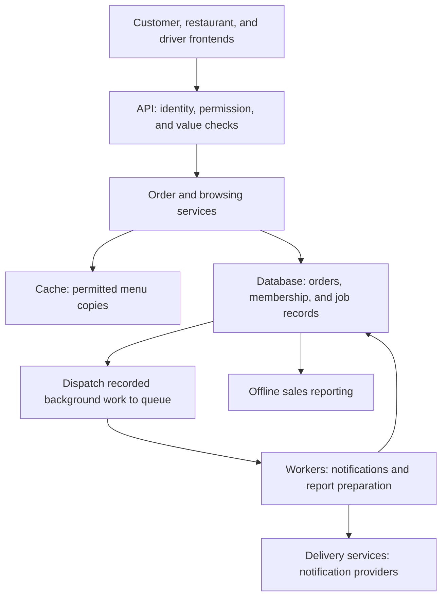
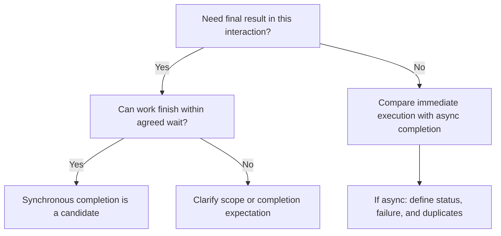
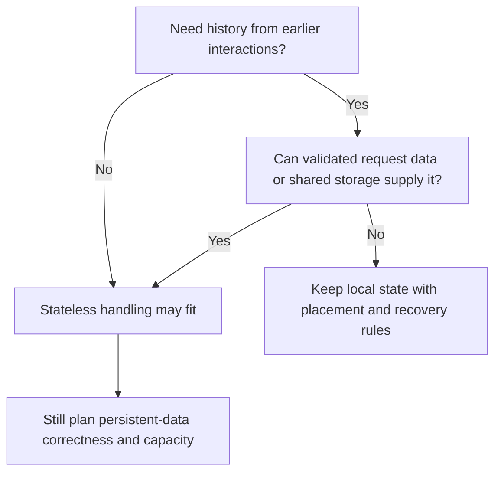
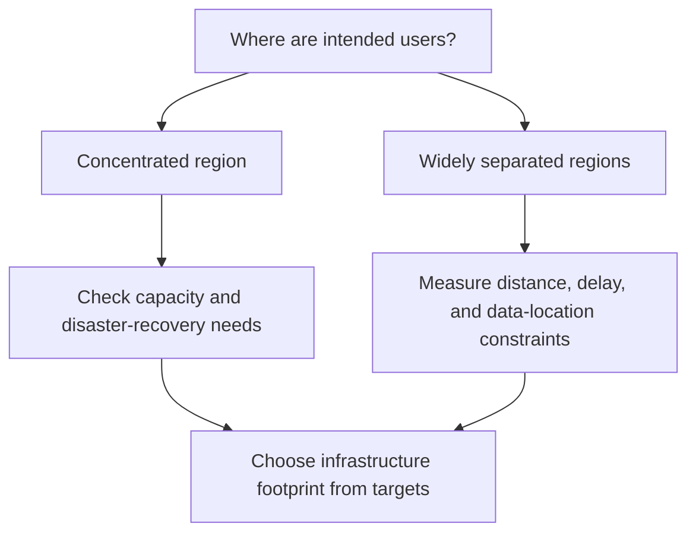
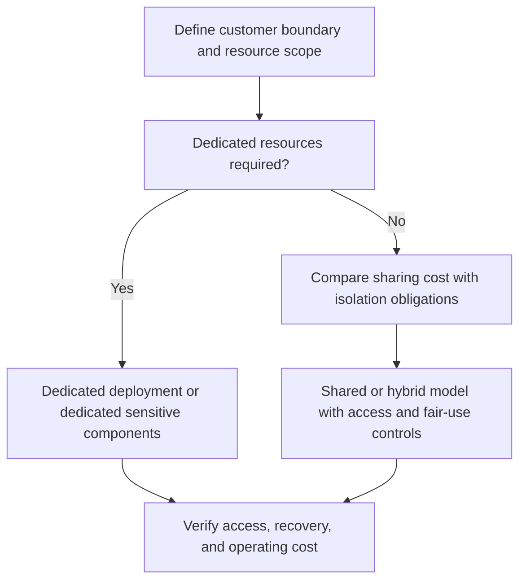

*Part 4 of 5 of [Requirement Characterization](/tutorials/system-design/requirement-characterization) · Sections 70–97.* These sections provide applied practice. New to the topic? Start with [Requirement Characterization Fundamentals](/tutorials/system-design/requirement-characterization/fundamentals).

## 70. Forty classification exercises

Classify each situation before reading the solutions. Name the boundary you are classifying and explain your evidence. Unspecified labels may remain unknown.

| # | Situation | Classification question |
|---|---|---|
| 1 | Search a public website | Interaction, timing, completion? |
| 2 | Calculate monthly payroll | Grouping and timing? |
| 3 | Receive readings from ten million sensors | Workload and audience? |
| 4 | Check a bank balance | Interaction and correctness? |
| 5 | Generate annual tax reports overnight | Processing and priority? |
| 6 | Deliver live chat messages | Communication contract? |
| 7 | Open a product description | Read or write? |
| 8 | Delete a profile photograph | Read or write? |
| 9 | Remember sign-in only on Server A | State handling? |
| 10 | Any server retrieves a cart from shared storage | State handling? |
| 11 | Employee expense portal | Audience and trust? |
| 12 | Public shopping mobile app | Audience and trust? |
| 13 | Sell scheduling software to hospitals | Market and scale? |
| 14 | Sell a personal music subscription | Market and tenancy? |
| 15 | Run the same application for thirty companies | Tenancy? |
| 16 | Each customer has a dedicated application environment | Tenancy? |
| 17 | User in Japan accesses one US server | Geography and deployment? |
| 18 | One-country product keeps recovery infrastructure elsewhere | Geography and deployment? |
| 19 | Prefer blue buttons | Strictness? |
| 20 | Accepted purchase cannot create duplicate orders | Strictness? |
| 21 | Customers can cancel orders | Requirement type? |
| 22 | 95% of cancellations finish within one second | Requirement type? |
| 23 | Taxi product cannot launch without ride requests | Priority? |
| 24 | Decorative route animation can wait | Priority? |
| 25 | Return export job ID before preparing the file | Completion contract? |
| 26 | Return actual search results in the response | Completion contract? |
| 27 | Group new readings every five seconds | Processing model? |
| 28 | Evaluate machine alarms as readings arrive | Timing and interaction? |
| 29 | Train recommendations after closing | Timing? |
| 30 | Use yesterday's recommendations on a homepage | Timing and freshness? |
| 31 | Trust a customer's submitted discount percentage | Trust issue? |
| 32 | Controlled worker sends a malformed invoice | Trust and validation? |
| 33 | Separate customer databases with shared application servers | Tenancy boundary? |
| 34 | One customer overloads shared workers | Resource issue? |
| 35 | Server checks document owner before returning content | Protection? |
| 36 | Service records events now, groups summaries at midnight | Mixed dimensions? |
| 37 | A hospital employee system must work continuously | Audience and criticality? |
| 38 | Everyone worldwide reads public manuals from one deployment | Geography and workload? |
| 39 | Game server remembers player positions | State? |
| 40 | User submits the same payment after a timeout | Failure and repetition? |

### Solutions with reasons

1. Interactive, online, usually synchronous for search results. The user needs an answer now; indexing can differ.
2. Batch and offline relative to employee interactions; typically asynchronous submission. Correctness and payday deadline still matter.
3. Write-heavy ingestion if receiving readings dominates. Machine clients may be external; device ownership determines audience and trust.
4. Interactive online read with synchronous result; agreed freshness and ownership are important. It can cause audit writes too.
5. Batch/offline; priority is unknown until business obligations are clarified. Annual frequency does not mean optional.
6. Sending can synchronously acknowledge acceptance and asynchronously deliver. Recipient presence changes timing, not the need for outcomes.
7. Read at the product-data boundary. Analytics logging may add a write elsewhere.
8. Write because stored data changes. Authorization may require preliminary reads.
9. Locally stateful session handling. Losing A can lose the only session copy.
10. Stateless app handling is possible; shared cart data remains stateful. A server need not remember earlier requests privately.
11. Internal audience. Employee clients still need identity, permissions, and validation.
12. External audience and untrusted client. Installed official software can still be altered or imitated.
13. B2B. Neither user count nor throughput follows from the market label.
14. B2C. Tenancy depends on account isolation and resource boundaries, not subscription alone.
15. Multi-tenant application if each company is a customer boundary. Database sharing remains unspecified.
16. Single-tenant application deployment. Shared provider administration may still exist.
17. Global or international audience if such users are intended; one-region deployment. One overseas user alone may not define the entire product scope.
18. Regional audience and multi-region infrastructure. Recovery deployment does not make users global.
19. Usually soft and possibly nice-to-have. A binding branding contract could change strictness.
20. Hard correctness in the stated scope. Define operation identity and uncertain failures.
21. Functional behavior. Rules about eligibility may require further clarification.
22. Non-functional latency target. It can independently be hard or soft.
23. Must-have function for the agreed release. This does not impose zero latency or universal availability.
24. Nice-to-have for this release; postpone without removing the product's purpose.
25. Asynchronous final completion with synchronous acceptance. “Queued” is not “file ready.”
26. Synchronous completion at this boundary. Internal services could use other patterns.
27. Micro-batch. A five-second grouping interval adds waiting plus execution delay.
28. Online processing without necessarily interactive behavior. No human must be requesting and waiting.
29. Offline preparation. It can be batch even though computers are internet-connected.
30. Online serving of offline-prepared data. Clarify whether yesterday's suggestions are fresh enough.
31. Untrusted input must be independently checked. A client's claimed discount is not authority.
32. Even trusted workers need validation. Identity and managed ownership do not prevent bugs.
33. Multi-tenant application with dedicated tenant data stores. Specify both boundaries.
34. Noisy-neighbor problem. Quotas, fair scheduling, or reserved capacity may help.
35. Authorization and ownership validation; authentication must identify the caller first.
36. Online write ingestion combined with offline batch summarization. One product contains both.
37. Internal audience with hard or demanding availability requirements. Internal does not mean low stakes.
38. Global audience with one deployment; manual-serving reads likely dominate. Updates still require writes.
39. Locally stateful live handling. Recovery and placement need planning if continuity matters.
40. Timeout leaves uncertainty. Reuse the intended operation identity or resolve status to avoid extra financial effects.

## 71. “It depends” exercises

**Pause:** is an online shop read-heavy, synchronous, and stateless?

<details>
<summary>Solution</summary>

Browsing may be read-heavy, interactive, online, and synchronous. Ordering writes records. App servers may be stateless while order workflows persist. Notifications can be async; sales summaries can be offline batch. A single product-wide label would hide these differences. Count activity by workflow and boundary before selecting optimizations.

</details>

**Pause:** are reports batch, and is chat asynchronous?

<details>
<summary>Solution</summary>

A nightly report processes grouped data, but opening one prepared report is an interactive read. Chat acceptance may be synchronous while delivery is asynchronous. The word “report” or “chat” does not identify the exact operation or completion contract.

</details>

**Pause:** are B2B tools necessarily multi-tenant?

<details>
<summary>Solution</summary>

No. Customers can receive dedicated deployments, or share the application with separate databases. Market relationship and sharing model are independent. Ask what the contract requires.

</details>

## 72. Common misconceptions

| Misconception | Correction and reason |
|---|---|
| Stateless means no database | It describes local request-history dependence at a specified layer |
| Async means slow | Completion is separate from acceptance; work can finish quickly |
| Internal systems need no security | Employees, bugs, and compromised devices can violate boundaries |
| B2B means few users | One customer can contain many users or machines |
| Global means multi-region | User geography and infrastructure placement are different |
| Read-heavy means no writes | Reads dominate a measure; writes still exist and can be critical |
| Batch means offline | Grouping and operational timing are different dimensions |
| Multi-tenant means shared tables | Shared applications can use separate databases |
| Trusted clients need no validation | Control and identity do not eliminate mistakes or compromise |
| Must-have means hard technical guarantee | Product scope and acceptable deviation are separate |
| Soft means unimportant | A flexible speed target can greatly affect revenue |
| Async means eventually successful | Jobs can fail permanently; outcomes must be reported |
| All workflows have the same labels | Browsing, purchase, notification, and reporting differ |
| Global means writes everywhere | Some global services use one authoritative write location |

## 73. Fifteen statements that sound correct but are wrong

1. **“Our frontend validates prices, so users cannot change them.”** Clients can submit other values. Server-side price rules are required.
2. **“We use JWT, therefore our backend is stateless.”** A **JWT**, JSON Web Token, is a structured token format, like a standardized claim ticket. **JSON** is a text format for named values, like a labeled form. A token may carry claims, but servers can still depend on local carts, sessions, or game state. Verify token protections and all state dependencies.
3. **“Worldwide users require every database to be globally copied.”** Copy only where allowed and useful; freshness and write-location needs differ by data.
4. **“Multi-tenant SaaS requires one database.”** Sharing can occur at the application layer with separate stores.
5. **“A queue prevents overload forever.”** Sustained arrivals faster than processing create growing waiting work.
6. **“The payment timed out, so it failed.”** The response may be lost after success. Resolve uncertainty.
7. **“The job was accepted, so it completed.”** Acceptance and completion are different states.
8. **“A 99.9% target is automatically soft.”** It can be a binding commitment; ask about consequences and measurement.
9. **“Reads dominate, so write correctness is less important.”** A rare price update or purchase can still require exact handling.
10. **“Authentication authorizes every document.”** Identity does not establish permission for each resource.
11. **“An encrypted message is trustworthy.”** Encryption can protect transmission while carrying an invalid request.
12. **“A cache always improves the system.”** Stale data, maintenance cost, and miss handling can outweigh benefits.
13. **“Dedicated servers guarantee tenant privacy.”** Misconfigured access and support tools can still cross boundaries.
14. **“An average rate is the required server capacity.”** Peaks, data size, and operation cost may dominate.
15. **“MVP means correctness can wait.”** Scope can shrink while essential correctness remains required.

## 74. Quantitative workload exercises

### A. Ten million users

Each performs 50 reads and two writes per day. Calculate before opening.

<details>
<summary>Worked solution</summary>

Reads = 10,000,000 × 50 = 500,000,000/day. Writes = 10,000,000 × 2 = 20,000,000/day. Divide both by 20,000,000: **25:1**, strongly read-heavy by action count. Average reads/s = 500,000,000 ÷ 86,400 ≈ 5,787.0. Writes/s ≈ 231.5. Capacity still needs peaks and per-action costs.

</details>

### B. One thousand sensors

Each emits ten readings per second. Assume each reading causes one logical write.

<details>
<summary>Worked solution</summary>

Writes/s = 1,000 × 10 = **10,000**. Daily writes = 10,000 × 86,400 = **864,000,000**. This establishes write arrival rate, not the read/write ratio, since query reads are unspecified. It suggests write-intensive ingestion, with reads measured separately.

</details>

### C. Product catalog

Five million product views and 50,000 product changes per day.

<details>
<summary>Worked solution</summary>

Assuming one logical read per view and one write per change, ratio = 5,000,000:50,000 = **100:1**. Read-heavy. Views/s average ≈ 57.9; changes/s ≈ 0.579. Image bytes and analytics writes could change resource demand, so state the counting boundary.

</details>

### D. Ten million sensors every thirty seconds

<details>
<summary>Worked solution</summary>

Each sensor emits 1/30 reading per second on average. Total = 10,000,000 ÷ 30 ≈ **333,333.3 readings/s**. There are 86,400 ÷ 30 = 2,880 readings per sensor per day. Total = 10,000,000 × 2,880 = **28,800,000,000/day**. If devices send together, bursts exceed this average. One storage operation may contain several readings.

</details>

### E. A queue under sustained overload

Arrivals are 1,000 jobs/s; workers finish 800 jobs/s. Ignore starting backlog. How many jobs wait after one minute?

<details>
<summary>Worked solution</summary>

Growth = 1,000 − 800 = 200 jobs/s. After 60 seconds, 200 × 60 = **12,000 waiting jobs**. More buffering delays failure but does not close the capacity gap. Increase processing, reduce arrivals or work cost, or refuse some work under an agreed policy.

</details>

## 75. Synchronous and asynchronous timelines

These times are illustrative, not measured product performance.

| Time from submission | Synchronous payment attempt |
|---|---|
| 0 ms | User submits |
| 20 ms | Server receives request |
| 300 ms | Provider supplies authorization result |
| 350 ms | User receives the operation's result |

The dependent purchase interaction waits for the authorization outcome. This does not imply later settlement has finished.

| Time from submission | Asynchronous export |
|---|---|
| 0 ms | User asks for export |
| 50 ms | Server returns “queued” and job identity |
| 30 seconds | Worker finishes the file |
| 31 seconds | User receives notification |

**Pause:** what is the export's completion latency?

<details>
<summary>Solution</summary>

About 30 seconds to file readiness in this timeline, or 31 seconds to notification. The acceptance latency is only 50 ms. Define which result you measure. The operation can use a synchronous API response to acknowledge asynchronous final work.

</details>

## 76. Stateful failure exercise

A user signs in to Server A. The next request reaches B, which does not know the session. Explain what happened and propose remedies.

<details>
<summary>Solution and alternatives</summary>

The application stored required session history only on A. Routing to B exposed that dependency. Sticky sessions may route normal requests back to A but do not solve A's failure. A shared session store lets B retrieve validated state, with extra lookup and shared-store recovery needs. A validated request-carried token can remove some local session dependencies, with expiry, revocation, and permission questions. Replicating or migrating state may preserve a deliberately stateful design, but adds coordination. Select based on what must be remembered and what failure behavior is acceptable.

</details>

## 77. Multi-tenant isolation exercise

A user in Tenant A requests `GET /documents/123`. Document 123 belongs to Tenant B. What must the backend check?

<details>
<summary>Solution</summary>

Authenticate the caller; determine their allowed tenant memberships from trusted information; establish the active authorized tenant; check that the document belongs to that scope; and verify the user's permission for the requested action. Do not trust a caller-supplied tenant ID alone. A public document may have different explicit sharing rules, but those rules still need verification. Returning a record solely because the numeric ID exists leaks Tenant B's information. Check tenant scope in data access, files, caches, and exports as well as ordinary screens.

</details>

## 78. Global-system exercise

Intended users live in India, Germany, the United States, Brazil, and Japan. One server runs in the United States. What is a requirement question, and what is a design decision?

<details>
<summary>Solution</summary>

Requirements questions: What latency is acceptable in each location? What availability and recovery are needed? Which data may be handled where? Which local languages and time zones matter? What operating budget is available? Design candidates: nearby content copies, selected regional services, recovery infrastructure, or maintaining one location if targets permit it. Distance can hurt response times; one server can be a concentrated failure point. However, worldwide access does not prove multiple write locations are necessary. More locations cost money and add coordination, operations, and data-copy responsibilities. Confirm the needs first.

</details>

## 79. Reusable requirement-characterization template

Copy this into a design document. Use complete, checkable statements; distinguish confirmed facts from estimates. “Unknown” is preferable to invented certainty.

```markdown
# Requirement Characterization

## Product and purpose
[Name; problem solved; release scope]

## Core users and callers
[People, organizations, administrators, devices; who buys and who uses]

## Hard requirements
[Condition; scope; operating assumptions; failure behavior; how verified]

## Soft requirements
[Target; measurement; acceptable exceptions; consequence of missing target]

## Functional requirements
[Actor can perform action and receive specified outcome]

## Non-functional requirements
[Measured quality, capacity, protection, location, or operating constraint]

## Must-have features
[Required for this version; reason]

## Nice-to-have features
[Deferred value; explicit boundary of scope]

## Workload
[Read-heavy / write-heavy / mixed / unknown, for each workflow]
Evidence: [Reads, writes, period, data sizes, peaks, counting boundary]

## State model
[Stateful / stateless / mixed at each layer]
Reason: [What is remembered; where; loss and recovery behavior]

## Processing model
[Interactive / batch / mixed; who waits; grouped items]

## Timing
[Online / offline / mixed; deadlines and freshness]

## Communication
[Synchronous / asynchronous / mixed; acceptance vs completion]
[How status, failure, retries, and duplicate operations are handled]

## Audience
[Internal / external / mixed; dependencies recorded separately]

## Business model
[B2B / B2C / other; buyers, users, administrators]

## Client trust
[Control assumptions; trust boundaries; server-enforced checks]

## Geographic scope
[Regional / global; users; computation; permitted data locations]

## Tenancy
[Single / multi / hybrid; which resources shared; customer boundaries]

## Key architectural implications
[Need → possible design response → cost → condition requiring it]

## Assumptions, evidence, and open questions
[Question; owner; decision it could change; how to validate]
```

For example: “Browse product descriptions: estimated 100 reads per update; descriptions may be 60 seconds old; cache is a candidate.” That is stronger than “read-heavy, use cache” because it records the evidence and allowed stale behavior. Keep the final characterization concise by moving calculations to an appendix when needed.

## 80. How characterization becomes design reasoning

| Characterization | Need revealed | Candidate design response |
|---|---|---|
| Repeated read-heavy browsing | Enough cheap read capacity | Cache acceptable copies or add read replicas |
| Global customers with strict response goals | Limit geographic waiting | Deliver permitted content near users |
| Untrusted clients | Important rules cannot rely on caller honesty | Validate values and permissions on the server |
| Shared tenants | Prevent data crossing and unfair resource use | Tenant-aware access checks, quotas, or isolation |

Add the condition and cost. “Cache” requires acceptable staleness and invalidation rules. **Invalidation** means discarding or marking a copy unusable, like removing an old price poster; it prevents continued use of known outdated data. Good reasoning can also conclude that an extra component is unnecessary at the current scale.

## 81. Combined case study: food delivery

**Actors** are people or systems participating in a workflow, like customers, cooks, and couriers. Here they are customer, restaurant staff, delivery driver, and platform administrator.

Assume an initial city launch with many restaurants sharing the provider's application. Must-have functions: browse available restaurants, place an order, let restaurants accept or reject it, coordinate delivery, and show order status. Core hard rules include permitted access, agreed prices, no duplicate financial effects for the same intended purchase, and valid order transitions. **A workflow transition** is a change between defined stages, like “ordered” to “accepted”; preventing “delivered” from jumping back to “unpaid” matters for coherent behavior.

Soft targets may concern normal browsing and notification delay. Nice-to-have functions include decorative animations and personalized suggestions. Define exact latency targets before designing around them.

| Workflow | Characterization | Consequence |
|---|---|---|
| Browse restaurants | Read-heavy, interactive, online, synchronous | Fast reads; define menu freshness |
| Place order | Writes, interactive, online, synchronous acceptance | Validate ownership, price, availability, and duplicate handling |
| Restaurant fulfillment | Persistent stateful workflow, online events, often async propagation | Track allowed transitions and report outcomes |
| Driver updates | Write-oriented position/status events | Define ordering, freshness, permission, and burst behavior |
| Notifications | Asynchronous delivery | Track failures; delayed notice is not lost order state |
| Sales analytics | Offline batch processing | Protect live operations and meet reporting deadline |

The platform includes B2C consumer ordering and B2B restaurant relationships. Customer and driver devices are external, untrusted clients. Staff administration is internal but still protected. It starts regional; global expansion is a later requirement question. Restaurant organizations can be tenants in shared administrative tools, but public restaurant menus intentionally cross some visibility boundaries. Model public data, private tenant records, and order participants separately.

**Pause:** does a restaurant tenant get permission to view all platform orders?

<details>
<summary>Solution</summary>

No. It may view orders assigned to that restaurant under its roles. Customers see their own orders; drivers see permitted assignments; administrators have specifically authorized privileges. Tenant membership alone does not imply every action or record is allowed.

</details>

## 82. Architecture sketch after characterization

This is an illustrative arrangement, not a production prescription. The frontend lets participants interact; the API receives agreed requests; the backend enforces rules; the database keeps authoritative order records; the cache provides permitted copies; queued work lets workers perform delayed tasks. All those terms were introduced before this sketch.



Browsing motivates quick copies only where freshness permits. Order correctness motivates authoritative records and checked transitions. Delayed notification work motivates a job record and queue. Persistent order state does not force every API server to depend on private memory.

There is an important failure gap to resolve: if an order is saved but its notification job is not, the order exists without its expected event. One possible response is to record pending work together with the order under an appropriate transaction, then dispatch it with safe retries. This is often called an **outbox pattern**, like placing a signed order and its outgoing letter in the same official ledger. It helps prevent forgotten work, but repeated dispatch can still occur, so recipients need duplicate handling. The sketch's arrows do not themselves guarantee atomic updates or successful delivery.

## 83. Characterization before technology selection

“We should use Kafka.” Why? Start instead: some work may finish later; arrivals can burst; the sender should not wait for every downstream consumer. A durable messaging mechanism may help. Only then compare implementations.

The following names are optional examples, not prerequisites or recommendations for a specific project. An **orchestrator** manages running software across computers, like a supervisor assigning and replacing kitchen stations; it matters when operating many instances becomes a problem.

| Technology | Plain description and analogy | Requirement that might motivate evaluation | Limits to check |
|---|---|---|---|
| Redis | Fast data store often used for cached values; a nearby working notebook | Repeated lookup needs with defined freshness | Memory cost, persistence settings, and failure behavior |
| Kafka | Distributed event log storing a sequence for consumers; a shared ordered journal | Many event consumers, retention, and replay needs | Operation cost, delivery behavior, ordering scope; not equivalent to every task queue |
| PostgreSQL | Relational database organizing related records in tables; structured ledgers | Related order data and controlled transactional updates | Capacity, access patterns, operational setup |
| Cassandra | Distributed database designed for data spread across nodes; many coordinated record depots | Very large distributed data workloads with suitable access patterns | Data model, consistency choices, and operations |
| CDN | Distributed content delivery, taught earlier | Fast geographically dispersed image or video delivery | Cacheability, privacy, and freshness |
| Kubernetes | Orchestrator for packaged applications; a supervisor across many stations | Many application instances need coordinated deployment and replacement | Management complexity; may be unnecessary for a small system |

A **distributed system** consists of cooperating components on different computers, like several branches coordinating service; messages can be delayed or fail independently. It is not automatically preferable to one well-sized deployment. An **implementation** is the concrete way a design is realized, like choosing particular ovens for a kitchen layout. Evaluate technologies against the required behavior; their names do not provide evidence of correctness.

Requirement → characteristic → architectural need → technology evaluation. If a candidate adds more complexity than the requirement justifies, omit it.

## 84. Practical decision trees

These guide questions; they do not replace judgment.

### Synchronous versus asynchronous



A deadline shorter than necessary work cannot be solved merely by choosing a label. Negotiate a smaller result, delayed completion, or greater capacity where it actually helps.

### Stateful versus stateless application handling



### Regional versus global



### Single-tenant versus multi-tenant



## 85. Characterization trade-off table

| Choice | Benefits when matched to needs | Costs or risks | Common use |
|---|---|---|---|
| Hard guarantees | Protect essential acceptance conditions | Stronger checks and constrained failure behavior | Financial correctness |
| Soft targets | Permit negotiated exceptions and optimization | Poorly defined exceptions can hide failure | Normal response speed |
| Read-heavy optimization | Reduce repeated lookup cost | Stale copies and extra storage | Catalog browsing |
| Write-heavy optimization | Handle high arrival rates | Buffering delay and partition complexity | Telemetry ingestion |
| Local stateful handling | Fast access to current interaction state | Placement, failover, and migration | Live games |
| Stateless app handling | Flexible request distribution | Dependence on shared systems | Account APIs |
| Interactive emphasis | Immediate user progress | Peak capacity and waiting pressure | Checkout |
| Batch emphasis | Efficient grouped work | Delayed results and rerun safety | Payroll |
| Online emphasis | Current operational decisions | Tight freshness and capacity requirements | Ride matching |
| Offline emphasis | Separate expensive deferred work | Prepared results can age | Recommendation training |
| Synchronous completion | Direct final answer | Caller waits; dependency delays propagate | Profile retrieval |
| Asynchronous completion | Separate acceptance from long work | Status, duplicates, and final failure handling | Video preparation |
| Regional footprint | Simpler geography and coordination | Concentrated failure exposure | City service |
| Global service footprint | Wider reach and possible proximity | Copies, location rules, and operating complexity | International collaboration |
| Single-tenant deployment | Dedicated customer capacity and changes | Idle resources and many deployments | Isolation-sensitive customer |
| Shared multi-tenancy | Resource sharing and common upgrades | Tenant leaks and noisy neighbors | Hosted enterprise tool |

When a characterization does not affect the current requirement, avoid designing speculative complexity for it. A small global read-only manual may be adequately served through content delivery rather than a global write database.

## 86. Ten requirement-conflict scenarios

Try to identify the tension and a question that could resolve it before reading the final column.

| # | Demands | Tension | Clarification or possible resolution |
|---|---|---|---|
| 1 | Worldwide users; all covered data in one country; extremely low delay worldwide | Remote requests must travel | Define covered data and latency; nearby public content may help, but physics remains |
| 2 | Every tenant fully dedicated; tiny per-tenant price | Dedicated resources cost more | Define exact isolation boundary, customer size, and pricing |
| 3 | Instant completion; 30-minute calculation | Work exceeds waiting target | Return acceptance, reduce computation, or relax deadline |
| 4 | Every read immediately current; freely serve old copies | Freshness conflicts with stale reads | Identify fields that require authoritative reads |
| 5 | Never lose accepted events; accept all events during unlimited outage | Finite storage cannot hold unbounded arrivals | Bound outage and arrivals; define admission behavior |
| 6 | Allow offline edits; every editor sees the same latest version immediately | Disconnected devices cannot exchange current data | Define later merge behavior and which operations require connection |
| 7 | Immediate permanent deletion; indefinite identifiable history | Retention obligations conflict | Clarify record categories and approved handling policy |
| 8 | Anonymous use; enforce permissions tied to verified identity | No identified subject for protected actions | Separate public and protected capabilities |
| 9 | Customize every tenant independently; upgrade everyone identically | Versions and behavior diverge | Define supported configuration instead of unlimited custom code |
| 10 | Always accept unlimited load; fixed small budget; no degraded service | Resource demand can exceed capacity | Bound load, plan scaling budget, or permit controlled refusal |

A conflict is not always impossible: refining scope can resolve it. Do not silently violate one condition to satisfy another. Record the decision and its consequences.

## 87. Requirement evolution

A startup might begin with regional consumers, one deployment, and mostly synchronous short operations. Later it may serve global users, add enterprise customers, formalize tenant boundaries, and move long workflows to asynchronous completion.

Growth does not force every change simultaneously. Existing stateful data remains valuable; only particular application boundaries may change. Measure new peaks, identify new location and isolation obligations, and preserve important behavior during change. Review characterization when customers, geography, workflows, contracts, or operation rates change. Reversible initial choices can help, but building every future possibility at launch can waste resources.

## 88. Mock interview: URL shortener

**Interviewer:** Design a URL shortener.

**Candidate:** Before choosing components, what are the core actions?

**Interviewer:** Create a short link and redirect visitors. Statistics can wait until later.

**Candidate:** How often are redirects performed compared with creation?

**Interviewer:** Assume 100 million redirects and one million creations per day.

**Candidate:** That is 100 reads per creation at the logical action boundary. Is the mapping required to be correct even if redirect speed occasionally misses a target?

**Interviewer:** Yes. Aim for fast redirects, but define a realistic measured target.

**Candidate:** Are links public, and where are visitors?

**Interviewer:** Public callers worldwide. Start with ordinary consumers, no company workspaces.

**Candidate:** Browsers are untrusted. We need checked destinations and abuse controls. Redirects return synchronously; analytics can be deferred. Any data-location constraints or expiry rules?

**Interviewer:** Expired links must stop redirecting. No additional location rule in this exercise.

**Candidate:** Then cache behavior must respect expiry. App servers can consult shared mappings without private session dependence. I'll keep global user scope separate from the decision about server regions.

| Topic | Characterization |
|---|---|
| Product scope | Creation and redirect must-have; statistics optional initially |
| Strictness | Correct mapping and expiry hard; speed target to specify |
| Workload | 100:1 logical reads:writes |
| State | Persistent mappings; stateless app handling possible |
| Processing | Interactive, online redirects; offline statistics possible |
| Communication | Synchronous redirect; asynchronous analytics candidate |
| Audience and market | External/public, consumer-oriented under stated assumptions |
| Trust | Untrusted callers |
| Geography | Global users; deployment footprint undecided |
| Tenancy | Enterprise tenancy outside initial scope |

Notice how assumptions become evidence only when the interviewer supplies them. The candidate avoids treating global access as an instruction to copy all data everywhere.

## 89. Mock interview: analytics platform

**Interviewer:** Design an analytics platform.

**Candidate:** What decision must it support, and how fresh must results be?

**Interviewer:** Managers need yesterday's sales every morning. It is internal.

**Candidate:** Then a daily offline batch is plausible. How do sales arrive?

**Interviewer:** Throughout the day; ingestion writes dominate arrival work.

**Candidate:** Queries later read substantial data. Does the sender need the report when submitting a sale?

**Interviewer:** No; just reliable acceptance. We also want a dashboard.

**Candidate:** Acceptance can be synchronous, while summarization is asynchronous. Dashboard reads are interactive and online, even if results are prepared offline. Is it one organization or a hosted service for several?

**Interviewer:** One organization now.

**Candidate:** Then enterprise multi-tenancy is not confirmed. We must protect internal roles and keep report jobs from delaying ingestion. What are the correct-total rules, late-data policy, and morning deadline?

| Topic | Result |
|---|---|
| Audience | Internal |
| Workload | Write-oriented ingestion; read-intensive aggregation and dashboard queries |
| Processing | Daily batch plus interactive dashboard |
| Timing | Offline calculation plus online ingestion and viewing |
| Completion | Synchronous acceptance; asynchronous report preparation |
| State | Persistent records and summaries; workers can be replaceable |
| Priority | Accurate required totals and deadline; optional presentation extras |
| Geography and tenancy | Need clarification; one organization stated |

Compared with a shortener, completion deadlines and efficient grouped processing matter more than minimizing every calculation's immediate latency.

## 90. Mock interview: enterprise SaaS

**Interviewer:** Design a hosted document application for companies.

**Candidate:** Does one application serve multiple companies, and what must be separated?

**Interviewer:** Yes. Company documents and administration must be isolated.

**Candidate:** B2B market and multi-tenant application. Browser clients are external and untrusted. May a user belong to several companies?

**Interviewer:** Yes, but access must follow the selected organization's membership and role.

**Candidate:** That makes per-request tenant and resource authorization important. Any hard location obligations?

**Interviewer:** Some contracts restrict covered documents to agreed locations.

**Candidate:** We'll record that as a scoped hard constraint and include copies and recovery arrangements. Are page-response goals contractual or normal targets?

**Interviewer:** Normal targets. Exports can finish later.

**Candidate:** Interactive online reads and edits, synchronous accepted edits, async exports. Internal support tools need separate privileges and audit records. Global customers do not automatically mean documents are written in every region.

| Topic | Characterization |
|---|---|
| Requirements | Hard isolation and stated location obligations; soft normal UX targets |
| Functions and scope | Read/edit documents core; define optional enhancements |
| Market and audience | B2B external application; internal support tools |
| Trust | Untrusted browsers; controlled staff still need checks |
| Tenancy | Shared app; data-store model still to select |
| Geography | Customer-dependent regional data boundaries within possible global service |
| State | Documents and memberships persistent; app handling may be stateless |
| Processing | Interactive online editing; offline export jobs where acceptable |
| Communication | Sync acceptance, async export completion and notifications |

## 91. Beginner mistake checklist

Before proposing a design, check these statements:

- I described the goal and requirements before choosing components.
- I applied independent classifications to the appropriate scope.
- I separated workflows rather than inferring all behavior from one path.
- I counted writes even in read-heavy work, and considered operation cost.
- I defined failure outcomes for asynchronous jobs.
- I separated stateless application handling from persistent data.
- I enforced checks for internal callers as well as public clients.
- I estimated B2B user and machine activity instead of assuming small scale.
- I established tenant boundaries instead of inferring them from B2C or B2B.
- I separated global users from globally writable storage.
- I considered sharing models beyond one set of tables.
- I treated soft targets as measurable and potentially important.
- I separated must-have scope from hard technical conditions.
- I justified each proposed technology through a need.

A missed check suggests an unanswered question, not automatically a need for extra infrastructure.

## 92. Practice: public search service

Characterize across all 13 dimensions before opening.

<details>
<summary>Detailed answer</summary>

Assume consumers search public pages. Functional needs are accept query and return relevant results; non-functional needs include measured latency, capacity, and availability. Search is must-have; themes can wait. Hard conditions may include access rules and correct handling of accepted requests; relevance and normal response delay are usually flexible measured goals. Search serving is read-heavy, while collecting and updating searchable records involves writes. App request handling can be stateless; searchable data persists. Search is interactive, online, and typically synchronous. Preparing searchable data can be offline or continuously updated with batch and streaming components. Audience is external and consumer-oriented, though business offerings are possible. Browser clients are untrusted. Global scope depends on intended users. Consumer accounts do not automatically establish organization tenancy. Candidate implications include fast read structures and deferred collection work, with freshness and geography decided by requirements.

</details>

## 93. Practice: ATM

An **ATM**, automated teller machine, is a machine through which customers perform banking actions, like a self-service bank counter. Characterize a cash withdrawal.

<details>
<summary>Detailed answer</summary>

Functional requirements include identify account, request withdrawal, authorize it, dispense cash, and show outcome. Hard conditions concern permitted access, balances, and consistent accounting of cash and debit under failures. Normal response time may be soft; transaction scope is must-have. The workflow mixes reads and writes, is interactive and online, and usually synchronously returns an authorization/outcome. The terminal is physically exposed and should not be trusted to invent balances or unrestricted permissions; controlled hardware may still have stronger specific assurances than an arbitrary browser. The workflow stores persistent financial state; some server requests can be stateless. Customers are external, generally B2C in this scenario; institution integrations may be B2B. Geography and tenancy depend on the provider. A cash-dispense failure after authorization needs explicit resolution; neither a timeout nor a screen message proves the cash and debit state agree. Later reconciliation can be async or batch.

</details>

## 94. Practice: IoT telemetry

Ten million sensors send a temperature reading every thirty seconds. Characterize ingestion and analysis.

<details>
<summary>Detailed answer</summary>

Functional needs are receive readings and retrieve or analyze them. Define hard acceptance, ownership, and allowed-loss conditions; missing some readings might be acceptable for one product and prohibited for another. Cosmetic dashboards may be optional. Average arrivals are about 333,333.3 readings/s, with synchronized bursts possible. Ingestion is write-intensive; historical analysis reads substantial data. Sensors are machine clients, possibly untrusted or compromised despite registered identities. Online ingestion and alerts can coexist with offline batch analytics. Synchronous acknowledgments can precede asynchronous processing; acceptance must match the promised retention. Device identities and measurements persist; workers may be stateless. Internal/external, B2B/B2C, regional/global, and tenant boundaries depend on whether the system serves one owner or many customer fleets. Buffering, grouped writes, partitioning, and quotas are candidates only after item size, peaks, retention, and freshness are known.

</details>

## 95. Practice: payroll

One company calculates employee payroll every month.

<details>
<summary>Detailed answer</summary>

Functional needs include calculate pay, apply approved inputs, produce records, and initiate the agreed payment process. Correct calculations, approvals, and due dates can be hard; presentation preferences can be soft. Core payroll is must-have. Processing is internal, batch, offline relative to employee requests, and commonly asynchronously started. It reads employee and work records and writes payroll results; quantify before declaring one side dominant. Persistent records and workflow state are necessary, while calculation workers can avoid private session dependence. Internal clients still need permission and validation. One organization's deployment does not establish a B2B SaaS or multi-tenant model; if sold to companies it could. Geographic obligations follow actual employees and records. Safe reruns must avoid duplicate payments. Employees opening payslips use an interactive online read path.

</details>

## 96. Practice: multiplayer gaming

<details>
<summary>Detailed answer</summary>

Players interact with a changing shared game. Functional needs include joining and submitting allowed actions; hard conditions can include permitted access and authoritative game rules. Very low latency may be crucial yet needs an explicit acceptance target and operating conditions. Core play is must-have; cosmetics can wait. The live match is interactive and online, often with stateful session handling. Actions and position updates mix reads and writes; not every change must be stored permanently. User-controlled clients are untrusted, so the authoritative service must reject invalid moves. External consumer play suggests B2C under this assumption. Global users can connect to regional matches; nearby players can be grouped if the product permits. Communication can use asynchronous updates alongside request/response operations; real-time does not mean every exchange is synchronous. Tenant organization boundaries may not apply, though match isolation does. Recovery, latency budgets, cheating prevention, and acceptable loss matter more than broad labels alone.

</details>

## 97. Practice: streaming video

<details>
<summary>Detailed answer</summary>

Assume an external consumer service with global viewers. Play and discover videos are functional core requirements; protection, playback start time, capacity, and availability are non-functional. Access boundaries can be hard, normal playback performance soft or contractual. Delivery is read-heavy by bytes, while uploads and viewing events create writes. Interactive online playback coexists with offline or deferred video preparation. APIs may provide synchronous metadata, while transcoding is asynchronous. Playback uses a continuing flow of media; it is not adequately described by one synchronous-versus-asynchronous label. App servers can avoid private session dependence, but content, accounts, and progress persist. User devices are untrusted. Regional copies may help permitted content delivery. Consumer accounts do not dictate enterprise tenancy; a creator or organization product may introduce tenants. Clarify rights, privacy, freshness, and geography before choosing copy locations.

</details>
