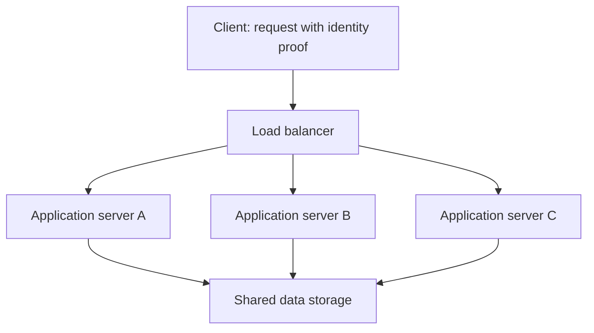
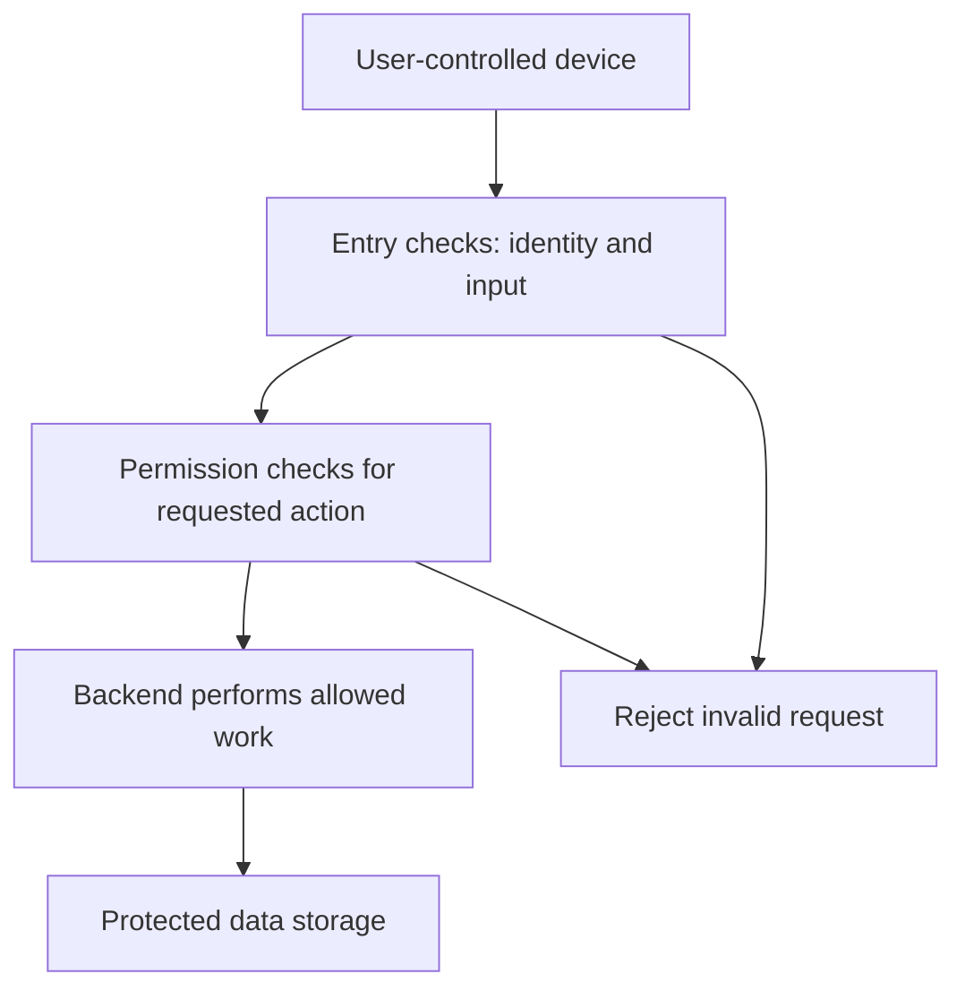

*Part 2 of 5 of [Requirement Characterization](/tutorials/system-design/requirement-characterization) · Sections 12–56.* These sections cover the individual dimensions. New to the topic? Start with [Requirement Characterization Fundamentals](/tutorials/system-design/requirement-characterization/fundamentals).

## 12. Reads and writes

Reading a library catalog retrieves an existing record. Adding a newly arrived book changes it. A **read operation** retrieves existing data: view a profile, open an article, search products. A **write operation** creates, changes, or deletes data: create an account, post a message, update an address, delete a comment. These operations matter because reading and changing information use different resources and create different correctness risks.

A **database** organizes stored data so software can retrieve and update it, like a carefully maintained filing cabinet; an order database stores purchases. **Storage** is the more general place data is kept, like shelves or cabinets; software can store a photo as a file without organizing it as an order record. **Persistent** data survives beyond the current operation, like a written ledger; saved orders remain after a server restarts. These are different from temporary calculation memory.

**Pause:** is deleting a comment a read?

Solution

Deletion changes stored data, so it is a write. The server may read the comment first to check ownership; one user action can cause several reads and writes.

## 13. Read-to-write ratio

A **ratio** compares quantities, like two cups of flour for one cup of water. “100 reads : 1 write” means 100 reads for every write over the chosen period. If there are 10,000 reads and 100 writes, divide both numbers by 100: the ratio is 100:1.

Use the same measurement boundary and period. Count user actions separately from database operations: one feed view can read many records and write a view event. Ratios help describe workload; they do not capture data size, operation cost, or bursts.

## 14. Read-heavy systems

A noticeboard is read many times after one update. News pages, product catalogs, video descriptions, public documentation, and search serving often have that pattern. **Read-heavy** means reads dominate according to an explicitly stated measure, usually operation count.

Possible responses:

| Term | Definition and analogy | Software example and importance |
|---|---|---|
| Cache | A quickly accessible saved copy; a menu kept at each table | Keep popular product details close to the server to reduce repeated retrieval |
| Replica | Another maintained copy of data; duplicate catalogs in branches | Serve some reads from a second database copy |
| CDN: content delivery network | Computers in several locations delivering saved content; local distribution depots | Deliver product images closer to customers |
| Read optimization | Arrange data access to retrieve needed results efficiently; alphabetize a directory | Avoid reading every product to find one |

Copies can become **stale**, meaning older than the latest accepted change, like yesterday's price list. Ask how fresh each read must be. A cached description might be acceptable; a final stock or price decision may need checking against authoritative data—the agreed source of truth, like the official inventory ledger. More copies add expense and coordination. A small read-heavy site may need only a simple database and sensible page design.

**Pause:** should checkout trust the price in a cached product page?

Solution

No, if the accepted price must reflect current rules. The server must calculate or validate the purchase price against the appropriate trusted source. Cache descriptive content where stale copies are acceptable.

## 15. Write-heavy systems

A factory sensor recording every second resembles a clerk constantly adding entries. **Write-heavy** means writes dominate the measured workload. Examples include **logs** (records of what happened, like a ship's log; server error records aid diagnosis), **telemetry** (measurements sent from devices, like remote meter readings; temperatures reveal equipment condition), **IoT** (Internet of Things: connected physical devices, like networked thermometers), and **clickstreams** (sequences of clicks, like a trail through a store; visits help analyze usage).

**Ingestion** means receiving data into a system, like accepting parcels at a depot. Ten thousand arriving sensor readings per second can demand substantial write capacity even if few people query them.

| Possible response | Plain meaning and analogy | Benefit and cost |
|---|---|---|
| Batching | Group several operations, like delivering many letters in one trip | Reduces per-operation overhead; adds waiting and complicates partial failure |
| Queue | Ordered or organized waiting work, like numbered service tickets | Absorbs temporary bursts; delayed work still needs processing |
| Partitioning | Split data or work into parts, like dividing deliveries by district | Shares load; makes cross-part work harder |
| Index | Extra lookup structure, like a book index | Speeds selected reads; storing and maintaining it can cost writes and space |

The queue does not create unlimited capacity. If arrival stays faster than processing, waiting work keeps growing. Choose how long to wait, whether to refuse excess work, and what must survive failures. Index costs depend on the database and type of change; avoid “every index always costs the same.”

**Pause:** a queue handles a short surge. Does that prove long-term capacity is sufficient?

Solution

No. It moves the waiting point. The processing rate must eventually exceed arrivals enough to clear the accumulated work within the deadline.

## 16. Mixed workloads

A social product writes posts and likes, reads feeds and like counts, and may write a viewing event whenever someone reads. A popular post can create far more reads than a private message. Characterize each workflow and storage boundary. “Mixed” can mean both significant reads and writes; it need not mean exactly 50:50.

## 17. Worked workload calculation

Assume 1,000,000 users each make 20 feed reads, two posts, and ten likes per day. Count these logical actions only; ignore extra storage operations.

1. Reads: 1,000,000 × 20 = **20,000,000/day**.
2. Post writes: 1,000,000 × 2 = **2,000,000/day**.
3. Like writes: 1,000,000 × 10 = **10,000,000/day**.
4. Total writes: 2,000,000 + 10,000,000 = **12,000,000/day**.
5. Ratio: 20,000,000:12,000,000 = **5:3**, or about **1.67:1**.

There are more reads, but this is only modestly read-leaning; calling it strongly read-heavy would obscure the substantial writes. A day has 24 × 60 × 60 = 86,400 seconds. Average rates are about 231.5 reads/s and 138.9 writes/s. An **average** spreads all activity evenly across the period, like dividing daily restaurant orders across opening hours. Real lunch rushes exceed it. Measure peaks and the work per operation before sizing servers.

## 18. State

A waiter remembers “Table 10 ordered two pizzas.” That remembered information is **state**: information representing an earlier interaction or current condition that affects later behavior. A saved shopping cart, a bank balance, and a game's current positions are state. It matters because losing or misplacing it can change outcomes.

Distinguish the existence of system state from whether a particular server depends on its own local memory. **Local** means private to that server, like one waiter's notebook. **Shared** means accessible to several servers, like a common order board. **Session** means a series of interactions treated as related, like one customer's visit; a sign-in session connects multiple requests to a user.

## 19. Stateful servers

A **stateful server** depends on remembered information from earlier work, often in local memory. A waiter needs their notebook to know your earlier order. If sign-in information is only on Server A, a later request must reach A or obtain that state elsewhere. A live game server may keep the current match in memory for quick updates.

State can be useful for rapid coordination and long-lived interaction. It creates recovery and placement obligations: what happens if the server fails or a request goes elsewhere? Stateful is not automatically bad; it often matches the problem.

## 20. Stateless application servers

At a ticket counter, any clerk can serve you if you bring your ticket and the clerks can consult shared booking records. A **stateless application server** processes each request without relying on private local session information left by an earlier request. It can use information carried in the request and read shared stored data.

A **credential** is evidence used to establish identity, like an identity card; a password is one example. A **token** is a piece of data used as proof or reference, like a claim ticket; a request might contain a signed sign-in token. Signed means protected against undetected alteration using a checking mechanism, like a tamper-evident seal; the server still verifies it.

A **load balancer** distributes requests among servers, like a host assigning diners to available waiters. **Horizontal scaling** adds more servers, like opening more checkout counters; **scalability** is the ability to handle growth while meeting agreed conditions. Stateless handling can simplify this because requests need not stick to a specific server. Shared storage and other limits still constrain capacity.

## 21. Stateless does not mean no data

A stateless application server can read and write a database, use a cache, and store files. **Object storage** keeps independently named blobs such as photos, like numbered boxes in a warehouse; it suits large files that are not structured order records. The entire system still has state in these places.

“Stateless application server” means no required private local session history between requests. It does not mean “the system remembers nothing,” “there is no database,” or “every storage read is unnecessary.” Protocol-level statelessness also differs from application design: a communication protocol can define independent requests while the application still keeps sessions.

**Pause:** a server retrieves a cart from a shared database for every request. Is the server necessarily stateful?

Solution

The cart is stateful data, but the application server can be stateless with respect to local session memory. Say which layer you mean.

## 22. Stateful and stateless trade-offs

**Failover** means switching to another component after a failure, like using a replacement cashier. **Sticky sessions**, also called session affinity, route a user's related requests to the same server, like returning to one waiter. An **external session store** keeps session information outside an individual application server, like a shared order board. **State migration** moves remembered information to another server, like handing over a notebook. Each helps manage state but adds its own work.

| Property | Local stateful handling | Stateless application handling |
|---|---|---|
| Remembered interaction | May be private to a server | Request plus shared sources are sufficient |
| Adding servers | Must place or move state | Often simpler request distribution |
| Failure recovery | Recover or reconstruct server state | Replacement can handle requests; shared data still needs recovery |
| Speed | Local state can be fast | Shared access can add delay |
| Common uses | Live games, ongoing connections | Product lookups, account interfaces |
| Cost and complexity | Session placement, migration, recovery | Shared-store capacity, token checking, data coordination |

Sticky routing helps normal operation but does not preserve state when that server dies. Shared stores reduce local dependence but become important shared components. Stateful and stateless designs can coexist in one product.

## 23. Interactive versus batch

Ordering one coffee and waiting is **interactive** work: a user or caller is actively requesting and waiting for a useful result. Search, sign-in, checkout, and map lookup are typical examples. Preparing 1,000 packed meals together is **batch** work: a collection is processed as a group, often without anyone waiting on an individual item. Monthly invoices, nightly payroll, daily analytics, and grouped image processing are examples.

A **job** is a unit of work submitted for processing, like a catering order; a report-generation job has inputs, completion, and failure outcomes. A **batch job** processes a collection. A **data warehouse** organizes data mainly for analysis, like a separate archive for comparing years of sales; it keeps complex reports from having to use only the immediate order-processing view.

The distinction is not a strict logical opposite: a user may start a batch export and wait for it. Record both grouping and interaction expectations rather than forcing one label.

## 24. Interactive and batch trade-offs

**Scheduling** decides when work runs, like assigning baking times. **Resource usage** describes consumption of computing time, memory, network, and storage, like how much oven space a meal uses. These matter because work competes for limited capacity.

| Aspect | Interactive emphasis | Batch emphasis |
|---|---|---|
| Time | Low delay for an individual result | Completion by a group deadline |
| Throughput | Enough capacity without long waits | Efficient processing of many items |
| Scheduling | Respond to current activity | May run at quiet times |
| Efficiency | Spare capacity can protect responsiveness | Grouping can share setup costs |
| Resource usage | Avoid bursts delaying users | Large jobs can monopolize shared resources |
| Failure recovery | Return a useful error promptly | Resume or repeat unfinished portions |

Batch is attractive when waiting is allowed and setup is expensive. It is less useful when a customer needs one answer now. Define whether repeating a batch can create duplicate effects.

**Pause:** can daily payroll use a fast user-facing confirmation?

Solution

Yes. Starting the payroll job can be interactive; calculating all payroll can remain batch work. Confirmation of submission is different from completion.

## 25. Micro-batching

**Micro-batching** processes small groups frequently, like collecting outgoing letters every five minutes instead of once a day. Software might process new events every five seconds. **Streaming** processes a continuing flow of arriving data, like handling each parcel as it reaches a conveyor; software can update totals continuously. An **event** records something that happened, like an “order placed” ticket; it lets later components react.

Micro-batching can reduce per-item setup costs with short delays. An item arriving just after a group closes waits nearly the next interval, plus processing time. Five-second grouping does not guarantee a five-second final result. Choose the interval from the actual freshness requirement.

## 26. Online versus offline

When a shop checks stock during a purchase, it performs **online processing**: work on the active operational path whose results are needed reasonably soon. When staff analyze last month's sales later, it performs **offline processing**: deferred work outside the immediate request path. These meanings are common in system design; elsewhere “offline” can mean disconnected from the internet. State the intended meaning.

Checkout, balance lookup, and ride matching are online. Historical analysis, cleanup, and overnight recommendation preparation are offline. A private local network can run online processing without public internet access. An offline report can use internet-connected computers.

## 27. Online and offline recommendations

A shopkeeper studies past sales after closing, then suggests goods while a customer shops. Software can **train a model**—derive a rule or prediction mechanism from examples, like learning buying patterns—overnight. That offline step creates a **recommendation model**, a mechanism suggesting items, which the online homepage uses immediately.

Offline work improves efficiency and avoids delaying the homepage. The model may become outdated; specify how fresh suggestions must be and what the homepage shows if the model is missing. Making everything online is unnecessary when yesterday's learning is sufficient.

## 28. Interactive versus online; batch versus offline

| Pair | First concept asks | Second concept asks | Distinguishing example |
|---|---|---|---|
| Interactive / online | Is a caller actively waiting? | Is work part of active operations? | A sensor alert is online even without a waiting human |
| Batch / offline | Are items processed together? | Is work outside the immediate operational path? | A live fraud check can inspect a small group of transactions online |

A user opening a previously computed report is interactive and online at the viewing stage, while computation was offline and batch. Categories apply to steps, not permanently to the data or product.

**Pause:** is a continuous machine alert system interactive?

Solution

It is online when events are evaluated during operations. It need not be interactive if no caller is awaiting a requested result. The alert recipient may interact with a separate dashboard.

## 29. Synchronous communication

You ask a restaurant a question and remain on the phone for its answer. **Synchronous** interaction means the caller waits for the requested operation's result before continuing that dependent work. A profile lookup normally needs the actual profile in its response. A **service** is software providing a particular capability to callers, like a specialist counter; a profile service provides profile data. This defines which component owns the answer.

Waiting does not necessarily freeze the whole computer or interface. The program can do unrelated work while one logical operation awaits a result. This chapter classifies the caller's completion contract, not every programming-language execution mechanism.

## 30. Asynchronous communication

You leave an order and receive a call later. **Asynchronous** interaction separates accepting a request from providing its final outcome. The caller can continue before all work is finished. A queue can hold work; a **worker** is software that performs queued work, like a cook using the next ticket.

Asynchrony does not require a queue, and it can be very fast. A queue is one implementation option. **Background processing** means work occurs outside the immediate foreground interaction, like kitchen preparation after a customer leaves the counter. It often uses asynchronous communication, but the words describe different things: communication contract versus execution placement.

## 31. Synchronous profile example

An **API**, or application programming interface, is an agreed way for software to request operations, like a menu specifying what the kitchen accepts. A **frontend** is the user-facing software, like the dining room; a **backend** is software performing behind-the-scenes work, like the kitchen. Their agreement prevents one side guessing how the other works.

`GET /profile` is a common notation for requesting profile data. `GET` means retrieve; `/profile` names the operation or resource being addressed. **HTTP** is a set of rules for web requests and responses, like a standard order form understood by both parties. Do not confuse an API notation with a promise about internal execution.

The frontend asks; the backend obtains the profile; the response contains the result or an error. The user needs the result for the current interaction, so synchronous completion is a reasonable starting point.

## 32. Asynchronous video example

Uploading a video can synchronously return “accepted, job 81” while preparation continues. **Transcoding** converts video into different representations, like translating one recording into formats usable by different players. It can take substantial computing time. The worker later marks the video ready and sends a notification.

Useful outcomes include queued, processing, complete, and failed. The client must have a way to discover them: ask for status, receive a notification, or both. Do not label the file ready merely because its upload was accepted. If acceptance promises durable work, record the job safely before acknowledging it.

## 33. Synchronous and asynchronous trade-offs

**Coupling** describes how much one component depends on another's immediate behavior, like a waiter who cannot proceed until a cook answers. **Retry** means attempting work again after failure or uncertainty, like calling back after a dropped line. **Idempotency** means repeating the same intended operation does not create extra effects, like a numbered claim being redeemed only once; repeated requests for one payment must not create more charges. These terms matter because a timeout does not prove work never occurred.

| Aspect | Synchronous completion | Asynchronous completion |
|---|---|---|
| Simplicity | Often straightforward for short operations | Requires job status and final outcomes |
| Feedback | Final result is immediate when successful | Acceptance now; result later |
| Delay | Caller waits for processing | Early acceptance; final work can still take time |
| Coupling | Depends on immediate downstream response | Can reduce immediate dependence |
| Failure | Return error or uncertain result | Record, retry, report eventual failure |
| Bursts | Waiting requests can accumulate | Queue may buffer bounded bursts |
| Duplicate risk | Retried uncertain requests | Retried requests and redelivered jobs |
| Cost | May occupy waiting resources | Adds coordination and processing components |

Asynchronous is not automatically better. If a short lookup is needed immediately, extra queue and status machinery may add complexity without benefit. Both patterns need limits, correctness, and understandable failures.

## 34. Common sync/async mistakes

1. Making a 30-minute export synchronous can exceed waiting limits. Return a job reference if delayed completion is acceptable.
2. Making a simple profile read asynchronous can force needless status checks. Ask whether the final answer is needed now.
3. Forgetting failure reporting leaves users with jobs that appear to run forever. Define failed states and recovery.
4. Retrying duplicate jobs can send two emails or create two charges. Define operation identity and safe duplicate handling.
5. Treating “accepted” as “completed” can show a video before it is playable. Show the actual state.

**Pause:** a response is lost after a successful payment. Should the client submit a fresh payment?

Solution

It should first resolve the original operation or retry using the same agreed operation identity. A new identity could cause another charge. This issue exists in synchronous and asynchronous designs.

## 35. Internal versus external systems

An employee-only stock room is internal; the shop floor is external-facing. An **internal system** is mainly used within an organization: employee portals, payroll administration, analytics, or a deployment dashboard. A **deployment** is installing and operating an application in an environment, like opening a configured shop; the dashboard helps staff manage those running applications.

An **external system** serves customers, partners, or the public: banking apps, shopping sites, public APIs, or social products. The label describes audience or exposure, not security quality. A customer-facing system can also contain internal administration functions.

## 36. Architectural consequences of audience

| Concern | Internal tendency | External tendency |
|---|---|---|
| Identity | Existing employee identities may be reusable | Customer and partner sign-in may be needed |
| Usage | Sometimes tied to working hours | May arrive at any time |
| Usability | Training may be available | Self-service clarity often matters more |
| Access | Restricted entry paths may be practical | Public entry needs abuse and overload handling |
| Change coordination | Staff may follow coordinated updates | Many independent clients may update slowly |

An **integration** connects systems so they can cooperate, like connecting a store's tills to its stock ledger; importing sales into payroll is one example. Internal systems can have demanding integration requirements. External users may require stable behavior despite changes. None of these tendencies is universal: a hospital's internal system can be more critical than a small public website.

## 37. Internal does not mean trusted

An employee can make mistakes; a compromised staff device can send harmful requests. **Compromised** means another party has gained improper control, like a stolen office key; software running on that device can misuse access. Internal systems still check identity, permissions, and input.

**External dependencies** are systems outside your operational control that your software needs, like a delivery company used by a shop; a payment provider is an example. “External users” and “external dependencies” are separate questions. An internal payroll system may depend on an external banking service.

**Pause:** an employee report tool calls an outside bank API. Is the tool external?

Solution

Its audience is internal, while it has an external dependency. Record both, since dependency failure can affect internal deadlines.

## 38. B2B versus B2C

A wholesaler sells to shops; a grocery store sells to households. **B2B**, business-to-business, means software is sold or provided to organizations. Payroll software and corporate project tools are examples. **B2C**, business-to-consumer, means software serves individual consumers, such as personal music listening or food ordering. The distinction matters because buying arrangements, account structure, support, and priorities can differ.

An organization can have thousands of users under one customer account. A single person can also have several roles, such as restaurant operator and consumer. Identify who buys, who uses, and who administers; they may differ.

## 39. Possible B2B characteristics

Organizations may ask for contracts, connections to existing systems, administrative controls, customization, complex permissions, and evidence of meeting obligations. **Customization** means adjusting behavior for a customer's needs, like a tailor changing a suit; different approval rules are a software example. **Administrator** means a person with management responsibilities, like a building manager; company administrators may add employees. Their privileges require careful boundaries.

An **SLA**, service-level agreement, is an agreed commitment describing service conditions and consequences, like a contracted delivery deadline; it may specify measured availability. A contract does not prevent outages; it makes expectations and remedies explicit. **Auditability** is the ability to reconstruct who did what and when, like a signed ledger; recording approval changes helps investigate disputes.

B2B may mean fewer purchasing organizations, yet huge numbers of users, devices, or transactions. It may involve complex setup, but a small B2B appointment tool can be simple. Ask what this particular customer actually needs.

## 40. Possible B2C characteristics

Consumers often expect easy signup and clear **UX**, user experience: the overall experience of achieving a goal, like how easy shopping feels; a clear checkout improves UX. Large promotions can create **traffic spikes**, sudden increases in incoming requests, like a queue after a concert ends. Public systems may need **abuse prevention**, controls against harmful misuse, like preventing someone blocking every checkout counter; limiting automated fake signups is an example.

Some B2C systems have millions of users; others serve a local club. Account structures can be complicated through families, subscriptions, or delegated access. Public exposure suggests questions about unexpected volume and misuse, but does not specify the final scale.

## 41. Other business models

**B2B2C** means a business provides a service through another business to consumers, like a payment platform used by shops for shoppers. **C2C**, consumer-to-consumer, connects individuals, like a neighborhood resale market. A **marketplace** connects multiple parties to exchange goods or services, like a market hall; food delivery connects restaurants, drivers, and consumers.

A food platform has B2C ordering and B2B restaurant operations. Do not force its whole design into one label. Each relationship can imply different permissions, support, and contractual expectations.

**Pause:** does selling software to ten companies prove low throughput?

Solution

No. Each company could operate thousands of devices sending data continuously. Customer count, user count, and operation rate are separate measurements.

## 42. Client trust: begin with the caller

A client sends requests. It might be a browser, phone app, another server, or a sensor. Think of a message arriving at a bank counter: knowing where it came from does not automatically prove every statement in it. Ask who controls the software, how identity is checked, and which claims the server independently verifies.

Trust is scoped: a service may be trusted to report shipment status but not to decide customer permissions. A classification should record the exact justified assumptions, not simply “safe.”

## 43. Trusted clients

A **trusted client** is one for which the system has stronger justified assurances about control, identity, and allowed behavior, like a trained employee using a controlled company terminal. A managed backend service or batch worker can qualify for particular operations.

Trusted does not mean perfectly safe. Bugs, stolen credentials, compromised software, and misconfiguration remain possible. Check permissions and data constraints even for authenticated services. Trust can reduce some exposure assumptions; it must not remove correctness rules.

## 44. Untrusted clients

An **untrusted client** runs outside the server's reliable control, like a customer writing their own order slip. Browsers, phone applications, user-controlled devices, and arbitrary public API callers typically fit this category. Users can alter software or construct requests directly.

An authenticated browser remains untrusted about price, ownership, account balance, and role claims. Authentication proves a checked identity; it does not prove every submitted value is true. Important rules must be enforced by the server.

## 45. Client-side versus server-side validation

Suppose the mobile screen refuses transfers above ₹10,000. A modified client can send ₹50,000 anyway. **Client-side validation** checks input in the caller, like a customer using a measuring guide; it catches mistakes early and improves experience. **Server-side validation** checks input at the service enforcing the rule, like the clerk independently checking the form; it protects correctness and security.

The server checks the amount, account ownership, available funds, operation identity, and applicable limits. In a store, it computes trusted prices rather than accepting the client's total. Validation must also check relationships and permissions, not merely whether a number looks well formed.

**Pause:** can a server trust a hidden price field because users cannot see it on screen?

Solution

No. Hidden interface fields are still client-controlled input. The server must obtain or verify the price from a trusted source.

## 46. Trust boundaries

A **trust boundary** is a point where information crosses between areas with different control or trust assumptions, like the entrance from a public lobby to a staff-only office. Requests from a customer's device to the backend cross one. Boundaries can also exist between internal services and sensitive storage.

Authentication checks who; authorization checks what they may do; validation checks acceptable values and relationships; encryption protects information against unauthorized reading during storage or transmission. These measures complement each other. An encrypted request can still contain an unauthorized action. Restrict even trusted services to the permissions their jobs need.

## 47. Regional and global: vocabulary

A **region** is a geographic area relevant to users or computing infrastructure, like a delivery district. Examples include India, Europe, or a smaller area. Provider-defined computing regions have specific boundaries; do not assume they equal political or legal boundaries.

A **data center** is a facility housing computers and supporting equipment, like a warehouse for computing. **Cloud computing** means obtaining computing resources as a service rather than owning every machine, like renting prepared kitchen space; renting servers is an example. Neither concept is required to understand geography, but both explain where software physically runs.

Record where users live, where work runs, and where each category of data may be stored or processed. Those are three different questions.

## 48. Regional systems

A **regional system** primarily serves a particular geographic scope: a city's bus service, a country's tax portal, or a local restaurant network. Like a local delivery business, it may use a simpler operational footprint and avoid long-distance communication for many users.

Regional deployment can reduce cost and coordination. It can also concentrate outage risk and may still need another location for recovery. Narrow geography does not imply a small workload: one city can generate enormous request volume.

## 49. Global systems

A **global system** serves users across widely separated areas, like an international parcel business. Video services, international collaboration products, and social applications may be global.

| Challenge | Definition and analogy | Example and importance |
|---|---|---|
| Replication | Maintain copies elsewhere, like duplicated branch records | Nearby copies can speed reads but must be updated |
| Data residency | Agreed location rules for covered data, like records restricted to a territory | Decide where customer records and copies may live |
| Time zones | Different local clock conventions, like branches opening at different local times | Specify what “daily report” means |
| Disaster recovery | Restore service after a major disruption, like reopening after a warehouse fire | Plan recovery if a location is lost |
| Localization | Adapt language, formatting, and conventions, like translated signs and local units | Show dates, addresses, and currency appropriately |
| Regulatory differences | Different applicable obligations, like different local building rules | Confirm obligations rather than assuming one worldwide rule |

Global reach creates questions about latency, freshness, availability, cost, and coordination. A **multi-region deployment** operates in more than one computing region, like multiple distribution depots. It is a possible response, not a definition of global service.

## 50. Why distance affects delay

A nearby parcel usually needs less travel than an overseas parcel. Network signals also travel through physical media and equipment; they cannot arrive instantaneously. Longer paths generally add delay, and multiple request-and-response trips multiply it. Congestion and processing can outweigh distance in particular cases, so “nearby is always faster” is too strong.

A customer in India may reach an Indian server faster than a server across the world. Nearby cached images can help, while an order that must be recorded elsewhere still pays that communication delay. No infrastructure choice eliminates physical travel time.

**Pause:** can a global service meet every latency target simply by making its server more powerful?

Solution

More computing power can reduce processing delay, but it cannot remove distance-related communication delay. Reduce network trips or place permitted work closer to users when the target requires it.

## 51. Global users and multi-region infrastructure

| User scope | Infrastructure | Interpretation |
|---|---|---|
| Regional | One region | Simple initial footprint |
| Regional | Several regions | May support disaster recovery |
| Global | One region | Global access with possible long-distance delays |
| Global | Several regions | May improve proximity or resilience; adds coordination |

**Resilience** means continuing or recovering despite disruption, like a business using spare delivery routes; another region may help service survive location failure. Global users are a requirement characteristic. Multi-region deployment is a design decision. Neither implies that every database accepts writes everywhere. Clarify which records require nearby reads, nearby writes, or one authoritative location.

## 52. Tenants and tenancy

An apartment building has shared structure and separate households. A **tenant** in software is a customer or customer organization treated as a boundary for data, configuration, and access. A tenant can have many users. Some consumer products use accounts as tenant boundaries; others do not use that model. State the product's definition.

**Single-tenant** deployment dedicates an application environment to one tenant, like a detached house. **Multi-tenant** deployment serves multiple tenants through some shared application or infrastructure, like an apartment building. These terms require a resource boundary: application, database, computing environment, or whole deployment.

Multiple users on a website do not automatically make it an enterprise multi-tenant system. The important question is whether distinct customer boundaries need isolation within shared service.

## 53. Tenant isolation

**Tenant isolation** prevents one customer's access or activity from improperly crossing another customer's boundary, like locks between apartments. A **tenant ID** is an identifier for that customer boundary, like an apartment number; it must be bound to the authenticated user's allowed memberships, not blindly accepted from a request.

**Logical separation** uses enforced rules within shared resources, like separate locked cabinets in one room; data records can carry checked tenant identifiers. **Physical separation** uses distinct resources, like separate houses; customer databases or computers can be dedicated. Dedicated resources still need access controls and safe administration.

Isolation includes reads, writes, search results, files, caches, notifications, backups, and administrative tools. A **backup** is a recovery copy, like photocopying a ledger for safekeeping; it matters because losing the active store need not mean losing all records. Recovery copies need privacy protection too.

## 54. Tenancy models

| Model | What is shared? | Isolation and benefit | Cost or complexity |
|---|---|---|---|
| Shared application and database | Application and data store | Tenant-aware rules can use resources efficiently | One missing rule can leak data; shared capacity needs control |
| Shared application, separate databases | Application; each customer has a data store | Easier per-customer data operations | More databases to create, upgrade, and recover |
| Dedicated deployments | Little or none at the application level | Stronger infrastructure separation and customization | More environments, cost, and operational work |
| Hybrid | Different sharing for different customers or components | Balance differing needs | More variants and policies to maintain |

A provider can operate a SaaS product through dedicated customer deployments. **SaaS**, software as a service, means users consume provider-operated software, like subscribing to a managed service rather than installing every part themselves. SaaS is a delivery model; it does not mandate one shared database. Explain precisely what is shared rather than arguing over labels.

## 55. The noisy-neighbor problem

One apartment playing loud music affects others. A **noisy neighbor** in software is a tenant whose resource consumption degrades other tenants' service. One customer sending a million requests may delay everyone else.

| Control | Meaning and analogy | Example |
|---|---|---|
| Quota | Allowed amount, like monthly water allowance | Limit stored data per tenant |
| Rate limit | Allowed activity per interval, like admitting ten people per minute | Limit requests per tenant per second |
| Resource isolation | Separate or reserved capacity, like independent power circuits | Reserve processing capacity for each tenant |

Limits need clear responses and legitimate burst allowances. A limit that ignores unusually expensive requests may fail to protect capacity. Isolation can cost more, so use measured needs rather than making every customer fully dedicated by default.

## 56. Single-tenant and multi-tenant trade-offs

| Characteristic | Dedicated single-tenant deployment | Shared multi-tenant deployment |
|---|---|---|
| Isolation | Fewer shared runtime resources; access still needs protection | Must enforce tenant boundaries everywhere relevant |
| Cost | Often higher per small customer | Sharing can lower average cost |
| Operational effort | Many environments to operate | Fewer common environments; more complex shared policies |
| Customization | Separate changes may be easier | Variants can complicate common behavior |
| Resource efficiency | Idle capacity may be stranded | Capacity can be shared among tenants |
| Upgrades | Coordinate many installations | Common upgrades affect many customers together |

An **upgrade** replaces or improves a running software version, like renovating a building's lift. Shared upgrades are efficient but can affect more customers at once. Dedicated upgrades allow independent schedules but create more versions to manage. “Dedicated always secure” and “shared always cheap” are both too absolute.

**Pause:** B2B software gives every company its own database but shares application servers. Is anything multi-tenant?

Solution

Yes: the application servers are multi-tenant. Databases are dedicated per tenant. This hybrid boundary description is more informative than one global label.

