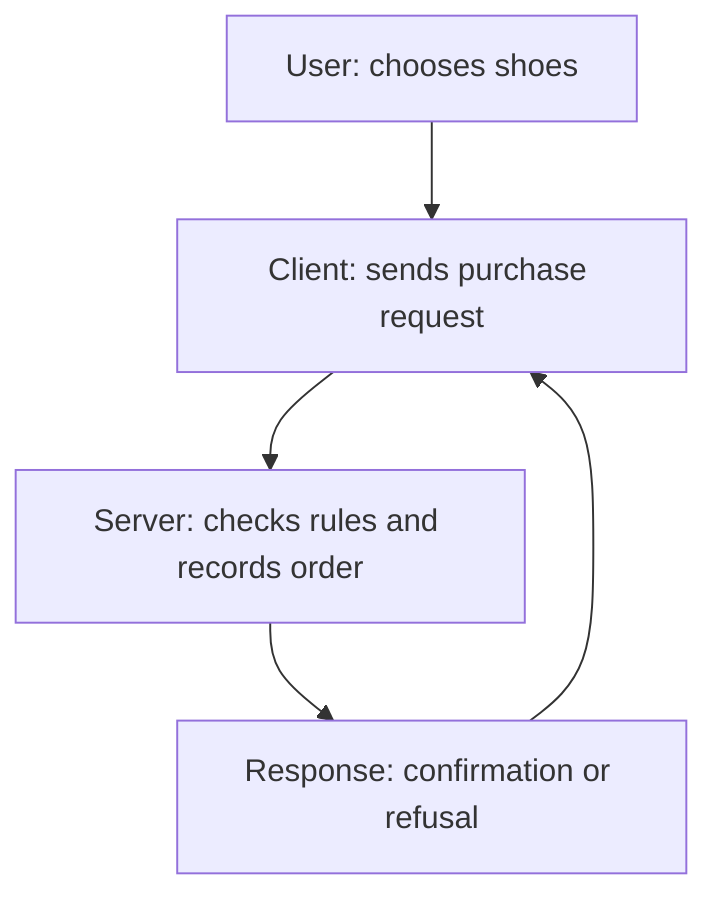

*A textbook chapter and practical workbook for absolute beginners*

**Purpose:** learn to understand a problem before choosing a software design. No programming, networking, database, or cloud knowledge is required. Every product and number below is a teaching example unless explicitly identified otherwise. Product labels describe assumptions, not facts about a named company's implementation.

**How to study:** read Sections 1–11 for foundations; [12–56](/tutorials/system-design/requirement-characterization/dimensions) for the individual dimensions; [57–69](/tutorials/system-design/requirement-characterization/combining-dimensions) to combine them; [70–97](/tutorials/system-design/requirement-characterization/applied-practice) for applied practice; and [98–103](/tutorials/system-design/requirement-characterization/quiz-and-revision) for assessment and revision. Work through a few sections per sitting. At each “Pause,” write your own answer before opening the solution. The numbered sections follow the requested learning progression.

**Learning outcomes:** explain all 13 dimensions; distinguish requirements from design decisions; estimate read and write activity; identify different workflows within one product; ask useful clarification questions; reason about costs and failure; and write a characterization that another engineer can use. You should be able to explain *why* a label matters, not merely name it.

## 1. Start from absolute zero: what is a system?

A restaurant has customers, waiters, a kitchen, ingredients, and payment arrangements. Those parts work together to produce meals. A bank handles money; a library lends books; a hospital treats patients; a supermarket sells goods; a postal service delivers letters. A **system** is a collection of cooperating parts that accomplish a purpose. The restaurant analogy matters because a system is more than one isolated component.

| System | Input: what comes in | Processing: work performed | Output: what comes out |
|---|---|---|---|
| Restaurant | Customer's order | Cook prepares food | Meal |
| Library | Borrowing request | Check membership and availability | Loaned book or refusal |
| Software shop | Request to buy shoes | Check stock and record purchase | Order confirmation or explanation |

**Software** is a set of instructions a computer follows, like a recipe followed by a kitchen. A **software system** combines those instructions with computers and information to do useful work. An **application** is software that performs a particular task: a shopping application helps people buy goods. These distinctions help us decide which parts must cooperate.

| First vocabulary | Plain meaning and analogy | Software example | Why it matters |
|---|---|---|---|
| User | A person using the system; a restaurant customer | Person shopping | Identify whose needs count |
| Client | Software that asks another system for work; the waiter carrying an order | A web browser asks for product details | Understand where requests originate |
| Server | Software, or the computer running it, that serves requests; the kitchen | Shopping server checks stock | Locate where rules are enforced |
| Request | A message asking for work; a food order | “Show product 42” | Define accepted inputs |
| Response | The answer to a request; the meal or refusal | Product details or “not found” | Define visible outcomes |
| Data | Recorded information; an order slip | Name, price, order number | Identify what is stored or transmitted |
| Network | Connections that carry messages between computers; roads between buildings | Phone communicates with shopping server | Messages take time and can fail |

A **browser** displays and interacts with websites, like a window into a shop. A **mobile app** is an application installed on a phone, like a portable shop counter. Both can act as clients.

**Pause:** is the person the client?

Solution

The person is the user. Their browser or app is the client. People and software have different responsibilities: the person chooses an action, while the client constructs a message. A server can also be a client when it requests work from another server.

## 2. What is a requirement?

“I need a car that carries five people” describes something a solution must satisfy. “Customers must be able to place an order” does the same for software. A **requirement** states a needed capability, quality, or condition. It is like a shopping checklist: it lets us evaluate a proposed solution.

| Term | Everyday analogy | Software example | Why distinguish it? |
|---|---|---|---|
| Requirement | Car carries five people | Customer can place an order | Describes necessary behavior or quality |
| Constraint | Car must fit the garage | Must work with an existing company sign-in system | Restricts possible solutions |
| Preference | Prefer a blue car | Prefer a dark background | Allows negotiation |
| Assumption | Assume mostly city driving | Assume launch users are in one country | Needs validation; may be wrong |

A constraint can itself be recorded as a requirement. These are practical distinctions, not perfectly separate boxes. Record who requested each condition, why it exists, and how to check it.

**Pause:** classify “We think customers will browse ten times more often than they buy.”

Solution

It is an assumption about usage. Measure or confirm it before using it to size the system. “The system must handle that workload” would be a requirement.

## 3. What is requirement characterization?

“We need a vehicle” could mean a bicycle, bus, ambulance, or cargo truck. Ask about passengers, cargo, distance, terrain, cost, and urgency before choosing one.

Similarly, “Build a messaging application” does not tell us who uses it, how frequently messages arrive, whether delivery can wait, or where users live. **Requirement characterization** means describing important properties of the problem and workload so that we understand what kind of system needs to be designed. A **workload** is the amount and pattern of work arriving, like the mix of lunch orders in a restaurant. In software it might be 500 product lookups and 20 purchases per second. It matters because different mixes require different capacity.

**Architecture** is the arrangement of major parts and how they cooperate, like the layout of a kitchen and dining room. A software architecture might separate ordering, payment, and delivery. Characterization comes first because the layout must support the work.

Ask: what requests dominate? Who uses the system? Where are they? Must a server remember earlier interactions? Can work happen later? Which requirements can be relaxed? Do customers share computers and storage?

**Pause:** why not choose a database immediately?

Solution

You do not yet know what must be stored, how it will be accessed, or which correctness and speed conditions matter. Choosing first risks fitting the problem to the tool.

## 4. The central mental model

1. **Product idea:** a useful outcome, such as ordering meals.
2. **Requirements:** what users need and the conditions of success.
3. **Characterization:** describe workload, timing, audience, and other dimensions.
4. **Constraints and priorities:** identify limits and what matters most.
5. **Architecture:** choose cooperating parts that satisfy those needs.
6. **Technology choices:** select particular products or implementation tools.

First understand the problem. Then choose the solution. In practice, discovery is iterative: an estimate can reveal a conflict that sends us back to clarify a requirement. The sequence describes the reasoning, not a ban on revisiting decisions.

## 5. Classification is multidimensional

A restaurant can be inexpensive, vegetarian, busy, and open late simultaneously. Each label answers a different question. Software works the same way. The terms below are a preview; each is taught independently later.

| Dimension | Question |
|---|---|
| Hard / soft | How negotiable is a condition? |
| Functional / non-functional | What must it do, and how well or under what constraints? |
| Must-have / nice-to-have | Is the capability essential to this product version? |
| Read-heavy / write-heavy | Which data operations dominate? |
| Stateful / stateless | Does this server depend on remembered local interaction information? |
| Interactive / batch | Is someone interacting and waiting, or is grouped work being processed? |
| Online / offline | Is the work on the active operational path or deferred? |
| Synchronous / asynchronous | Does the caller wait for the final result? |
| Internal / external | Who uses or accesses it? |
| B2B / B2C | Are customers organizations or individual consumers? |
| Trusted / untrusted clients | Which assumptions about the caller can be justified? |
| Regional / global | Where are users and operational obligations? |
| Single-tenant / multi-tenant | Which customer boundaries share which resources? |

The first three classify **individual requirements**. The remaining dimensions usually classify **workflows, components, deployments, or products**. A system is not itself “must-have”: its search function may be a must-have. Specify the thing being labeled. Also allow “mixed,” “unknown,” and “depends on requirements”; a pair of labels is not an exhaustive taxonomy.

A public search path could eventually be described as read-heavy, stateless at the application layer, interactive, online, synchronous, external, serving consumers, handling untrusted clients, and serving global users. Its search function can separately be a must-have. Customer tenancy remains a separate product question.

## 6. Hard versus soft requirements

An elevator must support its rated load. A car buyer may prefer an exceptionally quiet cabin. The first is a condition of acceptance; the second admits a trade-off.

A **hard requirement** must be satisfied for the agreed solution to be acceptable. A **soft requirement** is a desirable target for which some deviation is acceptable under agreed conditions. “Hard” describes negotiability, not implementation difficulty. “Soft” does not mean unimportant.

For a bank transfer, “one accepted transfer must not debit the sender twice” is normally hard. “Search should usually finish within 500 milliseconds” may be soft. A **millisecond**, written **ms**, is one thousandth of a second; think of splitting a second into 1,000 tiny slices. Measuring search time in ms makes human-perceived delay precise. A 700 ms search may be acceptable during a brief surge, but repeated slow searches can lose customers.

Before reading the classifications, notice the qualifiers. The same topic can be hard under a contract and soft as an informal goal.

| Example condition | Classification in this example | Reason |
|---|---|---|
| One accepted payment must not create two charges | Hard | Financial correctness is an acceptance condition |
| Search should usually return within 500 ms | Soft | Occasional agreed exceptions are allowed |
| Required keyboard access must work before launch | Hard | Accessibility is a launch condition |
| Covered customer data must remain in the agreed territory | Hard | Explicit storage constraint |
| Buttons should use the preferred shade of blue | Soft | Visual preference is negotiable |
| Account deletion must finish within the agreed 30-day period | Hard | Stated acceptance deadline |
| Aim for 99.9% availability this quarter | Soft | Improvement target with tolerable deviation |
| Meet a signed availability commitment | Hard | Contractual acceptance obligation |
| Every invoice must use the agreed tax calculation | Hard | Incorrect output is unacceptable |
| Reports should normally finish within ten minutes | Soft | Limited delay is tolerable |
| Do not reveal one customer's private records to another | Hard | Privacy boundary |
| Product pictures should look crisp on common phones | Soft | Quality target needs further measurement |
| Launch on the agreed date | Hard if fixed | Business deadline may be nonnegotiable |
| Suggestions should usually be relevant | Soft | Quality can be measured and improved |
| Reject order quantities below one | Hard | Invalid input must not become an order |
| Retain specified records for the agreed period | Hard | Explicit compliance condition |

**Availability** is how often a service can successfully perform its promised work, like how often a shop is open and able to sell. A software example is the percentage of valid product requests successfully served. Define what counts as success, the measurement period, and exceptions; a percentage alone is incomplete. **Compliance** means meeting applicable rules or obligations, like following a building code; in software, a contract might require particular record handling. Determine the actual rules for the project rather than assuming a universal legal deadline.

Hard requirements can come from business, safety, regulation, contracts, product purpose, or correctness. A hard target is still not a magical guarantee against every imaginable failure: define its operating conditions, failure behavior, measurement, and remedy.

Possible design responses include **validation** (checking a proposed value, like checking a ticket; reject an invalid quantity), **redundancy** (extra copies or spare capacity, like a spare tire; another server can serve requests), and testing failure cases. Soft targets can permit **graceful degradation**: preserve essential service while reducing extras, like a restaurant offering a shorter menu during a rush; checkout works while recommendations disappear. Approximation can save cost, but only for outputs allowed to be approximate.

**Pause:** “Checkout should usually finish quickly” is commercially crucial. Must it be hard?

Solution

No. Importance and negotiability are different. Clarify “quickly,” the percentage of requests, conditions, and consequences. It becomes hard if stakeholders make the measured threshold an acceptance condition.

## 7. The hard–soft spectrum

Consider: never duplicate an accepted charge; normally finish checkout within two seconds; show useful suggestions within 500 ms; provide smooth suggestion animations. These differ in consequence and acceptable exception, even if a checklist ultimately labels each hard or soft.

Ask **“What happens if we violate it?”** A rough animation may inconvenience; a slow checkout may lose revenue; a duplicated debit may corrupt financial records; prohibited data storage may violate an obligation; wrong medical instructions might create a safety problem. State consequences before selecting stronger, more expensive guarantees.

For a soft target, specify an acceptable exception budget and escalation. For a hard invariant—an **invariant** is a rule that must remain true, like “one seat cannot be sold to two travelers”—specify how to preserve the rule during retries and failures. The software example is one final charge per accepted purchase; the rule guides both design and verification.

## 8. Functional versus non-functional requirements

A car must carry passengers; it must also be safe and fit its parking space. A **functional requirement** describes behavior: what the system does. A **non-functional requirement** describes quality or constraints under which behavior is delivered. Think **what** versus **how well / under what conditions**.

**Latency** is elapsed time from a defined start to a defined result, like waiting from ordering coffee to receiving it. “Profile appears within 300 ms” measures software latency. **Throughput** is work completed per unit time, like coffees served per minute; “2,000 successful lookups per second” measures software capacity. **Concurrent** means happening at the same time, like 50 diners seated together; 100,000 connected users is not automatically 100,000 requests per second. These distinctions prevent misleading capacity requirements.

**Encryption** makes data unreadable without the appropriate key, like putting a letter in a locked box; protecting stored customer details is a software example. It matters for confidentiality, but does not itself decide who is entitled to see data.

| # | Functional behavior | Paired quality or constraint |
|---|---|---|
| 1 | Create an account | 95% of valid creations finish within 1 second |
| 2 | Sign in | Limit repeated unsuccessful attempts |
| 3 | Send a message | Accepted messages survive a defined server failure |
| 4 | Search products | 95% of searches finish within 300 ms at agreed load |
| 5 | Place an order | Never record two orders for the same accepted purchase request |
| 6 | View a profile | Meet the agreed availability target |
| 7 | Upload an image | Accept files up to the agreed size |
| 8 | Download a report | Protect download access from unauthorized users |
| 9 | Reset a password | Reset link expires after the agreed interval |
| 10 | Cancel a booking | Preserve correct seat counts under simultaneous requests |
| 11 | Generate payroll | Finish the agreed monthly workload before payday |
| 12 | Export account data | Meet the agreed completion deadline |
| 13 | Delete an account | Apply retention and deletion rules consistently |
| 14 | Play a video | Start playback within the agreed percentile target |
| 15 | Edit a document | Preserve accepted edits during agreed failure conditions |
| 16 | Add a payment method | Encrypt sensitive stored fields |
| 17 | Display invoices | Keep the agreed invoice history available |
| 18 | Translate interface text | Support the agreed languages |
| 19 | Run a scheduled report | Use no more than the agreed resource budget |
| 20 | Notify a customer | Prevent another customer receiving private notification content |

Some paired constraints also imply behavior. Password expiry and language selection need functions to enforce them. “Users must authenticate before viewing private documents” combines identity-checking behavior and a security constraint. Split it into testable statements instead of arguing about the label. **Authentication** checks identity, like checking an identity card; software checks a sign-in proof. Its importance is knowing who is making a request. **Authorization**, introduced here for comparison, checks permission, like deciding whether that person may enter a particular room; software checks whether they may read a document. Identity alone is insufficient.

“95% within 300 ms” means at least 95 out of each 100 measured requests meet the threshold. A **percentile** is a threshold below which a specified percentage of measured values fall, like ordering waiting times and finding the 95% point. Averages can hide very slow requests. Define the sample and conditions.

**Pause:** is “sensitive data must be encrypted” a feature priority?

Solution

It is primarily a non-functional protection constraint. It can also be hard and must-have for the release. These classifications answer different questions.

## 9. Must-have versus nice-to-have

A bicycle needs wheels to fulfill its purpose; decorative lights may be optional. A **must-have** is essential to the purpose or agreed scope of the product version. A **nice-to-have** adds value but can be postponed without making that version useless.

For ride sharing, passengers must request rides and drivers must accept them. Animated cars, custom themes, and social sharing can wait. An **interface** is the means of interacting with software, like buttons on an elevator; a ride request screen is an interface. A **user interface**, or **UI**, is the part a person sees and operates. It matters because behavior must be accessible to users, not merely possible internally.

Hardness asks whether a condition can be violated; priority asks whether a capability belongs in scope. A recommendation feature can be nice-to-have while its privacy rules, *if it ships*, are hard. A must-have search function can have a soft latency target.

## 10. Minimum Viable Product

An **MVP**, or **Minimum Viable Product**, is the smallest product scope useful enough to test the core value with real users. Minimum means remove extras; viable means still useful and acceptable; product means something people can actually use. Like a simple neighborhood food stall, it may have three meals rather than fifty, but must still deliver safe food.

Start from the product idea, list possible features, select core capabilities, and deliver the MVP. For an order service, order placement and accurate confirmation might be core. Animated maps may wait. Small scope does not authorize incorrect charges or exposing private orders.

**Pause:** can an MVP omit error handling?

Solution

It can have fewer features, but must handle failures required for acceptable use. A failed payment must have an understandable outcome. Simpler recovery may be acceptable if explicitly agreed.

## 11. Prioritization with MoSCoW

**MoSCoW** is a way to sort priorities: **Must Have**, **Should Have**, **Could Have**, **Won't Have Now**. The lowercase letters make the name pronounceable. It is like planning a trip with essentials, valuable extras, optional treats, and items left at home.

For a first-release online shop with a conventional cart purchase flow:

| Capability | Priority | Reason |
|---|---|---|
| Browse products | Must | Customers must find something to buy |
| Add to cart | Must | Chosen purchase workflow requires it |
| Checkout | Must | Turns selection into an order |
| Payment | Must | Assumed business model requires payment at purchase |
| Wish list | Should | Helps return visits but first purchase works without it |
| Product comparison | Could | Useful for some catalogs; can wait |
| Animated previews | Could | Presentation enhancement |
| Social sharing | Won't now | Outside the initial goal |

A shop with “buy now” may not require a cart. A business invoicing later may not need immediate online payment. Scope follows the stated product, not a universal feature list. Should-have items have a workable temporary alternative; could-have items have less impact if omitted.
