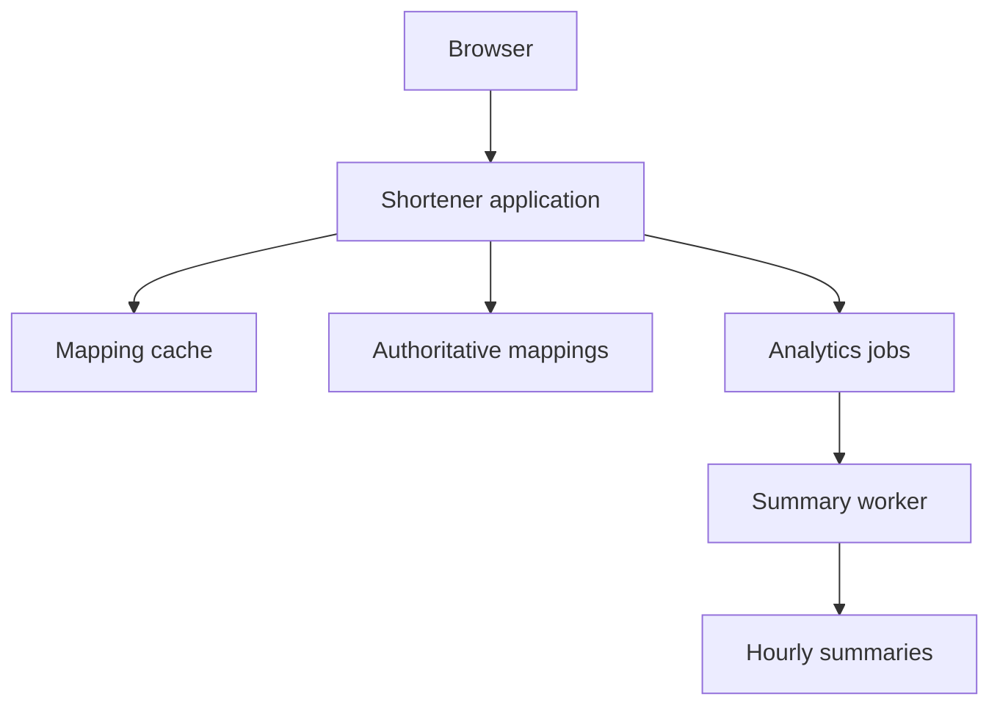

*[System Design Trade-offs](/tutorials/system-design/trade-offs) · Part IV — Six worked case studies · Sections 29–34 of 55.* New to the topic? Start with [Trade-off Fundamentals](/tutorials/system-design/trade-offs/fundamentals).

## 29. URL shortener

A **URL** is a web resource address, like a postal address for a page. A URL shortener creates a short address mapped to a longer one; a **redirect** instructs a browser to visit the mapped destination, like forwarding mail. The mapping is an authoritative fact, not an approximate popularity count.

**Assumptions:** 1,000 redirects/s, 10 creations/s, redirect p95 below 200 ms, no incorrect destination, recent creations work immediately for their creator, analytics can lag one hour. Team: three engineers.

| Decision | Requirement → trade-off → approach | Downside and revisit |
|---|---|---|
| Redirect lookup | Fast but correct destinations → latency/consistency → authoritative mapping plus cache for suitable entries | Mutable/deleted mappings need invalidation; revisit if freshness fails |
| Creation | Unique short keys → guarantees/throughput → enforce uniqueness and retry collisions | Some failed attempts; revisit key-generation contention |
| Reliability | Public redirects matter → cost/reliability → tested redundancy and recovery appropriate to target | Cost and operator work; increase coverage if outage harm grows |
| Flexibility | Basic creation first → simplicity/flexibility → modules without broad plugin framework | Custom domains require later work; add when real demand exists |
| Hosting | Small team → managed/self-hosted → managed database if it fits | Fees and limits; revisit measured TCO/control |
| Analytics | Hour-old totals acceptable → precompute/on-read and sync/async → durable event policy plus background summaries | Lag and processing failures; define whether any event loss is acceptable |

**Failure walkthrough:** A cache miss uses the authoritative store; store unavailability cannot justify guessing a destination. A deleted link must not continue redirecting if the deletion requirement forbids it. Analytics failure should not necessarily stop redirects, but the declared event durability boundary must remain honest.

**Review:** Deploy application and schema compatibly, track redirect latency/error rate and cache age, test restoring mappings, and retain an analytics rebuild strategy. Start without a separate analytics store if a background summary in the existing database suffices.

## 30. Social feed

A feed lists posts relevant to a user, often from followed authors. **Ranking** orders candidates by relevance, like arranging a reading list; it consumes computation and can change results. **Assumptions:** feed p95 under 300 ms, posts may appear up to 30 s late, independent reactions may merge, private posts must not be disclosed.

| Area | Choice and reasoning | Costs/failure response |
|---|---|---|
| Reads | Derived feed entries for frequently accessed users reduce repeated collection | Storage and update lag; show age or retry when outside promise |
| Availability | Accept safely mergeable reaction events during some communication failures | Duplicates and conflicts; define identity and merge semantics |
| Normalization | Keep authoritative posts/permissions; derive feed references | Rebuild and delete propagation; recheck sensitive access |
| Precomputation | Fanout ordinary authors; fetch high-fanout authors at read time | Hybrid ranking and merging logic; monitor fanout backlog |
| Communication | Durable acceptance followed by background fanout | “Posted” and “visible everywhere” differ; track completion |
| Guarantees | Order within relevant user/room scope, not all reactions globally | No universal order; account-security operations remain stricter |

**Why stale content can be acceptable:** Missing a new public post briefly may have low harm. Revealing a revoked private post is different. “Social systems tolerate staleness” is too broad: content, counters, permissions, and account changes require separate promises.

**Operations:** Track oldest feed update, read latency, storage per user, retry effects, and access-control behavior after revocation. Define whether removed posts can remain visible briefly; enforce stricter deletion where required. Revisit fanout strategy when high-follower writes dominate cost.

## 31. Banking system

A **ledger** is the authoritative record of financial movements, like an official account book. **Assumptions:** completed transfers must balance, accepted records survive specified failures, duplicate client requests must not create duplicate movements, some informational screens can be a few seconds old.

| Workflow | Choice | Why and accepted cost |
|---|---|---|
| Transfer | Atomic business update with suitable isolation and durable commit | Prevent partial or conflicting movement; more coordination/retries |
| Isolated branch writes | Reject operations without sufficient authority | Protect ledger rules; reduced partition availability |
| Balance display | Define whether informational or used for an authoritative action | Stale display may be tolerable; action must check authoritative rules |
| Payment retry | Durable operation identifier and reconciliation | Avoid duplicate effect; store extra metadata and handle uncertainty |
| Throughput | Scope coordination where invariants permit; preserve cross-account rules | More independent work, but shared transactions still cost |
| Reliability | Invest in tested backup, failover, audit, and trained operators | High cost justified by harm; avoid unsupported “zero loss always” |
| Hosting | Evaluate managed or self-hosted against actual control and obligations | Neither label establishes safety or compliance |

**Failure walkthrough:** Transfer commits but reply is lost. A timeout cannot be treated as proof of failure. The caller retries with the same identifier or queries the known operation. Recovery retrieves the committed result. If an external institution is involved, reconciliation and explicit pending states are necessary; one local transaction cannot control every institution.

**Review:** Measure completion, unresolved operations, conflicting updates, restoration time, and audit completeness. Define the exact failure assumptions behind durable acknowledgement. Correctness dominates these boundaries, while marketing images need no ledger-grade guarantee.

## 32. E-commerce

**Assumptions:** fast browsing, no stock below zero from successful reservations, durable orders, eventual email receipts. A **reservation** temporarily assigns inventory, like holding an item behind the counter; it needs expiration and release rules.

| Workflow | Requirement → chosen trade-off | Accepted downside |
|---|---|---|
| Browse | Descriptions may be 30 s old → cache suitable details | Temporary stale display |
| Reserve | Final unit cannot have two active holders → authoritative conditional update | Waiting/refusal and expiry logic |
| Order | Acknowledged order survives specified failures → durable transactional record | Persistence latency |
| Pay | Provider outcome can be uncertain → tracked idempotent operation and reconciliation | Pending state and operator workflow |
| Receipt | Within five minutes, not required before response → durable async job | Retry and delivery lag |
| Reporting | Hour-old dashboard acceptable → summaries | Freshness bound and corrections |

**Failure walkthrough:** Payment succeeds but order finalization fails. Persist the attempt before calling the provider, use an operation key, and reconcile the outcome. Do not charge again blindly. Release unpaid reservations only under rules that account for in-progress or late payment outcomes. Production payment design requires a fuller state machine than “call payment, then save.” A **state machine** defines valid states and transitions, like ordered steps from “held” to “paid” to “confirmed”; it prevents contradictory status changes.

## 33. Video platform

**Assumptions:** uploads receive a clear acceptance result, videos become playable within a stated processing target, playback remains smooth, counters may lag. **Content delivery network**, CDN, means distributed servers caching content near users, like local distribution depots; it can reduce long-distance delivery but costs money and has cache behavior.

| Trade-off | Chosen starting point | Why, downside, revisit |
|---|---|---|
| Precompute vs on-read | Produce common playback versions in advance | Fast viewing; storage/work for unpopular videos; revisit rendition use |
| Sync vs async | Durably accept upload, process in background | Long conversion avoids request wait; status and retries needed |
| Cost vs reliability | Protect playback path separately from metrics | Playback harm is higher; redundant delivery costs |
| Managed vs self-hosted | Compare operated transcoding/CDN with team-run alternatives | Team expertise and volume matter; benchmark TCO |
| General vs specialized | Object storage for blobs; specialized video processing where required | Workload fit; extra components and transfer costs |
| Latency vs consistency | Cache suitable metadata; update view counts later | Lower read delay; permissions and entitlements remain strict |

**Failure walkthrough:** A worker fails after producing a rendition. Retry should find or safely replace the same output, not create infinite duplicate files. A playable indicator changes only after required outputs exist. Track upload-to-ready delay, stalled jobs, playback failures, and unused-version storage. A cheap request acknowledgement does not mean cheap processing.

## 34. Analytics platform

**Assumptions:** ten million events/day, operational dashboards ≤15 minutes old, official financial totals require reconciled input and traceable corrections. **An event** is a record of something that happened, like a receipt; different events can have different loss tolerance.

| Choice | Benefit | Cost / control |
|---|---|---|
| Batch summaries | Efficient repeated aggregation | Lag; schedule and completion monitoring |
| Incremental summaries | Lower update delay | Deduplication, correction, and late-data logic |
| Specialized analytical store | Efficient broad scans | Data pipeline and another restore plan |
| Denormalized analysis views | Easier report reads | Duplication and schema versioning |
| High-throughput ingestion with scoped guarantees | More independent processing | Must define duplicates and ordering, not assume all events expendable |
| Normalized authoritative inputs | Reconciliation and rebuild | Input retention cost |

A **watermark** is a processing estimate of how far input time has progressed, like marking a batch of receipts as mostly received; it helps reason about late events, not prove no event can arrive later. Beginners can start with a daily complete batch and explicit corrections rather than a complex streaming system.

**Failure walkthrough:** Duplicate purchase events inflate revenue unless operation identity and aggregation rules avoid repeat effects. A late refund must adjust the correct period under the reporting rules. A dashboard can be temporarily delayed, but an “official” report must state completion and reconciliation boundaries.

**Review:** Track input completeness, duplicate rate, result age, correction history, scan cost, and rebuild duration. Adopt another system only after the existing store misses required capacity or features.
