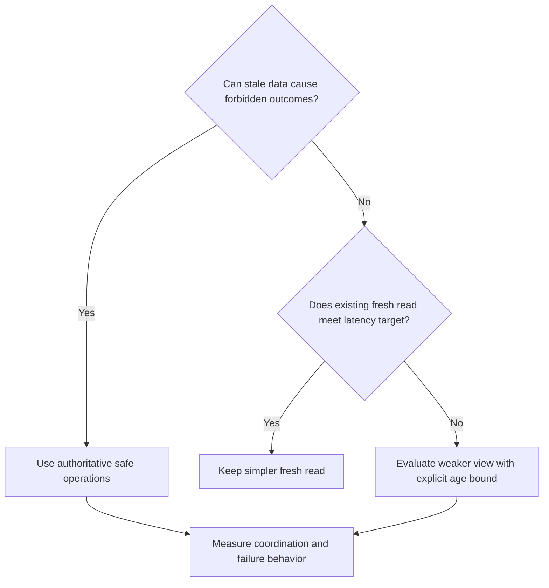
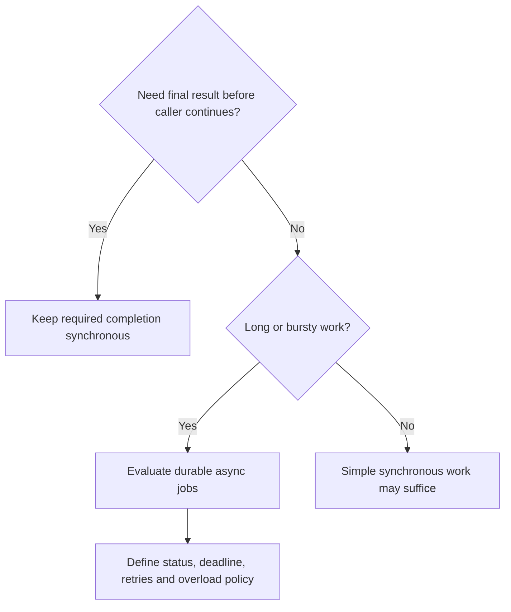
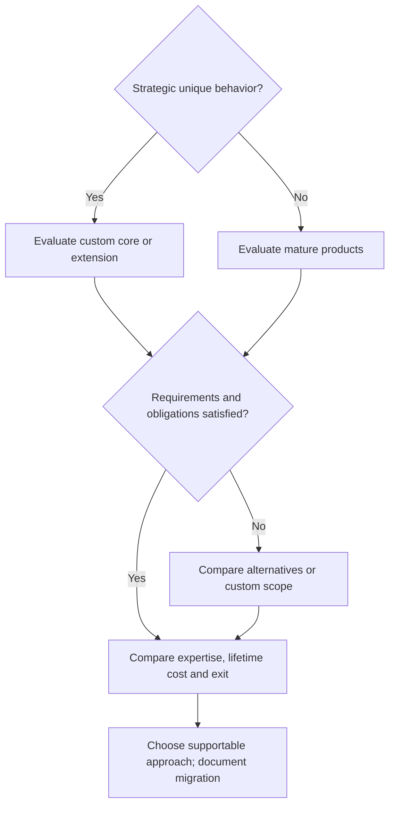
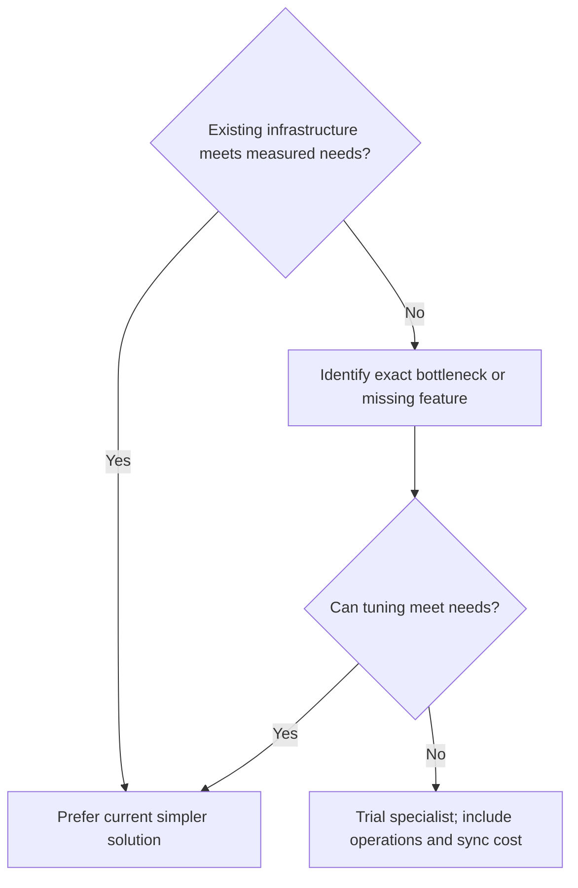
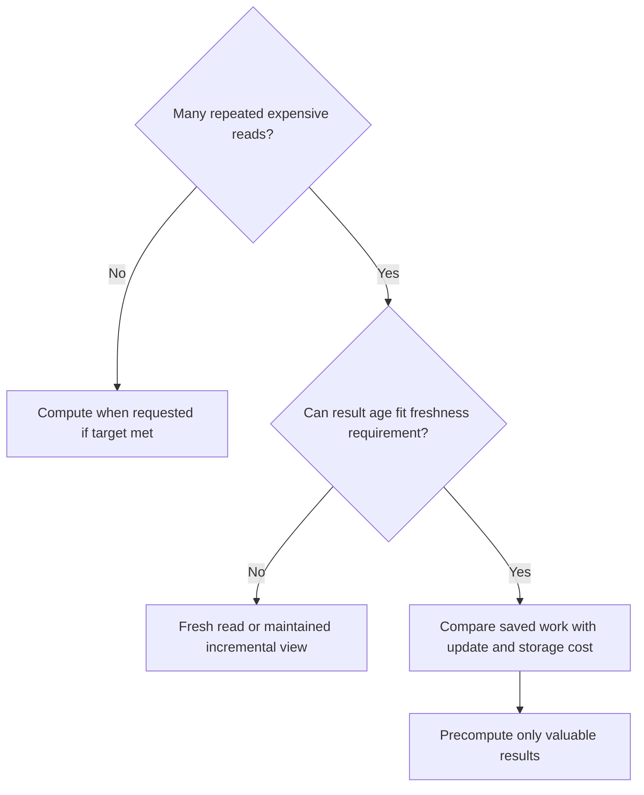
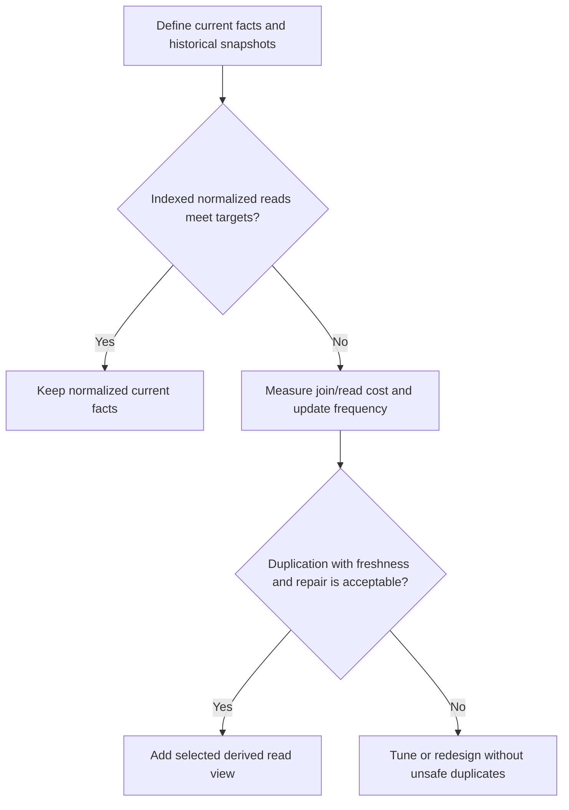

*[System Design Trade-offs](/tutorials/system-design/trade-offs) · Part III — Decisions, failures, and evolution · Sections 21–28 of 55.* New to the topic? Start with [Trade-off Fundamentals](/tutorials/system-design/trade-offs/fundamentals).

## 21. Trade-offs interact and have intermediate positions

Adding a cache may improve latency, throughput, and database load, while increasing memory cost, staleness, invalidation effort, and diagnosis difficulty. Replication may improve survival and read capacity, while adding storage cost, propagation lag, failover rules, and write waiting. A queue can improve burst handling but delay final results and require duplicate-safe workers.

A **spectrum** is a range of choices between extremes, like a dimmer instead of an on/off switch. Do not force a false binary.

| Trade-off | Several possible positions |
|---|---|
| Latency vs consistency | Existing fresh indexed read; nearby stale copy; read-your-writes; coordinated authoritative read |
| Cost vs reliability | Tested restore; extra host; separate-zone failover; separate-region recovery |
| Simplicity vs flexibility | Fixed behavior; small validated options; bounded plugins; general workflow language |
| General vs specialized | Existing query; database index; built-in search; dedicated search system |
| Guarantees vs throughput | Per-item invariants; per-room ordering; coordinated cross-group transaction; global total order |

These are illustrative dimensions, not strict rankings. More mechanisms do not necessarily give better outcomes. A **hybrid** combines approaches, like a shared kitchen plus a specialist baking station: normalized source plus read view, synchronous validation plus async work, managed database plus team-run application, stateless APIs plus stateful database.

## 22. Reusable decision record

Keep the following template with every important design. It explains the choice to someone who was not in the original meeting.

```markdown
# Architecture Decision: [name]
Date and owner: [who can maintain/revisit it]
Status: [proposed / accepted / replaced]

## Problem
[Concrete user workflow and harm to avoid]

## Requirements
[Mandatory invariants, latency/freshness/recovery targets, workloads]

## Constraints
[People, money, geography, existing systems, obligations]

## Options
1. [Approach, not only a product name]
2. [Alternative]
3. [Hybrid or defer, if useful]

## Trade-offs
| Option | Benefits | Costs | Risks | Best when |
|---|---|---|---|---|
| ... | ... | ... | ... | ... |

## Decision
[Chosen behavior and component/data boundaries]

## Why
[Requirement that makes the benefits worth the costs]

## Risks and operations
[Deploy, monitor, fail, recover, owner, cost, diagnose]

## Validation
[Measurement or failure test that establishes acceptability]

## Exit and reversibility
[Migration work and compatibility assumptions]

## Revisit when
[Specific threshold, changed requirement, or review date]
```

**Example:** A receipts worker is accepted because email can finish within five minutes and provider delays should not block order acceptance. Its costs are durable job tracking and retries. Monitor oldest job age; revisit staffing/capacity if more than 1% of receipts exceed five minutes for three consecutive days. This is more useful than “use a queue because queues scale.”

## 23. Six decision trees

Each tree narrows discussion. It does not replace measurements, mandatory rules, or failure analysis.

### A. Latency vs consistency



Caveat: A fresh read followed by a separate write can still race. Choose a safe combined update when the invariant requires it. Weak views need a defined fallback when their age becomes unacceptable.

### B. Synchronous vs asynchronous



Caveat: Synchronous validation can precede async execution. “Accepted” must not falsely mean “complete.” A queue can fail or fill.

### C. Build vs buy



Customization, compliance, team expertise, and vendor exit must all be explicit. Neither strategic importance nor product availability settles the decision alone.

### D. General vs specialized



Do not add a technology just because its benchmark is impressive. Use representative requests and failures.

### E. Precompute vs computation-on-read



Include update frequency and unused results. An **incremental view** updates only affected parts rather than recomputing everything, like adding each new receipt to a running total; it reduces some work but adds update logic and correction handling.

### F. Normalize vs denormalize



The choice is not “correctness or speed.” You can preserve authoritative correctness and accept a defined derived-view lag.

## 24. Let failures reveal hidden trade-offs

| Failure | Hidden question | A reasonable response and accepted downside |
|---|---|---|
| Required replica unavailable | Can acknowledgement wait or use fewer copies? | Refuse important writes rather than silently weaken durability; accept unavailability |
| Queue unavailable | Can order complete without a durable email intent? | Store intent in an outbox and publish later; accept delayed mail and backlog |
| Managed provider outage | Which core functions actually depend on it? | Provide read-only or reduced service where safe; accept incomplete features |
| Database overloaded | Is extra traffic useful, or destructive? | Limit admission and shed optional work; accept some rejected requests |
| Network partition | Who can perform authoritative updates? | Continue on authorized side; other side browses or refuses writes |
| Stale cache | Is the observation still within its promise? | Refresh, use authority, or say unavailable for freshness-sensitive operations |
| Worker crashes after action, before acknowledgement | Could retry repeat the action? | Use durable duplicate handling and reconcile external outcomes |
| Backup restores but configuration is missing | Can the application actually run? | Restore tested data, credentials routing, and configuration; extra recovery preparation |

A **failure domain** is a set of parts vulnerable to one common event, like devices sharing one power supply. Independent hosts in the same building can fail together. **Split brain** is two parts acting as exclusive authority at once, like two cashiers each believing they control the same last seat. Recovery rules must prevent it.

## 25. Budgets for people, delay, and failures

### Complexity budget

A team has limited capacity to understand, test, operate, and recover systems. More services + databases + queues + regions mean more interfaces and potential interactions, not just more monthly bills. Spend complexity on demonstrated value. A new cache needs an owner, invalidation rules, monitoring, rollout, and recovery; “one small box” can hide much work.

### Performance budget

For a sequential request path, approximate:

*T*<sub>response</sub> = *T*<sub>network</sub> + *T*<sub>application</sub> + *T*<sub>database</sub> + *T*<sub>required dependencies</sub>.

Example: 40 ms network + 20 ms application + 60 ms database + 80 ms required provider = 200 ms. If extra coordination adds a genuinely sequential 50 ms, total becomes 250 ms. Concurrent branches contribute approximately their maximum rather than their sum when all must finish. Percentiles of separate components cannot generally be added to obtain the end-to-end percentile; measure the complete path.

### Reliability budget

A **service-level objective**, SLO, is a measured target for service quality, like “99.9% of eligible checkouts succeed within two seconds this month.” An **error budget** is the permitted fraction missing that target, like a planned tolerance for late deliveries. These matter because reliability investment should match an outcome, not pursue a vague perfection label. [[S3]](/tutorials/system-design/trade-offs/cheat-sheet-and-next-steps#54-source-notes-and-further-reading)

Not every component needs the same target. **Graceful degradation** keeps essential functions working when optional features fail, like serving meals despite a broken music system. Recommendation failure should not block checkout. Payment failure cannot safely degrade into “pretend paid.”

### End-to-end reasoning

An order request can use an API handler, business module, cache, database, and external payment provider. Not every request should contact every component. A cache hit can avoid a database read; payment may be invoked only after reservation. Examine sequential dependencies, freshness at every boundary, and how failures propagate. A strong database behind a stale cache does not create strong user-visible reads. A durable queue does not make an unrecorded order durable.

## 26. Common architectural mechanisms

### Multi-region

Multiple geographic regions may reduce local read latency and provide recovery from a regional loss. Costs include extra data copies, network transfer, consistency and conflicts, deployment rules, and operators. A nearby frontend does not shorten the path to a distant authoritative write. Preassigning ownership or accepting stale reads can change that path, with explicit costs.

### Caching

Useful for repeated reads, lower latency, and less authoritative-store work. Costs include memory, stale results, invalidation, and load spikes when entries expire. **Cache stampede** means many misses trigger the same expensive computation simultaneously, like everyone requesting a missing file at once. Coalescing refreshes or staggering expiry can help but adds logic. TTL is an expiry policy, not proof of freshness when upstream inputs are old.

### Replication

Can improve availability, read scale, and data survival when copies and failover are suitable. Asynchronous copies lag; synchronous copies can add waiting. More copies cannot repair every software defect or accidental deletion. Backups, testing, and data checks remain needed.

### Sharding — optional advanced foundation

**Sharding** splits data across stores, like filing customers A–M in one office and N–Z in another. It can spread data and write load. Cross-shard joins and transactions get harder; uneven popular groups can overload one shard. **Rebalancing** moves data to redistribute load, like changing which files each office owns; this requires safe routing and migration. Shard only when measured capacity or a firm forecast justifies it.

### Queues

They absorb bursts, support retries, and separate submission from processing. **Decoupling** reduces the need for two parts to operate at the same moment, like leaving a written request instead of speaking directly. It does not remove the logical dependency or eventual processing cost. Queues add delay, duplicates, ordering questions, capacity limits, and diagnosis work.

### Monolith vs microservices

**Microservices** divide an application into separately deployed services, like independent specialist shops cooperating on an order. They can support team ownership, independent deployment, and scaling one function. They add network boundaries, partial failures, permission checks, observability, releases, and data ownership issues.

| Dimension | Modular monolith | Microservices |
|---|---|---|
| Simplicity | One release; internal calls | Many releases and remote interactions |
| Flexibility | Clear modules can evolve | Independent teams can evolve bounded services |
| Scaling | Scale the application as a unit | Scale selected services when boundaries fit |
| Operations | Fewer deployment/recovery surfaces | More infrastructure and cross-service diagnosis |
| Failure isolation | Shared process failures may affect many functions | Isolation helps only if dependencies and resources are designed well |
| Team fit | Often practical for small teams | Can help several autonomous teams |
| Data | Local transactions easier | Cross-service invariants need extra coordination |

A monolith can handle large traffic; microservices can be overloaded. Choose from workload, organizational needs, and fault boundaries, not prestige.

## 27. Anti-patterns and misleading claims

An **anti-pattern** is a recurring approach that causes problems in a given context, like consistently packing important tools under everything else. Recognize these six:

1. Maximizing everything: zero delay, no loss under every imaginable event, perfect uptime, no cost, and no complexity are incompatible with physical and economic limits. Rank mandatory outcomes.
2. Copying a famous company: its scale, staffing, constraints, and obligations differ. Borrow the reasoning, not the shopping list.
3. Premature optimization: improve what measurement or firm requirements justify. Do not shard a database merely because growth is possible.
4. Ignoring people: hiring, learning, sleep disruption, and diagnosis belong in the cost model.
5. Technology-first design: “use Redis” is a product choice, not proof that caching is needed. Redis is one possible data-store product; the principle is reusable-data storage.
6. Hidden promise changes: accepting writes earlier is not an equivalent performance fix if acknowledged data can now disappear.

### Fifteen claims that sound right but are incomplete

| Claim | Why the reasoning fails | Better reasoning |
|---|---|---|
| 1. Strong consistency is always better | It can add unnecessary coordination | Identify which observations and invariants require it |
| 2. Lower latency always wins | Early replies may conceal loss or incomplete work | Measure acceptable delay and the completion promise |
| 3. More replicas improve everything | Extra work, shared failures, harder failover | Specify failure coverage and cost |
| 4. Managed is always more expensive | Compares fee with machines only | Include labour and recovery |
| 5. Self-hosting is always cheaper | Ignores staff and mistakes | Compare full lifetime cost |
| 6. Build gives control, so build wins | Control consumes expertise | Ask whether custom control provides business value |
| 7. Denormalization is bad design | Useful derived views can be intentional | Separate authority and read representation |
| 8. Stateless means no state | State moves elsewhere | Identify shared-store guarantees and cost |
| 9. Async is always more scalable | Backlog grows if processing cannot keep up | Compare arrival and processing rates |
| 10. A queue makes the operation faster | Acceptance and completion differ | Measure both times |
| 11. A specialist is always faster | Wrong query shape or extra transfer can negate benefit | Benchmark representative work |
| 12. More flexibility always helps | Unused options burden testing | Build for observed variations |
| 13. High throughput means low latency | Long waits can coexist with many completions | Track both under load |
| 14. Five replicas ensure high availability | Shared power, network, or bad release can fail all | Test independent failure domains and recovery |
| 15. Managed means operations disappear | Customer duties remain | Record responsibility and verify recovery |

## 28. Shipping, debt, and evolution

**Time to market** is time until users can use the product, like opening a shop before competitors. An **MVP**, minimum viable product, is a small useful version that tests key value. A **prototype** explores an idea and may not yet meet live-user guarantees. These distinctions matter: a prototype's unsafe shortcut must not silently become production behavior.

**Technical debt** is a design compromise that increases future work, like postponing a repair. Deliberate debt can be rational if impact, owner, repayment trigger, and exit are recorded. “We'll fix later” without a trigger is not a plan. Shortcuts must still respect mandatory business correctness.

| Evolution step | Evidence that might justify it | Benefit | Accepted cost |
|---|---|---|---|
| One application and database | Current targets met | Clear ownership and low burden | Coupled capacity/release |
| Add selected cache | Repeated reads exceed target | Less read work and delay | Invalidation and staleness |
| Add suitable replicas | Required failure coverage or read demand | Survival and read capacity | Lag, failover, coordination |
| Add durable queue | Long or bursty optional work | Fast acceptance; smoother processing | Completion tracking and retries |
| Add specialized search | Required ranking or measured search gap | Better retrieval | Synchronization and another operator surface |

This is an example path, not a maturity ladder. A video product may need a queue on day one; another may never need a separate search system. A good design at 10,000 users can need revision at 100 million users because workload, failure harm, staffing, and geography change. User count itself is not a capacity estimate.

### Operational trade-offs that recur

| Choice | Potential benefit | Accepted cost and control |
|---|---|---|
| Frequent small deployments | Faster feedback; smaller individual changes | More change events; automate checks and safe rollout |
| More automation | Repeatable operation and less manual work | Automation bugs have wide impact; test and retain recovery controls |
| Detailed observability | Faster diagnosis | Storage, processing, privacy effort; retain useful detail deliberately |
| Frequent backups | Smaller potential recovery gap | Storage and restore management; test usable recovery points |
| Strong resource isolation | Limits one workload's impact on others | Lower pooling efficiency; spend on critical boundaries |

**Practice:** “When we reach one million users, split into microservices.” Is this a good revisit trigger?

**Solution:** It is incomplete. Use evidence such as independent teams blocking one another's releases, a workload requiring separate scaling, or insufficient fault isolation. Estimate actual active traffic. A user-count milestone can initiate a review but does not dictate its conclusion.
