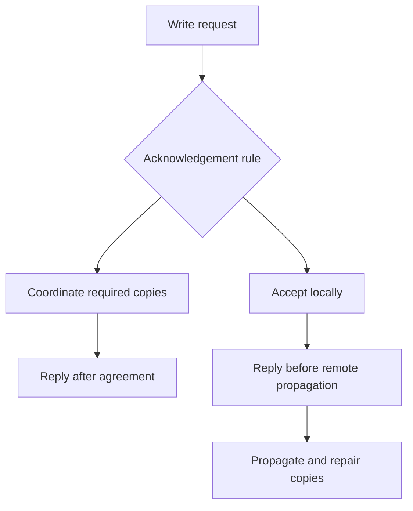
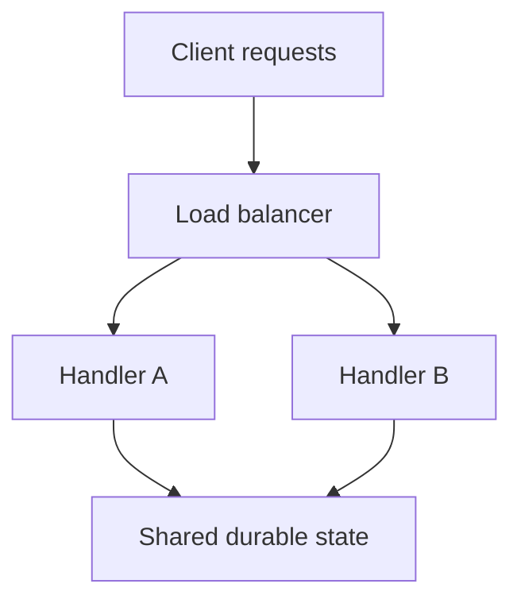

*[System Design Trade-offs](/tutorials/system-design/trade-offs) · Part II — The fourteen trade-offs · Sections 7–20 of 55.* New to the topic? Start with [Trade-off Fundamentals](/tutorials/system-design/trade-offs/fundamentals).

Each lesson follows the same pattern: everyday example, concrete software behavior, definition, alternatives, consequences, operational questions, and practice. “Prefer” always means “under the stated assumptions.”

## 7. Latency vs consistency

Two cashiers have copies of a price list. Checking the newest master list takes a walk to the office. Using the list on the counter is quicker, but a price change might be missed.

A banking screen shows ₹10,000. A withdrawal of ₹1,000 completes, giving ₹9,000. Must a later read on another device see ₹9,000, or may it briefly see ₹10,000? **Strong consistency** here means **linearizability**: operations appear to take effect one at a time between request and response, respecting the real-time order of non-overlapping operations. Like one shared official ledger, a read begun after a successful write completes sees that write or a later update. This is important when decisions must use an authoritative current value.

This does not mean every screen refreshes automatically or every physical copy changes simultaneously. A screen already displaying an old value needs a new read. A replica can lag internally if the system prevents it from serving a read that would violate the guarantee.

**Eventual consistency** means that, if new updates stop and communication and repair continue, copies converge under the system's conflict rules. Think of distributing a revised notice: offices may differ temporarily but eventually agree. A profile picture can propagate this way. “Eventually” does not establish a five-second deadline unless another promise does.

| Option | Benefits | Costs | Risks | Best when |
|---|---|---|---|---|
| Coordinate authoritative reads/writes | Compatible current observations | Waiting, coordination, sometimes rejected work | Slow or unreachable coordinator | Stale observations cause incorrect actions |
| Read a nearby potentially stale copy | Often faster, less central load | Propagation and conflict handling | Old data presented as current | Temporary staleness is acceptable |

Why delay? An authoritative server may need messages from other servers before treating a write as complete. A local acceptance followed by copying later avoids some waiting, but a different reader may reach an old copy. Geography, protocols, load, and storage also matter; strong consistency is not automatically slow at small scale.

**Hybrid:** Show fast, approximate stock on browsing pages; use an atomic reservation when buying. **Read-your-writes consistency** means a user sees their own successful changes in later reads, like a receipt reflecting their own purchase even while another notice board lags. It is useful for profile edits and is weaker than a global linearizable view.

**Questions:** How stale may data be? Does it affect money? Are concurrent writes possible? Is this a read or write path? Does “correct” mean fresh, or also an all-or-nothing multi-record update? A fresh read alone does not prevent two buyers racing to update stock.

**Operations:** Monitor p95/p99 delay and measured staleness; test unreachable replicas; own conflict repair; state which reads use which guarantee. Deploying a stale cache in front of a strong database can weaken the end-to-end observation.

**Practice:** Reactions must display within 150 ms; counts may lag 20 seconds. Checkout must not oversell. What matters, what relaxes, what choice, what downside?

**Solution:** Permit stale reaction counts and monitor their age, accepting temporary discrepancy. Reserve stock atomically in the authoritative store, accepting some waiting or refusal during failures. These workflows need separate promises; stronger rules everywhere would add coordination without the same benefit.

## 8. Availability vs consistency

Two ticket offices lose telephone contact. Both are open, but neither knows whether the other sold the last seat. Continuing to sell can conflict; refusing uncertain sales frustrates customers but protects the seat.

A **distributed system** consists of cooperating computers communicating over a network, like branches of one company. It can spread capacity or survive some failures, but messages can be lost or delayed. A **network partition** separates computers that cannot communicate reliably even though both may still run. It matters because a server cannot infer another server's latest actions from silence.

| Option | Benefits | Costs | Risks | Best when |
|---|---|---|---|---|
| Refuse or wait for operations lacking authority | Preserve required shared-data rules | Some callers cannot complete | Outage or timeout for isolated callers | Conflicting success is unacceptable |
| Let isolated sides update independently | Continue some useful work | Conflicts, reconciliation, weaker observations | Duplicate reservations or lost edits | Operations are safely mergeable or compensable |

A common hybrid keeps browsing available and blocks uncertain reservations. Some writes can continue on the side holding sufficient authority while isolated copies refuse them. You do not need to stop the whole product.

### CAP, carefully

**CAP** names consistency, availability, and partition tolerance. In the classical read/write model, it is impossible to guarantee both linearizable observations and completion of every request to a non-failing node despite an indefinite partition. CAP availability requires completing operations according to the service specification; returning “unavailable” to everything does not satisfy it. Practical availability is usually measured with deadlines and success rates. [[S1]](/tutorials/system-design/trade-offs/cheat-sheet-and-next-steps#54-source-notes-and-further-reading)

“Pick any two forever” is misleading. A network failure is an operating condition you must handle, not a desirable feature you remove to obtain two guarantees. Normal operation can have strong observations and successful responses, but coordination still costs time. Requirements vary by operation. CAP also does not say that any weakening immediately solves every business rule.

**Examples:** A ledger can deny isolated writes; reactions can be accepted for later merging; a shopping cart can merge item additions but must define removals and quantity conflicts. **DNS**, the Domain Name System, maps names to network addresses, like a phone directory. Cached answers allow name lookup during some failures but can show old addresses; this is a helpful analogy, not a full classification of every DNS operation.

**Operations:** Test partitions, define the authoritative side, prevent two conflicting leaders, expose reduced service clearly, and repair after reconnection. **Consensus** is a protocol for agreeing on an outcome among machines, like a committee recording one decision. A **quorum** is a required set of participating members, often a majority. These mechanisms can preserve agreement while a minority is disconnected; they cannot guarantee every isolated member completes every operation.

**Practice:** Both regions must sell every seat during any partition and must never double-sell. Is this achievable with unrestricted access to the same inventory?

**Solution:** Not with both promises in the classical model. Reject uncertain operations, or preassign disjoint seat ownership so regions sell only their own seats. The latter preserves local sales but may leave seats unavailable to customers in the other region; capacity flexibility is sacrificed. Merging two successful claims to one seat afterwards cannot make both promises true.

## 9. Durability vs latency

You dictate a letter. “Got it” could mean the secretary heard it, wrote it in a notebook, or placed copies in two buildings. These are different promises.

**Acknowledgement** is a message saying an operation was accepted or completed, like a receipt. A “Saved” response is meaningful only if it specifies what has actually happened and which failures the record survives.

| Option | Benefits | Costs | Risks | Best when |
|---|---|---|---|---|
| Acknowledge from memory | Very fast acceptance | Weak crash survival | Power or process loss erases accepted work | Explicitly expendable events |
| Acknowledge after durable local persistence | Survives specified local restarts | Storage waiting | Machine or location loss still possible | Local failure survival suffices |
| Acknowledge after required durable remote copies | Survives additional independent failures | Storage and network waiting; more cost | Common failures, incorrect failover, corruption | Important accepted business records |

Persistence means retaining data beyond the current process. Writing through a storage layer may leave data in temporary buffers; a durability promise depends on flushing, hardware behavior, and database configuration. **Write-ahead logging** records intended database changes in a durable log before completion, like entering a transaction in a journal before updating the main ledger. The log can support recovery; not every data page has to be rewritten before acknowledgement. [[S2]](/tutorials/system-design/trade-offs/cheat-sheet-and-next-steps#54-source-notes-and-further-reading)

Memory copies on three machines are not automatically three durable copies. Synchronous replication may wait for receipt, durable storage, or application of the change; define which. Replication is also different from backups: accidental deletion can propagate immediately.

**Hybrid:** Retain bank transactions durably; sample nonessential game-performance telemetry under an explicit loss policy. Business-critical audit events cannot be treated as expendable merely because they are called analytics.

**Operations:** Test actual recovery, power-loss assumptions, restore procedures, and failover data loss. Track how much acknowledged data could disappear. Deploy settings deliberately; a latency improvement obtained by weakening acknowledgement must change the product promise.

**Practice:** A note-taking app says “Saved” but holds the note only in application memory. What downside is hidden?

**Solution:** A crash can lose an acknowledged note. Either wait for sufficient persistence or show “saving/pending” and explain the boundary. For important notes, stronger durability is worth additional waiting; temporary cursor movement can have a different policy.

## 10. Cost vs reliability

A spare tyre costs money and room. It helps only if inflated and if someone can fit it. Three broken spares are not a reliable travel plan.

Redundancy can allow maintenance or failures without stopping service. Reliability also requires correct code, detection, tested recovery, staffing, and safe changes. More machines may worsen reliability if they introduce unmanageable coordination.

| Option | Benefits | Costs | Risks | Best when |
|---|---|---|---|---|
| Lower spend and limited protection | More budget for product; simpler setup | Less failure coverage; longer recovery | Downtime or lost work | Low-impact prototype with honest limits |
| More protection and operational investment | Fewer or shorter harmful interruptions | Resources, drills, engineering time | Complex failover and common dependencies | Outage impact warrants investment |

**Availability nines** describe percentages such as 99.9%. Under a time-based calculation for a 30-day month of 43,200 minutes:

| Target | Allowed unavailable time |
|---|---:|
| 99% | 432 min = 7 h 12 min |
| 99.9% | 43.2 min |
| 99.99% | 4.32 min |
| 99.999% | 0.432 min = 25.92 s |

These are budgets, not guarantees of evenly spaced outages. A request-based measure uses successful eligible requests divided by total eligible requests and need not yield the same result. Extra nines often cost more because rare shared failures, recovery, and change risk become dominant. [[S3]](/tutorials/system-design/trade-offs/cheat-sheet-and-next-steps#54-source-notes-and-further-reading)

**Hybrid:** Protect checkout more than recommendations; show a generic list if recommendation logic fails. Invest first in recovery testing when unused replicas cannot fail over safely.

**Questions:** How much loss per outage hour? Which hours matter? Is human safety involved? What interruption and data-loss durations are acceptable? What is prevention worth compared with reduction of impact?

**Operations:** Name the operator, rehearse location loss, monitor customer outcomes, and include labour in cost. A critical payment system, public store, and internal prototype merit different investment.

**Practice:** A prototype has ten internal users and can be down for one day. Must it use three regions?

**Solution:** Not from these requirements. A simple deployment with backups and a tested restore may suffice. Three regions add cost and coordination; revisit if outage harm or required recovery time changes.

## 11. Simplicity vs flexibility

A fixed menu is easy to cook. A menu allowing every ingredient substitution serves more preferences but requires more training and combinations to test.

A **module** is a clearly bounded part of a program, like a kitchen station. A **monolith** packages most application behavior as one deployable program. A **modular monolith** keeps internal responsibilities separated within that program. A **plugin** is an extension attached through defined rules, like an optional appliance fitting a standard socket. **Configuration** is adjustable information controlling behavior without changing the main program, like a restaurant's opening-hours setting.

| Option | Benefits | Costs | Risks | Best when |
|---|---|---|---|---|
| Fixed, clearly modular behavior | Easy testing, diagnosis, deployment | Some new variants need code changes | Hard-coded assumptions spread | Few actual variations |
| Plugins, rules, configurable workflows | Real variation supported without repeated rewrites | More combinations, permissions, compatibility work | Misconfiguration and difficult diagnosis | Frequent demonstrated variation |

A startup with 500 users can still need complex business behavior, but user count alone does not justify 20 services, a plugin framework, and a custom rule language. **SaaS**, software as a service, means customers use a provider-operated application, like subscribing to a staffed office service. Enterprise SaaS may genuinely require customer-specific approvals. Flexibility should answer observed variation.

**Hybrid:** Keep stable core rules explicit and offer a small validated extension point. A **workflow engine** coordinates configurable sequences of tasks, like a scheduler for approvals. Use it when sequences really vary; it is another system to learn and recover.

**Operations:** Version configuration, validate changes, audit which rule executed, test supported combinations, and assign ownership. Rollback of code alone may not undo a configuration or data-model change.

**Practice:** Three customers request the same optional approval step. What choice is defensible?

**Solution:** Add a bounded option with a clear default and tests. A general programming language for approvals is probably premature. Accept limited flexibility and revisit when several genuinely different sequences emerge.

## 12. Build vs buy

You can bake bread yourself or purchase it. Homemade bread offers recipe control but takes tools, skill, time, and continuing effort. Buying saves work but constrains ingredients and depends on the supplier.

**Build** means create the capability yourself. **Buy** means adopt another party's software or service, including paid services and adopted open-source software. **Vendor lock-in** is difficulty switching because of product-specific interfaces, data, contracts, or behaviour, like furniture built to fit only one house. It matters because a cheap initial choice may have an expensive exit.

| Option | Benefits | Costs | Risks | Best when |
|---|---|---|---|---|
| Build | Tailored behavior; control over design | Development, security, upgrades, incidents | Immature capability; expertise loss | Strategic uniqueness and sustainable expertise |
| Buy/adopt | Earlier delivery; existing features and expertise | Fees, integration, product constraints | Provider failure, changed terms, hard migration | Mature product fits a commodity need |

**Authentication** verifies identity, like checking a membership card; **authorization** decides allowed actions, like whether the card permits entering a restricted room. A managed identity product may handle password storage and sign-in protocols, but the application still needs correct permissions and account-lifecycle rules. Building authentication requires security expertise and long-term maintenance; buying it still requires evaluation and safe integration.

Apply the same reasoning to payments, email, monitoring, search, and database hosting. Distinctive fraud rules may be built around a purchased payment service. Control is not valuable unless someone can exercise it competently.

**Questions:** Is the capability competitively distinctive? Does a product actually meet mandatory behavior? Can we operate it? What are lifetime costs? What legal, residency, or audit needs apply? Can we export data and replace it? **Compliance** means meeting applicable obligations, like a shop following licensing rules; the precise obligations require domain-specific review rather than assuming a vendor solves them.

**Operations:** Assign integration ownership, monitor provider failures, track upgrades and contract changes, test an exit, and include on-call work. **On-call** means someone is responsible for responding outside ordinary work hours, like emergency maintenance duty.

**Practice:** Two engineers must launch sign-in in six weeks. Unique requirements are not known.

**Solution:** Evaluate a mature identity provider against explicit requirements. It may reduce delivery time and security implementation work. Accept fees and dependence; keep permission logic correct and record migration requirements. Building can become reasonable if provider limits prove incompatible and expertise exists.

## 13. Managed vs self-hosted

Renting an apartment with building maintenance differs from maintaining a house yourself. Either may use purchased appliances. Who made the appliance and who operates it are separate questions.

A **managed service** has a provider operating specified infrastructure tasks. **Self-hosting** means your team operates the deployed software. Buying a database licence and running it yourself is buy + self-hosted. Building an application on a managed database is build + managed support.

| Dimension | Managed option | Self-hosted option |
|---|---|---|
| Benefits | Reduced infrastructure work; provider expertise | Detailed control and tuning |
| Operational effort | Often lower, never zero | Team owns deployment and recovery |
| Control/customization | Limited by service contract and settings | Greater within software/hardware limits |
| Cost | Fees plus team integration and administration | Machines plus labour and tools |
| Upgrades | Provider may schedule or automate them | Team plans, tests, and runs them |
| Failure risk | Provider dependency; unexpected limits | Missed patches, poor backups, staff gaps |
| Best when | Service fits needs and team capacity is limited | Required control and sustained expertise justify it |
| Lock-in | Can be high or low | Can also be high through tools and data |

Provider duties may include hardware, installation, patches, backups, upgrades, and failover. Check the actual service: these are not automatic. The customer still owns data access, application queries, configuration choices, recovery objectives, and verifying restorability.

**Total cost of ownership**, TCO, includes purchase, operation, maintenance, and exit costs, like a car's price plus fuel and repairs. A $900 infrastructure bill can exceed a $2,000 managed bill after engineering effort. Conversely, a capable team at large predictable scale may have a defensible self-hosting case.

**Hybrid:** Self-operated application on a managed database. **Operations:** Inspect backup retention, patch responsibilities, upgrade windows, capacity limits, support, restoration tests, and who responds when the application fails.

**Practice:** A managed database includes daily backups. Can your team stop testing recovery?

**Solution:** No. You must know whether a backup restores the required data, how long restoration takes, and whether access/configuration is recoverable. Provider automation reduces tasks but does not establish your product's recovery guarantee.

## 14. General-purpose vs specialized infrastructure

A kitchen knife does many jobs. A bread slicer excels at a narrow task but costs money, space, and maintenance. Specialization earns its place when its particular benefit matters.

A **general-purpose** system serves many workloads. A **specialized** system focuses on particular patterns. A **relational database** stores related structured records with query and constraint tools, like linked ledgers. A **virtual machine** is a software-defined computer running on shared hardware, like a separately equipped workspace in a building. An **object store** holds named blobs such as images, like a warehouse of labelled boxes. They are broad foundations, not interchangeable tools.

A **search engine** indexes text for retrieval and ranking, like a library catalog sensitive to words. A **vector database** retrieves nearby numeric representations of items, like comparing items by coordinates on a similarity map. A **time-series database** specializes in time-stamped measurements, like a weather log. A **GPU** is a processor effective at many parallel calculations; **inference** applies a trained model to an input, like using learned examples to classify a picture. A GPU inference service runs that workload. These tools can help specific needs but add expertise and integration requirements.

| Option | Benefits | Costs | Risks | Best when |
|---|---|---|---|---|
| Existing general infrastructure | Fewer skills, integrations, recovery plans | May do unnecessary work for some queries | Bottleneck or missing feature | Meets measured requirements |
| Specialized component | Workload-fit features and possible efficiency | Extra synchronization, fees, operations | Derived data lag, new dependency | Proven gap justifies extra system |

**Search example:** A database `LIKE` query finds matching text patterns, like looking for words containing “shoe.” It can be sufficient for small catalogs; index use depends on pattern and database capabilities. Typo tolerance, ranking, and complex language search may justify dedicated infrastructure. First measure and consider built-in database search.

**Analytics example:** A **transactional workload** reads and updates individual business records, like recording each sale. An **analytical workload** examines many records for totals or trends, like calculating annual revenue. **Column-oriented storage** groups values by field, like keeping all amounts together instead of whole receipts; reading only a few fields over many rows can be efficient. It is not automatically best for every query.

**Hybrid:** Keep authoritative orders in the relational database; derive search documents or reports elsewhere. **Operations:** Monitor lag, retain rebuild procedures, handle missing/deleted records, test outages, and give the new store an owner.

**Practice:** A 5,000-item catalog meets a 250 ms search target in the existing database. Add a search cluster?

**Solution:** Not for speed alone. Stay with the measured solution unless required ranking or other features are absent. Accept limited search features and revisit when realistic traffic or catalog growth breaks the target.

## 15. Stateful vs stateless architecture

A waiter remembering your entire order privately is stateful. A waiter reading a shared order slip can be replaced by another waiter. The restaurant still has state; it has moved the memory out of that waiter.

A **stateful server** retains information between interactions that matters to correctness or progress. A **stateless request handler** does not require private per-client information from earlier requests to process the next one. It can use shared durable state and identity evidence carried in the request.

A **credential** is evidence used to establish identity or access, like a membership card; a request may carry a verified token rather than rely on a particular server remembering the user. A **token** is a data item representing a claim or permission, like a signed ticket, whose validity must be checked. A **session** is information linking a user's interactions, like an ongoing restaurant tab. A **load balancer** directs requests among servers, like a receptionist assigning desks. **Session affinity** sends a user's requests to the same server, like keeping the same waiter. **Locality** means work is near the data it needs, like keeping frequently used tools at the workstation.

| Option | Benefits | Costs | Risks | Best when |
|---|---|---|---|---|
| Local stateful process | Fast local access; natural live coordination | Ownership, transfer, checkpoints, recovery | Host loss loses progress; uneven load | Game sessions, media sessions, processing tasks |
| Stateless request handlers | Easier replacement and distributing requests | Shared-state calls and external dependency | Shared store overload or failure | Independent API requests and routing |

A **checkpoint** is a recorded progress snapshot used to restart work, like saving your place in a long task. Databases are stateful because retaining information is their purpose. Real-time media sessions and games may benefit from local state. Stateless API servers help only when the shared store and request representation support safe replacement.

**Hybrid:** Stateless web handlers plus a stateful database; stateful game hosts with durable checkpoints. **Operations:** Decide who owns state, how it is copied or moved, which host handles it, and how recovery avoids conflicting owners. Deployments may need to drain sessions, meaning let existing work finish before replacing a host.

**Practice:** A cart is stored only in Server A's memory. Requests randomly go to A or B.

**Solution:** B cannot reliably show the cart. Move cart state to suitable shared storage, or route to A with explicit replication and recovery. Shared storage adds latency and dependence; affinity alone does not preserve the cart if A fails.

## 16. Synchronous vs asynchronous communication

At a print shop you can wait until the document is printed, or leave a job and collect it later. Leaving quickly does not make printing itself faster.

**Synchronous communication** makes the caller wait for the operation's result. **Asynchronous communication** separates submission from final completion. In these architectural examples, “accepted” is a different state from “finished.” A program can also use non-blocking code while logically awaiting a synchronous result; programming style and business completion are separate dimensions.

| Option | Benefits | Costs | Risks | Best when |
|---|---|---|---|---|
| Synchronous completion | Immediate outcome; simple user reasoning | Caller holds resources and waits | Slow dependency and uncertain timeout | Caller needs final result now |
| Asynchronous execution | Burst absorption; long tasks away from request path | Queue, status, retries, recovery | Delayed jobs, duplicates, out-of-order work | Completion may happen later |

A synchronous sequence through services A, B, and C accumulates sequential waits. If C fails, the original request may fail. A queue can allow acceptance while workers temporarily stop, within queue durability and capacity limits. It does not remove the dependency required for eventual success.

**At-least-once delivery** allows the same job to be delivered again, like reissuing a delivery slip after uncertainty. It can prevent loss but risks duplicate business effects. Design workers to be idempotent and preserve the result, not merely check a flag in a race-prone way. AWS SQS standard queues are one concrete documented example where duplicates can occur. [[S4]](/tutorials/system-design/trade-offs/cheat-sheet-and-next-steps#54-source-notes-and-further-reading)

**Backpressure** slows or refuses new work when capacity is insufficient, like stopping orders when the kitchen is full. **Dead-letter storage** holds repeatedly failing jobs for investigation, like a tray for orders that cannot be fulfilled. These help avoid infinite retries and unbounded waiting.

**Hybrid:** Validate an upload and durably record its job synchronously; transcode later. **Transcoding** converts video into playback formats, like translating one document into several editions. Generate thumbnails and notify when complete. An accepted upload should not be labelled playable before conversion finishes.

**Operations:** Monitor oldest job age, completion delay, retry count, failure backlog, and duplicates. Track a job identifier from acceptance to completion. Coordinate transaction and queue boundaries: a durable **outbox** stores the intended job alongside the business record, like attaching a delivery instruction to the signed order; a separate publisher forwards it and can retry.

**Practice:** Confirmation email sometimes takes 20 seconds. Must checkout wait?

**Solution:** Usually the order result can be returned after durable acceptance, with email delivered later under a stated deadline. Accept queue and retry complexity. Persist the email intent with the order so a crash between order completion and submission does not silently drop the receipt.

## 17. Normalization vs denormalization

A school keeps a student's current address once in the student register and writes the student number on class lists. Copying the address onto every class list makes each list self-contained, but a move now needs many updates.

**Normalization** organizes relational data around its logical dependencies to reduce unnecessary duplication and update problems. Our beginner version stores a current fact in one logical place and refers to it by an identifier. This is not a ban on every repeated value: formal normalization considers relationships between fields and keys. **Denormalization** deliberately duplicates or combines facts to support particular reads. It trades simpler retrieval for maintaining additional representations.

### Concrete data model

| Customer table | Name |
|---|---|
| customer_id = 42 | Asha |

| Order table | Customer reference | Amount |
|---|---|---:|
| order_id = 900 | customer_id = 42 | ₹1,200 |

To show the current customer name with an order, join using customer_id. A denormalized display table might keep `order_id`, `customer_id`, and `current_customer_name` together.

| Option | Benefits | Costs | Risks | Best when |
|---|---|---|---|---|
| Normalize current facts | One logical update; less duplication | Joins or more lookups | Poor query/index design slows reads | Frequent updates, strict fact ownership |
| Denormalize selected views | Fewer joins; potentially faster read paths | Storage, propagation, rebuild work | Stale or contradictory copies | Measured read cost justifies duplication |

An **update anomaly** occurs when redundant copies disagree after a change, like one class list retaining an old address. If Asha becomes Asha Rao, updating the customer record is simple; updating every copied current name may be expensive and failure-prone.

However, an order's **historical snapshot** records what was true when purchased, like the name and address printed on an invoice. It may intentionally remain unchanged. That is not a stale copy of the current name: its meaning is different. Define field meaning before “fixing” apparent duplication.

**Read-heavy** means reads dominate; **write-heavy** means changes dominate, like frequent visitors versus frequent edits to a notice board. These ratios guide exploration, not an automatic denormalization rule. Indexed joins over a small dataset can be fast; huge frequently changing duplicates can be costly even if reads dominate.

**Hybrid:** Normalized authoritative records plus a denormalized read model. A **read model** is a representation shaped for specific queries, like a preassembled customer-order report. **Operations:** Version its schema, measure update lag, handle deletion, and test rebuilding. A **schema** specifies data structure and rules, like column headings and permitted entry types.

**Practice:** Customers change their contact details daily, and support needs current details for every order. The existing join meets its target.

**Solution:** Keep current details normalized and use the join. Duplicating them adds propagation risk without a measured benefit. If support reads later become expensive, add a derived view with explicit freshness; preserve immutable invoice fields separately.

## 18. Precomputation vs computation-on-read

A restaurant can prepare popular lunches before customers arrive or cook each lunch when ordered. Advance work speeds serving but risks waste and older food.

**Precomputation** calculates results before requests need them. **Computation-on-read** calculates when requested. **Aggregation** combines many records into a summary, like summing receipts into daily revenue; it matters because repeated scans can be expensive. A **batch** processes a group together, like cooking a tray at once; it can save overhead but delays individual results.

| Option | Benefits | Costs | Risks | Best when |
|---|---|---|---|---|
| Precompute | Fast reads; repeated work avoided | Background updates, storage, invalidation | Stale results; unused work; late-data repair | Frequent costly reads; acceptable result age |
| Compute on read | Fewer stored derived results; compute only when needed | Repeated cost, potentially slower reads | Demand spikes overload computation | Rare queries or very fresh results |

A social feed can collect followed authors' posts when opened, or place post references into follower feeds in advance. **Fanout** distributes one item's work to many destinations, like copying one announcement to every class. A celebrity with millions of followers can make precomputed fanout expensive; a hybrid prepares ordinary-author entries and merges celebrity posts at read time.

A cache often stores previously computed results. **Cache hit** means a usable entry exists; **cache miss** means work must be performed, like finding or not finding a file on your desk. Lazy caching is not necessarily computation before the first request. It is reuse after a request; background refreshing is a form of precomputation.

Computation-on-read is not automatically fresh: stale inputs or an older transaction snapshot can still produce an old result. Precomputed results can be maintained nearly immediately with sufficient work. Specify freshness at the output.

**Quantitative example:** One million dashboard views per day at 200 ms CPU per view consume 200,000 CPU-seconds, about 55.56 CPU-hours. Hourly precomputation at 10 CPU-seconds consumes 240 CPU-seconds, or four CPU-minutes. Ignoring serving and update costs, computation falls by about 833.3 times. Users may see an hour-old summary plus processing delay. CPU time is work, not elapsed time across parallel machines.

**Operations:** Measure summary age, completion of scheduled updates, unused computations, misses, and rebuild cost. Retain authoritative inputs; include late corrections. **Practice:** A report is requested twice yearly and needs current information.

**Solution:** Compute on demand if it meets its response target; daily precomputation likely wastes work. Accept a longer wait or a tracked background report job if computation is too long. Revisit if demand becomes frequent.

## 19. Strong guarantees vs throughput

One person numbering every receipt in a single global sequence can become a bottleneck. Separate receipt sequences for each shop permit independent work, if the business does not require one universal ordering.

Guarantees include strong observation rules, unique usernames, all-or-nothing changes, ordering, and **exactly-once business effects**: repeated processing produces one intended action, like one voucher redeemed once. Message delivery and business effect are different. A delivered-twice message can have a once-only effect if records and changes are atomic and external providers support safe duplicate handling. Promising exactly-once across every boundary without assumptions is misleading.

**Serializable transactions** behave like transactions ran in some one-at-a-time order, even if work overlaps. This protects many concurrent business rules but does not by itself require that order to match real-time completion. **Strict serializability** combines serializability with real-time ordering. Like separate rules for “take turns” and “respect who finished first,” these are distinct promises. Systems may retry transactions to enforce isolation. [[S5]](/tutorials/system-design/trade-offs/cheat-sheet-and-next-steps#54-source-notes-and-further-reading)

| Option | Benefits | Costs | Risks | Best when |
|---|---|---|---|---|
| Broad coordination and stronger guarantees | Clear shared correctness | Locks, messages, retry work, contention | Central bottleneck or unavailable agreement | Required global invariant |
| Scoped coordination and independent work | More parallel execution; less shared waiting | More careful boundaries | Cross-boundary rule violations if scope is wrong | Guarantees needed per account/item/group |

An **invariant** is a rule that must remain true, like “the number of sold seats never exceeds capacity.” It matters more than generic labels. A conditional inventory update and suitable transaction can protect one item without making every browse request globally serializable.

Global chat ordering can require all rooms to share a coordinator. Per-room ordering lets unrelated rooms progress independently. A transfer involving two independently stored account groups still needs a strategy for the shared invariant; two local transactions do not automatically form one safe global transaction.

Throughput is completions per second, not latency. Serving 10,000 requests at once but taking ten seconds per request can yield substantial throughput and terrible waits. **Batching** may increase throughput by sharing overhead but adds wait before execution. Guarantees and throughput are not inherently enemies: efficient protocols, better indexes, and narrower coordination can improve capacity while preserving essential rules.

**Hybrid:** Strict uniqueness for usernames, looser timing for profile-photo propagation. **Operations:** Monitor conflicting transactions, retries, hot records, ordering gaps, and saturation. Do not increase throughput by accepting forbidden business outcomes.

**Practice:** Must messages in different private chat rooms have one global sequence?

**Solution:** Usually per-room order satisfies user needs. Keep order within each room, allow rooms to execute concurrently, and accept that no single universal order exists. If a cross-room audit requires a different ordering rule, document it separately rather than weakening room correctness accidentally.

## 20. Operational complexity vs efficiency

A multipurpose kitchen may use more electricity than a specialized production line but be easier for two people to run. The production line pays off only when its savings exceed its setup and operating costs.

**Polyglot persistence** means using different storage systems for different workloads, like separate filing methods for receipts, photographs, and schedules. Orders may use a relational database, search a search engine, sessions a shared store, and analytics a **data warehouse**, a store shaped for large analytical queries. A **stream processor** continuously transforms arriving events, like a clerk updating a live summary as receipts arrive. These introduce synchronization and recovery responsibilities.

| Option | Benefits | Costs | Risks | Best when |
|---|---|---|---|---|
| Fewer familiar components | Easier diagnosis, upgrades, onboarding | Some workloads less resource-efficient | Large single bottleneck | Team capacity is limited and targets are met |
| Workload-tuned components | Better resource fit; separate scaling | More expertise, integration, deployment | Inconsistent derived data and recovery failures | Measured savings justify sustained operations |

Efficiency has dimensions: CPU work, memory use, storage, network traffic, money, and developer time. Reducing compute expense by $500/month is a poor financial trade if the extra system requires $2,000/month of maintenance effort without another valuable benefit. A large database may cost more resources yet reduce total cost for a small team.

**Observability** is the ability to understand internal behavior from outputs such as measurements, logs, and request histories, like a machine having useful gauges and maintenance records. A **log** records events; a **metric** is a numerical measurement; a **trace** links stages of a request. These support diagnosis but consume resources and require protecting sensitive information.

**Operations:** For each component ask: how deployed, who owns it, how monitored, how it fails, how recovered, how upgraded, what it costs, and how a request is followed across it. Operational simplicity is a product feature when it keeps the service dependable. It does not always outweigh efficiency at very large scale.

**Practice:** A specialized store cuts a report's resource bill by $10,000/month but requires $3,000/month of additional engineering and tested recovery work. Is it justified?

**Solution:** Potentially, if the benefit persists, integration and migration costs are included, and the team can support it. Confirm with representative measurement. Accept another failure domain and data pipeline; record a revisit threshold if workload or savings changes.
