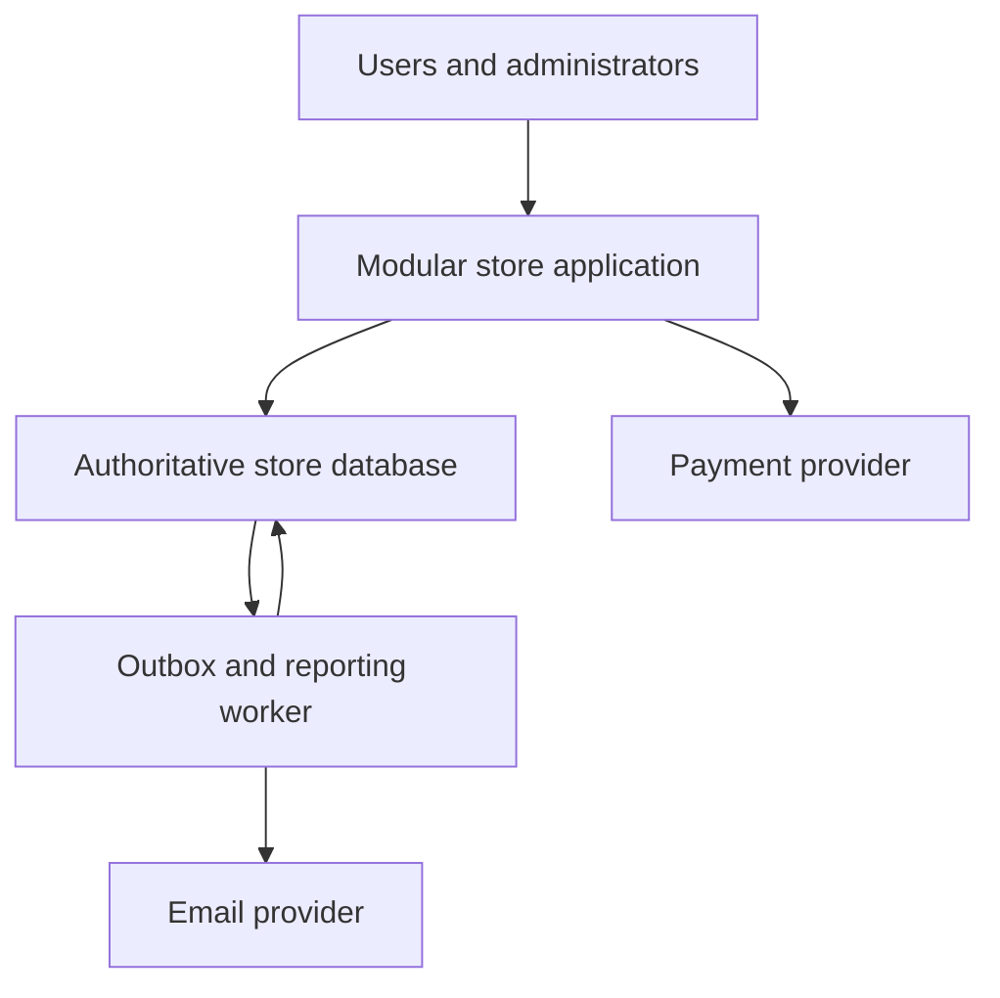

*[System Design Trade-offs](/tutorials/system-design/trade-offs) · Part X — Hands-on online-store project · Section 46 of 55.* New to the topic? Start with [Trade-off Fundamentals](/tutorials/system-design/trade-offs/fundamentals).

## 46. Analyze trade-offs for an online store

You are the architect for a small store. No coding is required. Your deliverable is a two-to-four-page design proposal plus decision records and a failure walkthrough. Use facts from this chapter; choose mechanisms before products.

### Functional needs

A **functional requirement** describes something the product does, like a shop accepting returns. Here: users browse products, add items to a cart, place orders, pay, and administrators manage inventory. A **quality requirement** describes how well behavior must work, like completing returns within a deadline. This project needs both.

### Exercise assumptions

- Three engineers; initial traffic 100 requests/s, 90% browsing.
- Browse p95 ≤300 ms; descriptions may be 30 s old.
- Final inventory reservation must not oversell.
- An acknowledged order must survive one application-server crash and the specified database failover; define the precise storage failure coverage in your proposal.
- Receipt email should finish within five minutes.
- Revenue dashboard may be one hour old.
- No unusual search features or customer-specific workflow language initially.
- Payment timeouts require an explicit pending outcome and safe reconciliation.
- Choose a practical operating budget and say what it includes.

### Instructions

1. Draw the smallest plausible architecture and assign each fact an authoritative owner.
2. Separate browsing, cart, reservation, payment, receipt, inventory editing, and reporting.
3. For each of the seven required trade-offs below, compare at least two options.
4. Write measurable requirements before choosing; explain assumptions that remain unresolved.
5. Define what the user sees when a dependency fails, including uncertain payment outcomes.
6. State deployment, monitoring, recovery, ownership, and cost for each added component.
7. Propose measurements and specific revisit triggers.
8. Review with a partner or explain aloud why another valid option was rejected.

### Required decision template

| Field | Your entry |
|---|---|
| Workflow and requirement | Outcome, invariant, workload, target |
| Trade-off | What improves and what gets worse |
| Options | At least two, including a simple baseline |
| Chosen approach | Component and behavior, not just tool |
| Why | Requirement that makes it worthwhile |
| Downside and failure | Risk being accepted and response |
| Operations | Deployment, monitoring, recovery, operator, cost |
| Revisit | Observable trigger and exit work |

Complete entries for consistency/latency, reliability/cost, sync/async, normalization/denormalization, managed/self-hosted, precompute/on-read, and simplicity/flexibility.

### Starting sketch

The worker can be part of the same codebase and need not require a separate queue product. It reads durable jobs from the database and must avoid contention with checkout. A separate cache is optional until justified.

### Reference solution

| Trade-off | Decision and why | Accepted downside, operation, revisit |
|---|---|---|
| Consistency vs latency | Authoritative atomic inventory reservation; fast browse from database initially, with optional bounded-age cache | Reservations may wait/refuse; monitor conflicts and p95; add a cache only for measured repeated-read cost |
| Reliability vs cost | Appropriate managed redundancy plus tested restore and failover matching the defined promise | Fees and rehearsals; measure recovery and checkout success; expand failure coverage as harm increases |
| Sync vs async | Synchronously record order/reservation/payment state; send receipt and compute reports later | Durable job/status/retry work; monitor age; split worker capacity if backlog threatens five-minute deadline |
| Normalize vs denormalize | Normalize current customer/product/inventory facts; retain invoice snapshots and selected report summaries | Some joins and derived update work; tune first; derive support views only for actual gaps |
| Managed vs self-hosted | Managed relational database if contractual behavior fits three-engineer capacity | Provider fees and limits; team retains schema, access, queries, and recovery validation; revisit TCO/control |
| Precompute vs on-read | Hourly dashboard summary if repeated report cost warrants it; freshness is one hour plus bounded processing | Corrections, schedule, storage; monitor output age; compute on read if rare demand makes advance work wasteful |
| Simplicity vs flexibility | Modular monolith, bounded settings, no broad plugin framework | Some future variations need code; add extensions for repeated real variation, not conjecture |

**Payment handling:** Persist an order/attempt identifier before a charge. Reserve stock according to a defined expiry policy. Call the provider with duplicate-safe identity; durably record confirmed or pending outcome. A lost reply triggers lookup/reconciliation, not a fresh charge. Confirm orders only under valid transitions. Store receipt intent with the confirmed state. Define refund/release procedures for conflicts between late outcomes and expired holds.

**Failure walkthrough:** Kill the application after provider success but before the local confirmation write. On restart, the durable attempt is pending. Reconciliation checks the original payment identity and completes the valid state transition once. The receipt worker may retry without sending uncontrolled duplicate messages. A database failure invokes tested recovery; an unavailable email provider produces a backlog, not a fabricated receipt success.

**Deployment and observation:** Release schema changes compatibly, monitor browse delay, reservation conflicts, payment uncertainty age, outbox age, report age, database capacity, and actual checkout success. Owners rotate with clear recovery procedures. A cheap bill without these responsibilities is an incomplete solution.

### Evaluation rubric — 100 points

| Criterion | Points | Full-credit evidence |
|---|---:|---|
| Requirements and constraints | 15 | Measurable targets, invariants, workloads, stated assumptions |
| Seven trade-off analyses | 28 | Four points each: alternatives, chosen benefit, cost, driver |
| Authoritative ownership and correctness | 15 | No oversell, clear state transitions, duplicate-safe effects |
| Failure and recovery | 15 | Crash/timeout/overload walkthroughs, tested recovery boundary |
| Operations and TCO | 10 | Owners, monitoring, deployment, restoration, people costs |
| Simplicity and justification | 7 | Every extra component earns its place |
| Revisit and migration | 5 | Specific triggers and feasible exit |
| Clear explanation and sketch | 5 | Understandable to another beginner |

Do not award a high score for naming many technologies. A design that violates a mandatory invariant must be corrected regardless of its total score.
