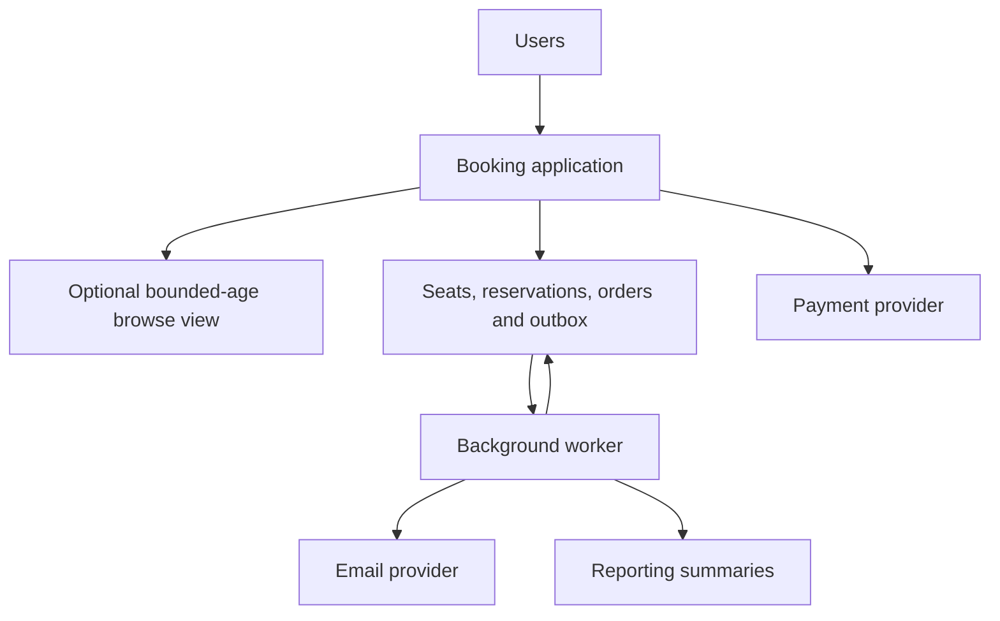
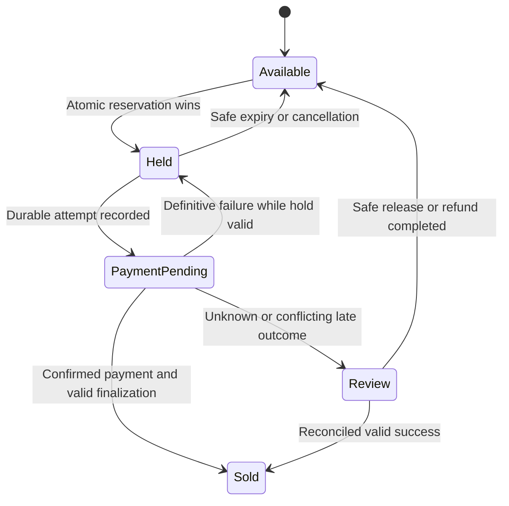

*[System Design Trade-offs](/tutorials/system-design/trade-offs) · Part XI — Final case study: online ticket booking · Sections 47–50 of 55.* New to the topic? Start with [Trade-off Fundamentals](/tutorials/system-design/trade-offs/fundamentals).

## 47. Requirements and assumptions

Functional needs: browse events, view seats, reserve seats, pay, receive confirmation. An **event** here means a concert or performance, not a processing log entry.

For a worked design, assume:

- Eight engineers, one initial primary region, tested separate-zone storage/recovery.
- 5,000 browse requests/s normally; popular-event bursts require an explicit admission policy.
- Browse p95 ≤300 ms with displayed availability allowed to lag five seconds.
- A seat must have no more than one active reservation or completed sale.
- Reservations expire after a stated hold period, initially five minutes, unless payment-transition rules extend or resolve the hold.
- Payment/order records need durable operation identity and explicit specified failure survival.
- Confirmation email within five minutes; reporting at most one hour old.
- Search initially needs event/date/venue filtering, not advanced linguistic ranking.
- Exact production peak scale, provider obligations, and retention requirements require further discovery.

These assumptions enable reasoning; they are not universal ticketing requirements. Reservation correctness does not promise that every requester can buy during overload or partitions.

## 48. Architecture and data ownership

Start with a modular booking application, a suitable managed relational database, durable outbox processing, and evaluated external payment/email capabilities. Browse optimization must not weaken seat reservation. The database owns seat/reservation/order state; payment status also has an external authoritative provider outcome that local reconciliation must track.

This is a logical view: replicas, backups, permissions, and monitoring are operational requirements even when not shown as extra boxes. The browse view is optional if fresh indexed queries meet the target. A separate search service is absent until justified.

## 49. Eight major decision records

Every record follows requirement → trade-off → options → chosen approach → why → downside → when to revisit.

### 1. Seat browsing

- **Requirement:** p95 ≤300 ms; displayed seat status ≤5 s old.
- **Trade-off:** response latency versus current observations, plus extra-view maintenance.
- **Options:** authoritative indexed query; selected cached/view data with tracked version/age.
- **Chosen approach:** measure direct queries first; add a bounded-age browse view only if required for normal and burst traffic.
- **Why:** browse is informational; final reservation performs the authoritative check.
- **Downside:** a seat shown free may no longer be available. A five-second TTL does not suffice if its source was already old. Track data age and prevent results outside the stated promise, using authority or an explicit reduced-service response.
- **Revisit:** queries miss p95 at representative load, view age exceeds five seconds, or the product requires stricter display semantics.
- **Operations:** monitor end-to-end age and p95, invalidate relevant changes, control miss bursts, and communicate “availability confirmed on reservation.”

### 2. Seat reservation

- **Requirement:** at most one active holder or completed sale per seat.
- **Trade-off:** essential coordination/guarantees versus latency, partition completion, and throughput.
- **Options:** independent isolated acceptance with conflict repair; authoritative atomic conditional transition; preallocated disjoint seat ownership.
- **Chosen approach:** authoritative atomic seat/reservation update in a suitable transaction; reject or wait when required authority is unavailable.
- **Why:** repairing double booking later violates the promise to one buyer. Multiple-seat orders need a defined all-or-nothing or partial-hold policy too.
- **Downside:** popular seats create contention, and some partitioned callers cannot reserve. A waiting room/admission limit can reject or delay demand rather than overload the database.
- **Revisit:** measured contention cannot meet legitimate throughput, geography changes, or disjoint allocation can meet business needs; every alternative must preserve the invariant.
- **Operations:** test concurrent buyers, hold expiry, failed owners, retries, and failover. Database uniqueness and safe transition rules are more important than a fresh display alone.

### 3. Payment and order durability

- **Requirement:** one intended charge, recoverable outcome, and durable confirmed order under named failures.
- **Trade-off:** persistence and stronger business guarantees versus fastest acknowledgement and operational simplicity; build versus buy for processing.
- **Options:** memory acceptance and a direct charge; durable tracked attempts with an evaluated provider; build processing capability if uniquely justified.
- **Chosen approach:** durable operation identity, provider-supported duplicate-safe requests, tracked pending/confirmed states, and reconciliation. Confirm only after required outcome and persistence.
- **Why:** a lost response cannot justify a second charge; users rely on a truthful confirmation.
- **Downside:** fees, provider dependence, network waits, state-machine complexity, and unresolved outcomes needing recovery. One local transaction does not atomically control an external provider.
- **Revisit:** product mismatch, control/obligation changes, TCO changes, or excessive unresolved outcomes; migration must preserve identifiers and reconciliation history.
- **Operations:** persist attempt before external work, monitor pending age, query original outcome, test crash boundaries, define late-success/refund handling, and verify durable failover.

### 4. Confirmation email

- **Requirement:** receipt within five minutes; not required before confirmed order response.
- **Trade-off:** synchronous simplicity versus background resilience and request delay.
- **Options:** wait for email; store durable email intent and send later.
- **Chosen approach:** outbox intent committed with order confirmation, then background sending with retries and result tracking.
- **Why:** provider delays should not withhold a valid ticket confirmation from the web page.
- **Downside:** late/duplicate delivery risks, job-age monitoring, and failure investigation. Not all providers guarantee duplicate suppression; define acceptable behaviour and use their supported identifiers.
- **Revisit:** backlog misses deadline, provider limits change, or notification becomes part of a stronger product completion promise.
- **Operations:** monitor oldest pending receipt, cap retries, retain failed jobs, and let users retrieve confirmed tickets independently of email.

### 5. Search

- **Requirement:** event/date/venue retrieval meets target; features initially simple.
- **Trade-off:** general-purpose simplicity versus specialized features/efficiency.
- **Options:** indexed relational queries/built-in search; dedicated derived search index.
- **Chosen approach:** existing database initially; add specialized search only for a proven feature/capacity gap.
- **Why:** another system needs synchronization and recovery; no stated gap requires it yet.
- **Downside:** sophisticated ranking may need later work; if a derived index is added, it can lag and must not become seat authority.
- **Revisit:** required ranking, typo tolerance, or measured query cost no longer fits after appropriate tuning.
- **Operations:** benchmark real queries, track lag if indexed separately, rebuild from source, propagate deletion, and keep reservation out of search results' authority.

### 6. Reporting

- **Requirement:** operational sales reports ≤1 h old; official financial records stay authoritative and reconciled.
- **Trade-off:** precomputation and denormalized views versus freshness and update complexity.
- **Options:** query completed orders every view; hourly summaries; incremental summaries.
- **Chosen approach:** selected hourly summaries if repeated work warrants them, retaining source records and correction logic.
- **Why:** users accept delay, and repeated aggregation can be wasteful.
- **Downside:** late payments/refunds, failed runs, and summary corrections. Display an “as of” time rather than presenting an old total as current.
- **Revisit:** report frequency is low, required age tightens, processing grows beyond deadline, or analytics begins harming reservation capacity.
- **Operations:** monitor output age and reconciliation, make reruns duplicate-safe, test rebuild, and isolate heavy reports where justified.

### 7. Infrastructure operation

- **Requirement:** operate with eight engineers and meet specified failover/restoration targets.
- **Trade-off:** managed operational assistance versus self-hosted control; reliability versus cost.
- **Options:** managed relational service with evaluated guarantees; team-operated database with staffed procedures.
- **Chosen approach:** suitable managed service plus team-owned access, schema, recovery validation, and incident response.
- **Why:** reduce infrastructure tasks while maintaining explicit product responsibilities.
- **Downside:** fees, service limits, provider failure, and possible migration difficulty. Managed backups are not proof of acceptable restoration.
- **Revisit:** control/obligation gaps, measured TCO changes, staff expertise, or unacceptable provider failure behavior.
- **Operations:** test zone loss, backup restore, key/configuration recovery, upgrades, and traffic overload; define who responds at each boundary.

### 8. Application structure

- **Requirement:** deliver a clear booking workflow now with maintainable ownership; future variation not yet established.
- **Trade-off:** simplicity and developer speed versus independent deployment and broad flexibility.
- **Options:** modular monolith; many separately deployed services; small selective extraction.
- **Chosen approach:** modular monolith with explicit reservation/payment/reporting boundaries and background workers as needed.
- **Why:** local business boundaries are understandable and do not require remote calls for every step.
- **Downside:** coupled release and scaling; a shared process can have a broad failure impact unless resources are controlled.
- **Revisit:** stable autonomous teams need separate releases, one workload needs distinct scaling, or a proven fault boundary merits extraction.
- **Operations:** compatible database changes, safe rollouts, scoped resource limits, useful traces, clear owners, and reversible extractions.

## 50. Reservation/payment flow and failures

“Review” can be automated or require an operator. This teaching sketch leaves details to explicit business policy; it does not claim every failure is solved by six state labels. A late payment must not silently sell a seat already reassigned. State transitions need atomic checks and durable evidence.

| Failure | User-visible result | Recovery and trade-off |
|---|---|---|
| Seat view stale | Reservation may say unavailable | Authority wins over display; acceptable informational staleness |
| Two simultaneous holds | Exactly one succeeds for one seat | Atomic enforcement; losing buyer sees honest failure |
| Database authority unreachable | Cannot confirm uncertain hold | Preserve rule; sacrifice some completion availability |
| Charge reply lost | Payment pending/being checked | Lookup original identity and reconcile; slower resolution |
| Worker dies before email acknowledgement | Ticket remains retrievable; email may retry | Duplicate-aware delivery; background complexity |
| Report update fails | Show last verified timestamp or reduced report | Do not label old data current; main booking continues |
| Primary zone lost | Tested failover/recovery policy activates | Required survival and recovery cost; no guessing from stale copies |
| Demand exceeds processing | Waiting room or rate-limited requests | Backpressure instead of uncontrolled overload |

**Validation plan:** Race many buyers for one seat; retry one operation after a lost reply; crash before/after each external boundary; fail required replicas; restore backups; stop email workers; overload browse and reservation separately; verify permissions; measure end-to-end latency, age, success, and unresolved outcomes.

**Final reasoning:** Browsing tolerates a little age, reservation preserves exclusivity, payment requires durable tracked effects, email finishes later, reporting reuses summaries, and infrastructure choices fit operator capacity. Each mechanism has a requirement and an accepted cost.
