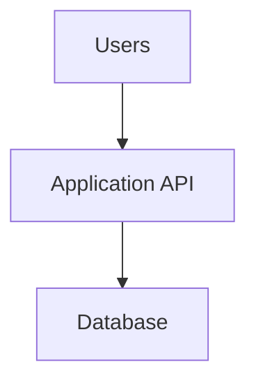

*[System Design Trade-offs](/tutorials/system-design/trade-offs) · Part VI — Practical workbook · Sections 37–42 of 55.* New to the topic? Start with [Trade-off Fundamentals](/tutorials/system-design/trade-offs/fundamentals).

Do the questions before consulting the labelled solutions. Plausible alternatives earn credit when they preserve the stated requirements and explain costs. The goal is justified reasoning, not matching a preferred technology.

## 37. Twenty scenario exercises

**IoT**, Internet of Things, means network-connected physical devices, like sensors reporting temperature; its measurements and critical alarms can need different guarantees. A game **frame** is one update/rendering step, like one tick of an animation; frequent state updates may make remote storage calls too costly. For **each** scenario answer five questions: (1) key trade-off, (2) side likely favoured, (3) driving requirement, (4) risk/downside, (5) alternative. Then add a measurement and revisit trigger.

| # | Scenario and stated requirement |
|---|---|
| 1 | Bank transfer: no partial transfer or duplicate debit; a short wait is acceptable |
| 2 | Social likes: display under 150 ms; count can lag 20 s |
| 3 | Dashboard: 1 million views/day; summaries may be one hour old |
| 4 | Video conversion: jobs take minutes; user can wait after acceptance |
| 5 | Autocomplete: p95 under 100 ms; catalog changes can lag 30 s |
| 6 | Last-item reservation: concurrent buyers; stock must not become negative |
| 7 | Recommendations: optional; checkout must continue if they fail |
| 8 | Internal employee tool: ten users, two maintainers, stable forms |
| 9 | IoT measurements: 100,000 events/s; some duplicates allowed, critical alarms cannot disappear |
| 10 | Multiplayer game: 50 ms action target; live state changes every frame |
| 11 | Profile edit: user must immediately see their own successful update |
| 12 | Legal archive: acknowledged records survive one location loss |
| 13 | Sign-in: launch in six weeks; no security specialist or unique protocol need |
| 14 | Database hosting: team cannot provide required overnight operations |
| 15 | Small catalog search: existing indexed query meets target and feature needs |
| 16 | Annual report: requested twice yearly; must use current verified records |
| 17 | Chat: order within each room matters; cross-room ordering is not needed |
| 18 | Name change: thousands of orders refer to current customer name; current join meets target |
| 19 | Warehouse search: specialized system could save $500/month but costs $2,000/month labour |
| 20 | Global cart: users may add items offline; conflict rules can be shown before checkout |

### Detailed scenario solutions

1. **Guarantees and durability over minimum latency.** Atomic, suitably isolated debit/credit with durable operation identity protects balanced movement. Waiting and retry complexity are accepted. Independent local updates without shared protocol are unsafe. A coordinated workflow with explicit pending states can be an alternative across separate institutions. Measure duplicate effects and unresolved transfers; revisit coordination only while preserving invariants.
2. **Latency over immediate count freshness.** Use a nearby derived count with ≤20 s age under the promise. Risk: count differs between devices; monitor lag and repair. A fresh indexed read is an alternative if fast enough. Never reuse this policy for authorization.
3. **Precomputation.** Repeated expensive work and one-hour tolerance justify summaries. Risks: delayed or late-corrected totals and background failure. Incremental summaries or on-read caching are alternatives. Track result age and CPU work; revisit if users require current totals.
4. **Async execution.** Durably accept a job and expose progress. Risk: stuck backlog or repeated outputs; make output steps duplicate-safe. A synchronous endpoint waiting minutes is an alternative only if callers and infrastructure support it. Measure upload-to-ready time, not just acceptance.
5. **Latency with bounded stale search.** Evaluate an index/cache only after existing database options; cap output age. Risks: absent recent items and stale deletions. Fresh database search is an alternative. Track p95, feature quality, and update age; revisit if 30 s is unacceptable.
6. **Essential guarantees.** Atomically reserve if stock remains sufficient. Risk: contention, rejected purchases, expiry complexity. Preallocated disjoint stock pools are an alternative with reduced sharing. Measure oversell, contention, and abandonment; never relax the required stock rule for throughput.
7. **Reliability through graceful degradation.** Return a generic list or omit recommendations; isolate resources and waits. Risk: less personalization, not failed checkout. Cached fallback is an alternative. Measure checkout success during injected recommendation failures.
8. **Simplicity.** One modular application and appropriate data store. Risk: later variation may need code changes. Bounded configuration is an alternative when actual needs appear. Measure support effort and form changes; avoid a broad plugin framework today.
9. **Throughput with scoped guarantees.** Process ordinary telemetry independently with duplicate-aware aggregation; give critical alarms a durable path. Risk: backlog and incorrect event classification. Sampling ordinary events is an alternative if explicitly acceptable. Measure alarm loss/completion separately from measurement throughput.
10. **Stateful locality.** Assign match state to a host with ownership and checkpoints. Risk: host loss and migration delay. Shared state is an alternative if latency remains acceptable. Measure action latency and recovery progress loss; test failure of the active host.
11. **Read-your-writes.** Route or version reads to observe that user's update. Risk: more routing/version logic and no universal latest view. Globally strong reads are an alternative at higher coordination cost. Test immediate subsequent reads on different handlers.
12. **Durability over quickest acknowledgement.** Wait for appropriately separated durable storage under the failure model. Risk: cross-location waiting and expense. Local durable save with “replication pending” is an alternative only if the user promise changes. Test location-loss restore.
13. **Buy/adopt.** Evaluate a mature identity capability; team still owns permissions. Risk: lock-in and service dependence. Building a constrained capability is an alternative only with sustainable expertise. Test integration, export, and provider outage behavior.
14. **Managed operation.** Choose a fitting service to reduce tasks the team cannot staff. Risk: contractual limits and remaining recovery work. Self-hosting with hired operations support is an alternative, including its cost. Verify responsibilities and restore target.
15. **General-purpose simplicity.** Existing query satisfies needs, so extra search infrastructure lacks a demonstrated benefit. Risk: later growth may break the target. Built-in richer search is a first alternative; then evaluate specialist search. Monitor representative workload rather than hypothetical scale.
16. **Computation-on-read.** Rare demand and current inputs argue against continuously storing results. Risk: report wait. A tracked async on-demand report is an alternative if slow. Measure generation time and validation, not merely page response.
17. **Scoped ordering and throughput.** Coordinate per room; allow rooms to progress independently. Risk: no universal sequence for cross-room reports. A global sequence is an alternative if a real requirement arises. Measure hot-room capacity and within-room order.
18. **Normalization.** Keep current name once; use the working join. Risk: future query cost. A derived support view is an alternative with freshness/rebuild costs. Keep invoice-at-purchase name separate; do not overwrite history.
19. **Operational simplicity and total cost.** $500 saved minus $2,000 extra labour is $1,500/month worse before integration. Risk: existing inefficiency persists; acceptable if requirements are met. Tuning the current query is an alternative. Revisit when benefit or staffing changes substantially.
20. **Availability with explicit merge rules.** Offline additions can synchronize later; identity, removes, and quantity conflicts need rules. Risk: surprising merged cart contents. Require online authoritative cart updates as an alternative. Checkout revalidates price and stock; cart merge must not promise reserved inventory.

## 38. Thirty classification questions

Classify each as **R** requirement, **T** trade-off statement, **D** architecture decision, or **C** technology choice. A decision can explicitly describe a trade-off; use the sentence's main function. “Need caching” states a mechanism, not a measurable user outcome.

| # | Statement |
|---|---|
| 1 | p95 search latency must be below 200 ms at 1,000 requests/s |
| 2 | Low read latency competes with fresh replicated observations |
| 3 | We will cache product descriptions for 30 seconds |
| 4 | Use Redis for the cache |
| 5 | A completed reservation must never double-book a seat |
| 6 | Self-hosting gives control but increases operations |
| 7 | Use a managed database for orders |
| 8 | Use PostgreSQL as the database engine |
| 9 | Confirmation email must arrive within five minutes |
| 10 | Async execution improves burst handling but delays completion |
| 11 | Use a durable outbox for email intent |
| 12 | Use Amazon SQS for queued jobs |
| 13 | Recover service within 20 minutes after one zone fails |
| 14 | More redundancy costs more money and operator work |
| 15 | Keep authoritative customer details normalized |
| 16 | Use Elasticsearch for the search engine |
| 17 | Report results must be at most one hour old |
| 18 | Precomputation speeds reads but uses storage and updates |
| 19 | Produce hourly revenue summaries |
| 20 | Use BigQuery for the analytics store |
| 21 | Support 10,000 completed messages/s |
| 22 | A global total order adds coordination compared with room ordering |
| 23 | Enforce ordering separately within each room |
| 24 | Use a particular identity-provider product |
| 25 | Retain acknowledged audit records after one machine loss |
| 26 | Early acknowledgement lowers wait but can reduce durability |
| 27 | Put active game state on an assigned match host |
| 28 | Use a particular container-orchestration product |
| 29 | Monthly total operating cost must be below $5,000 |
| 30 | Accept ≤30 s stale search results to satisfy the latency target |

**Answers:** 1 R, 2 T, 3 D, 4 C, 5 R, 6 T, 7 D, 8 C, 9 R, 10 T, 11 D, 12 C, 13 R, 14 T, 15 D, 16 C, 17 R, 18 T, 19 D, 20 C, 21 R, 22 T, 23 D, 24 C, 25 R, 26 T, 27 D, 28 C, 29 R, 30 D.

**Why:** Requirements state an outcome or limit; T sentences name a tension; D sentences select behavior or structure; C sentences name implementations. #30 is a trade-off decision, not just a tension. PostgreSQL, Redis, Elasticsearch, Amazon SQS, and BigQuery are example products, not automatic recommendations. **Container orchestration** coordinates packaged programs across machines, like assigning workstations and replacing failed staff; it is an implementation capability with its own operating cost.

## 39. Fifteen reasoning rewrites

Rewrite each simplistic statement to include a requirement, choice, accepted downside, and revisit condition. Attempt before reading the sample.

| # | Simplistic claim | Sample reasoned rewrite |
|---|---|---|
| 1 | We need strong consistency | Final-seat reservation must prevent two winners, so use an authoritative atomic update; accept contention and revisit only with invariant-preserving alternatives |
| 2 | Async is better | Video conversion takes minutes and may finish later, so durably queue it; accept status/retry work and revisit if completion delay misses its target |
| 3 | Replicate everything | Orders must survive one zone loss, so use appropriate independent copies and tested failover; accept extra cost and review actual failure coverage |
| 4 | We should build sign-in | Build only if a verified unique requirement cannot be met and we can maintain security; accept time/on-call cost and compare products again as needs change |
| 5 | Managed is too costly | Compare fees plus administration with self-hosted machines plus staff and recovery; choose within TCO and control limits and revisit at measured scale |
| 6 | Use microservices | Independent release teams may justify bounded services; accept remote failures and operations, and retain modules if those needs do not exist |
| 7 | Joins are bad | If a tuned join misses the support-screen target, derive the needed view; accept lag and repair, and revisit when updates dominate |
| 8 | Precompute everything | Precompute frequently read expensive results with acceptable age; accept storage/update work and stop computing unused results |
| 9 | Stateless always wins | Independent API requests benefit from replaceable handlers with shared state; accept store dependence and keep live sessions stateful where locality matters |
| 10 | We need five nines | Specify eligible operations and outage harm, then fund mechanisms that can support the target; accept cost and review against observed outcomes |
| 11 | Add a cache | Repeated catalog reads miss p95 and tolerate 30 s age, so cache selected data; accept invalidation and load-miss behavior and measure both |
| 12 | Use a specialized database | Required analytics scans remain too expensive after tuning, so evaluate a workload-fit store; accept a pipeline and restore plan and verify savings |
| 13 | Never lose any data | Name the expected failures and affected data; acknowledge critical writes only after required persistence and keep expendable telemetry separately labelled |
| 14 | Order every message globally | If users need only room order, coordinate per room; accept absence of universal order and revisit for a genuine cross-room rule |
| 15 | Optimize the machine bill | Compare resource savings with integration and human costs; add complexity only when total value is positive and sustainable |

## 40. Ten trade-off chains

For each decision list gains, costs, failure modes, and a condition that could reverse the decision. Solutions below are examples, not guarantees.

| # | Decision | Likely gains | Costs and failure modes | Revisit when |
|---|---|---|---|---|
| 1 | Add replicas | Survival/read capacity | Copy cost, lag, unsafe failover | Failure coverage still inadequate or cost exceeds value |
| 2 | Add cache | Lower repeated-read load | Staleness, misses, stampede | Freshness fails or hit rate is low |
| 3 | Add queue | Burst smoothing | Backlog, duplicates, stalled jobs | Final completion misses target |
| 4 | Denormalize view | Read efficiency | Duplicate updates and repair | View lag or write load dominates |
| 5 | Precompute report | Less repeated calculation | Unused work, old results | Demand falls or required freshness tightens |
| 6 | Buy identity service | Earlier delivery | Fees, dependence, integration errors | Mandatory behavior no longer fits |
| 7 | Self-host database | Greater tuning control | Patching, recovery, staffing gaps | Staff capacity or TCO changes |
| 8 | Add region | Local reads and disaster recovery | Network cost, conflicts, testing | Global write latency or burden exceeds benefit |
| 9 | Shard storage | More data/write capacity | Cross-shard work and rebalance | Uneven load or shared invariants dominate |
| 10 | Split services | Independent ownership/scaling | Remote failures and releases | Boundaries create more coordination than value |

## 41. Architecture-review exercises

### A. Small product

Requirements: 100 requests/s, small team, moderate availability, no global latency demand. Are a queue, cache, search cluster, microservices, multiple regions, and five databases justified?

**Solution:** None is justified by the rate alone. Benchmark realistic operations, clarify recovery, and keep the simple design if it meets targets. A queue might be justified by long work rather than traffic. A cache needs a repeated-read bottleneck and acceptable freshness. Search needs features or capacity the database cannot provide. Microservices need useful ownership/scaling/fault boundaries. Multiple regions need geography or failure requirements. Five databases need five specific workload justifications. The simpler design is easier to diagnose and operate, but must still have permissions, backups, recovery, and appropriate redundancy.

### B. High scale

Change requirements to 500,000 requests/s, global users, strict latency, mostly reads. What changes?

**Solution:** First estimate response sizes, hot data, write rate, target regions, and permitted staleness. A highly repeated read workload may justify edge caching and replicated views. Global writes may remain coordinated by ownership; determine their separate rate and invariant needs. The authoritative store may need partitioning if capacity is proven insufficient. Optional background tasks can move off the request path. A queue and microservices still do not follow automatically from a large number. Load test, define overload behavior, and include region-loss recovery.

### C. Compare two valid designs

A: one modular application + one logical database with appropriate backups/redundancy. B: independently deployed services + queue + cache + search cluster + replicated data stores.

**Solution:** A usually has fewer interfaces, releases, and diagnosis surfaces. B may independently scale and deploy suitable functions, at greater operational cost. Actual money depends on capacity and labour, not box count alone. Start with A for a small team when it meets needs. Choose justified portions of B as requirements emerge, not all together. A poorly structured monolith can be hard to understand; clear modularity matters.

## 42. Quantitative exercises and worked answers

### A. Replication storage

One terabyte stored once costs $100/month. Compare **1, 3, and 5 total copies**, ignoring compression, logs, backups, compute, and transfer. “Replica” sometimes means an extra copy beyond the primary; declare the convention.

**Answer:** $100, $300, $500/month. If the question means 1, 3, and 5 *extra replicas*, total copies are 2, 4, and 6, so $200, $400, $600. More independently durable copies can improve failure survival, but copy count alone gives no numerical reliability guarantee.

### B. Write acknowledgement

Local processing takes 20 ms. After it finishes, two replicas start in parallel, requiring 40 ms and 70 ms respectively, including their stated acknowledgement work.

**Answer:** Local-only reply: 20 ms. Wait for the first of those replicas: 20 + min(40,70) = 60 ms. Wait for both: 20 + max(40,70) = 90 ms. Sequential replication would be 20 + 40 + 70 = 130 ms. If replica work starts earlier or timings are measured from a different origin, recalculate. These numbers say nothing about durability unless the acknowledgements mean durable completion.

### C. Precompute savings

One million views/day; 200 ms CPU per on-demand report; hourly precompute costs 10 CPU-seconds each.

**Answer:** 1,000,000 × 0.2 = 200,000 CPU-seconds/day. Precompute: 24 × 10 = 240 CPU-seconds/day. Ratio = 833.3. Savings = 199,760 CPU-seconds before serving/storage/update costs. Maximum periodic age can approach one hour plus computation/propagation delay; failed runs make it longer without fallback.

### D. Managed vs self-hosted TCO

Managed: $2,000/month. Self-hosted: $900 infrastructure plus labour. Let fully loaded labour cost be $100/hour. Assume managed administration needs two hours/month and self-hosting needs fifteen.

**Answer:** Managed = $2,000 + $200 = $2,200. Self-hosted = $900 + $1,500 = $2,400. Managed is $200 cheaper under these assumptions. Without extra incident/support/exit differences, self-hosting breaks even at 13 hours/month since $900 + $100h = $2,200. Real labour use, incident risk, backups, licences, and migration can change the result.

### E. Reliability investment

A service earns $100,000 per peak hour. Assume an identified outage scenario has annual probability 10%, lasts two peak hours, and causes all that revenue to be unrecoverable. A tested improvement costs $8,000/year and reduces that scenario probability to 2% without other changes.

**Answer:** Before expected loss = 0.10 × 2 × $100,000 = $20,000/year. After = $4,000/year. Expected reduction = $16,000, exceeding $8,000 cost by $8,000. This is a decision aid, not a promise. Consider probability uncertainty, partial loss, delayed purchases, reputation, multiple scenarios, and the improvement's own failure risk. Severe harms can require protection even when a simple monetary average is small.

### F. Queue backlog

Arrivals are 1,200 jobs/s for ten minutes. Workers finish 1,000/s. Initially there is no backlog. Then arrivals fall to 800/s.

**Answer:** Growth = 200/s × 600 s = 120,000 jobs. Net drain after the burst = 1,000 − 800 = 200/s; drain time = 600 s. Queuing absorbs a burst only if capacity, deadlines, and later drainage are adequate. Some jobs now have long waits despite fast acceptance.

### G. Serial dependencies

Three mandatory services independently succeed on a request with probability 0.999 each. No fallback exists.

**Answer:** Under that independence assumption, success probability is 0.999³ ≈ 0.997003, or 99.7003%. Shared failures break the independence assumption. Removing optional dependencies from the required path or adding safe fallbacks may improve end-to-end success; multiplying percentages is not a full real-world reliability model.
